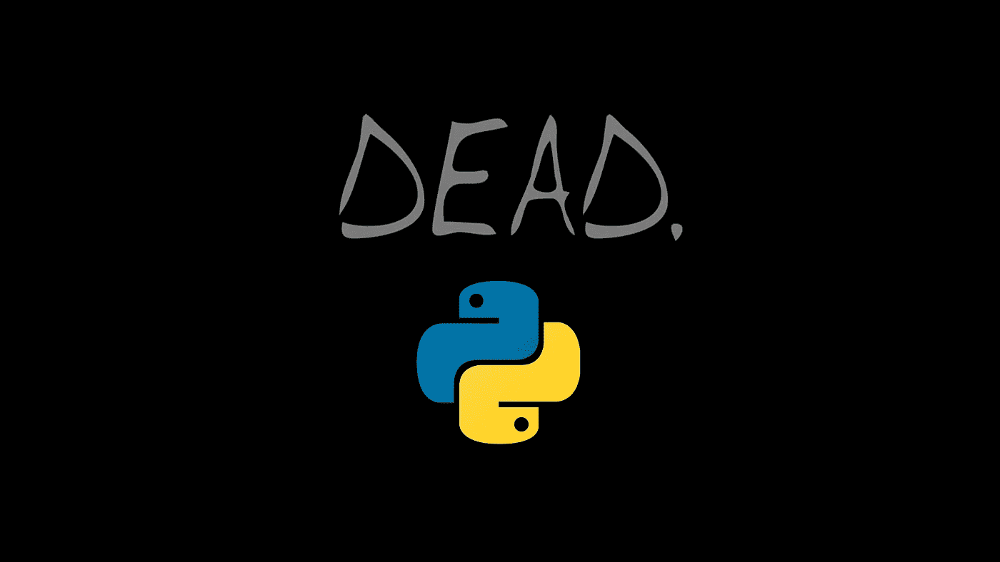

# 2022 年的⚰️python——它会消亡吗？

> 原文：<https://medium.com/codex/%EF%B8%8Fpython-in-2022-will-it-die-cb30b01295cc?source=collection_archive---------1----------------------->

## Python 会像比特币泡沫一样爆炸吗？

Python 这个词指的是两件事:**动物**，它也恰好是世界上最大的蛇，**Python 编程语言**。编程语言**是由** [**吉多·范·罗苏姆**](https://computerhistory.org/profile/guido-van-rossum/) 于 1989 年开发的，他想创造一种易于阅读的语言，这种语言将有助于教授计算机科学的学生，同时也有助于提高学生的语言能力