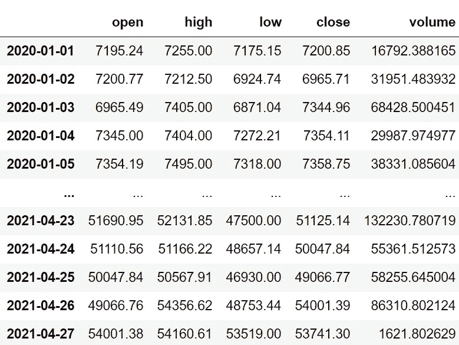
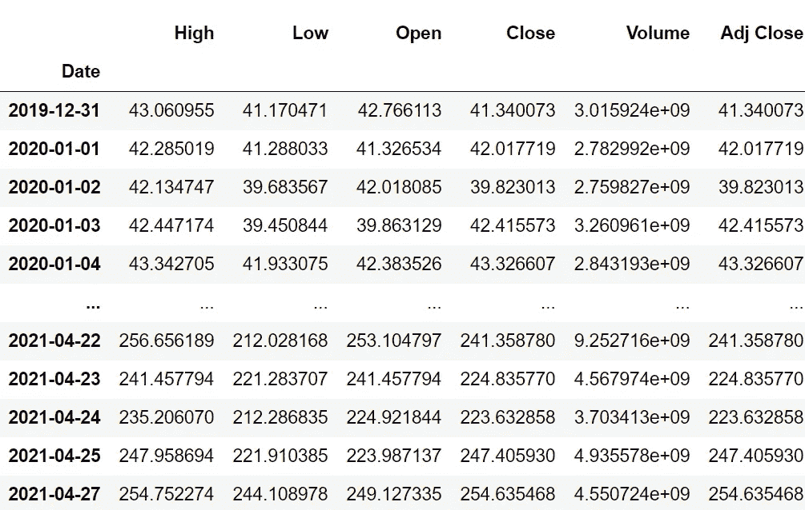
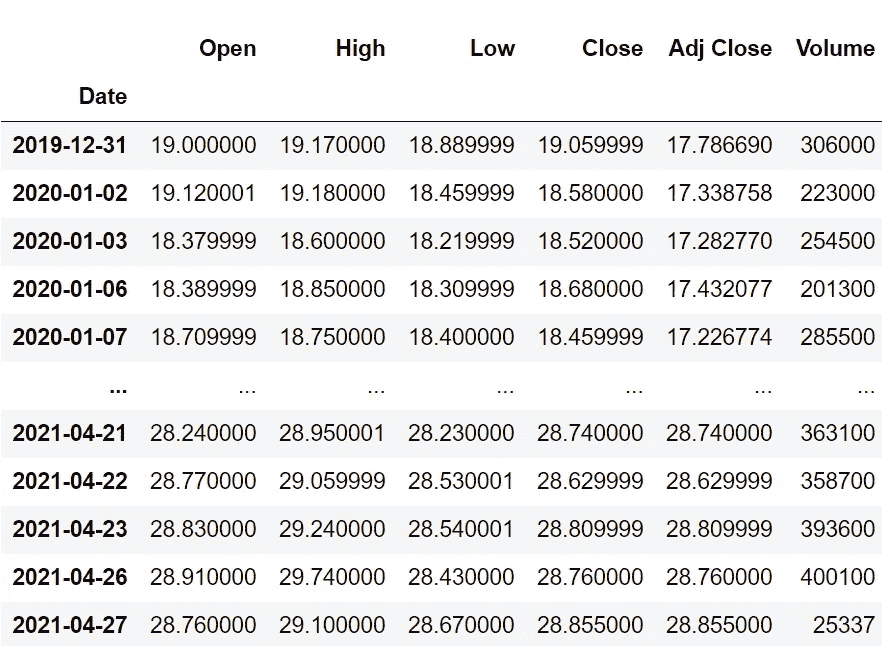
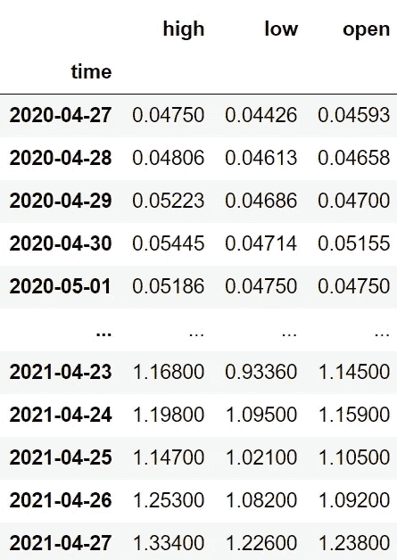
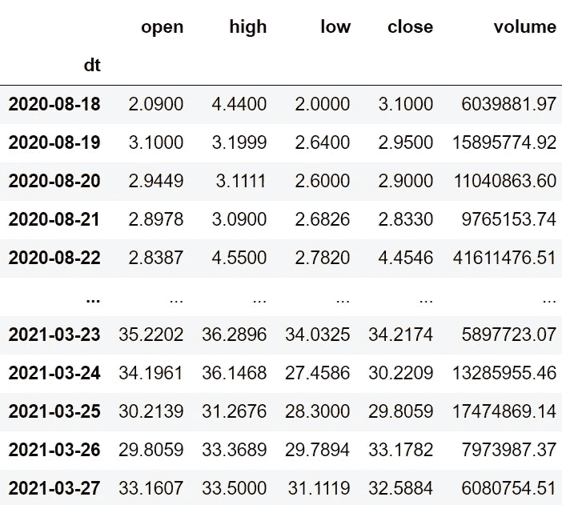
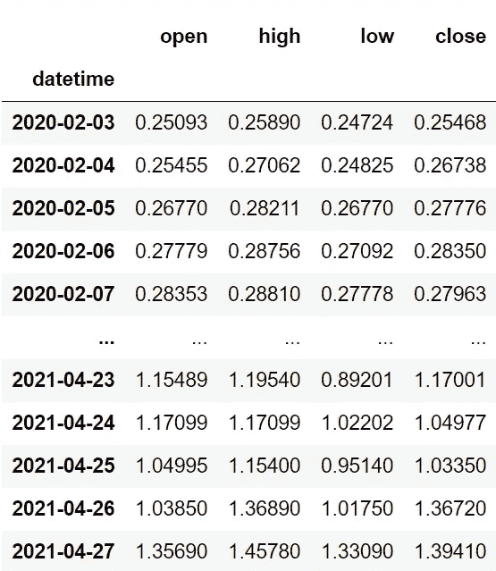
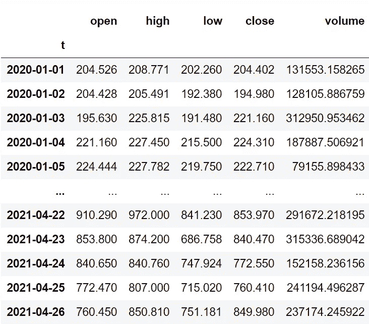
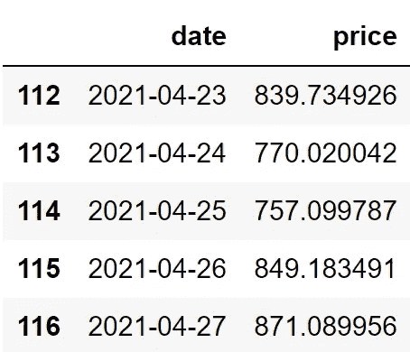
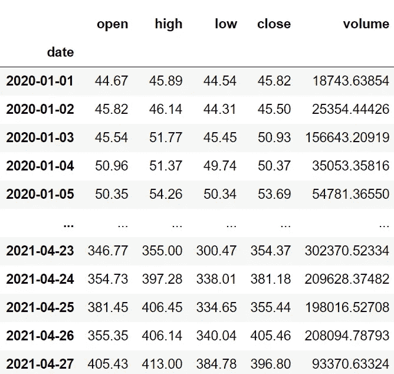

# 用 Python 获取加密货币数据的 10 个最佳资源

> 原文：<https://medium.com/codex/10-best-resources-to-fetch-cryptocurrency-data-in-python-8400cf0d0136?source=collection_archive---------1----------------------->

## 在 python 中无缝提取加密货币数据的所有有用的 python 包和 API 的列表


由 [Unsplash](https://unsplash.com?utm_source=medium&utm_medium=referral) 上的 [CardMapr.nl](https://unsplash.com/@cardmapr?utm_source=medium&utm_medium=referral) 拍摄的照片

# 介绍

最近几天，鉴于公众的反应，加密货币行业不仅吸引了投资者或企业，也吸引了世界各地成吨成吨的开发者。在比特币和以太坊代币的发行获得动力后，世界各地每个有抱负的开发者都开始努力创造自己的加密货币，然后在初始硬币发行(ICO)中拍卖，并在股票交易者之间交易。这种赚钱的新想法吸引了软件开发者去建立大量的项目。

这种趋势甚至一直延续到今天，没有任何中断，但利用加密货币市场数据开发基于加密的产品的方式已经开启了一个全新的篇章。有大量的资源来提取加密货币数据，但可靠性是最重要的考虑因素。在本文中，我们将看到 10 大可靠资源，我的伙伴 python 可以从中提取加密货币数据。

# 可靠的资源

我认为找到 10 大资源的因素是可靠的数据、易用性，最后是良好的文档。在考虑这些因素的同时，这是我得出的最终列表(注意:我不是在排名，只是列出 10 大有用资源):

```
**- IEX Cloud
- Alpha Vantage
- Pandas DataReader
- Yfinance
- Cryptocompare
- Fastquant
- Twelve Data
- Polygon.io
- Coinlayer
- Messari**
```

利用这些有用的资源，我们准备用 python 提取各种加密货币的历史市场数据。这些资源包括加密 API 和 python 包。每当使用加密 API 时，确保您在相应的数据提供者中有一个开发人员帐户，只有这样，您才能访问您的 API 密钥，这对于从 API 中提取数据是至关重要的。

# 1.IEX 云

IEX 云提供了大量的 API 端点，包括股票、商品、外汇、期权和加密货币的市场数据。数据是可靠的，在任何编程语言中使用它们的 API 都很容易。API 带有高度可定制的参数，可以帮助获得所需的信息。我真正欣赏 IEX 云的一点是他们在创建精彩文档方面投入的大量工作和时间。让我们用 IEX 云提供的 crypto API 来拉取 python 中比特币的历史数据。

不幸的是，提取历史数据的 API 属于高级类。因此，我决定使用 IEX 云提供的“价格”端点来获取给定加密货币的最新价格。

**Python 实现:**

**输出:**

```
**Price of 1 Bitcoin: 54700.07 USD**
```

如您所见，只需要几行代码就可以提取最新的加密信息。如果你是 IEX 云的付费用户，你可以尝试使用“报价”端点来提取给定加密货币的历史市场数据。让我们跳到下一个有用的资源。

# 2.阿尔法优势

当雅虎金融 API 停止运行时，一个名为 Alpha Vantage 的新玩家获得了动力。它是最早的数据提供商之一，并且在早期充当了 Yahoo Finance API 的出色替代品。Alpha Vantage 的使用率至今没有减少。它们为各种数据提供了数千个 API 端点，最棒的是大多数数据在一定限度内都可以免费使用。尽管文档不像 IEX 云那么花哨，但他们有一个很棒的文档，里面有很多很多的例子。来拉点数据吧！

**Python 实现:**

**输出:**



作者图片

API 的响应更加简洁，这有助于减少数据清理和操作的过程。此外，所提供的数据非常可靠。让我们探索下一个有用的资源。

# 3.熊猫数据阅读器

Pandas DataReader 是 python 中 Pandas 的一个子包。这个包从 Yahoo Finance API 中提取给定股票或加密货币符号的历史数据。让我们提取一些数据

**Python 实现:**

**输出:**



作者图片

这个资源最适合初学者，因为它不需要任何 API 键来提取数据或执行任何数据处理或数据操作。提取的数据也几乎与原始市场数据相似。关于 Pandas DataReader 唯一困扰我的是它们的文档。它看起来很整洁，但事物的排序方式似乎令人困惑，也有必要手动搜索它们提供的功能，而 IEX 云或 Alpha Vantage 的文档列出了这些功能，以便新程序员可以了解他们实际提供的功能。但是，这个问题不会以任何方式影响资源，因为互联网上有很多可用的教程。

# 4.y 金融

和熊猫 DataReader 一样，YFinance 是一个 python 包，用来提取各种市场数据。使用 YFinance，不仅可以提取历史数据，还可以提取其他相关数据，如给定符号的轮廓等。现在我们来摘录以太坊(ETH)的历史数据。

**Python 实现:**

**输出:**



作者图片

从代码中，我们可以观察到 YFinance 不仅可以无缝地工作，还可以帮助初学者在几行代码中提取可靠的数据。就像熊猫 DataReader 没有这么好的文档一样，YFinance 也不例外。事实上，更糟。他们只有一个关于 [PyPi](https://pypi.org/project/yfinance/) 的主要功能的小文档，这也令人困惑。有了 YouTube 上很棒的教程的帮助，这个问题不是一个很难解决的问题。让我们继续下一个资源。

# 5.CrytpoCompare

CryptoCompare 允许用户使用其高度可定制的 API 提取各种加密货币数据。用户可以访问大量的 API 端点，包括不同类型的区块链数据。大多数用户爱上 CryptoCompare 是因为它的用户友好的网站和文档，在那里可以生成和定制所需的 API URL。是时候用 python 中的 CryptoCompare 的 API 提取一些市场数据了。

**Python 实现:**

**输出:**



作者图片

初学者也可以尝试使用 CryptoCompare 的 API 进行实验，即使它包含 API 调用等任务，因为文档非常用户友好，API 的响应非常清晰，只需要少量的数据处理。说到数据可靠性，CryptoCompare 的数据是高度可靠的，可用于进行广泛的技术分析和研究。

# 6.Fastquant

Fastquant 是一个强大的 python 包，主要关注回溯测试交易策略领域，但也通过其`get_crypto_data()`函数提供可靠的加密货币数据。该函数将返回指定时间段内给定加密货币的历史市场数据。利用 Fastquant 强大的功能，我们用 python 来获取一些历史数据。

**Python 实现:**

**输出:**



作者图片

Fastquant 有两个缺点。首先是缺乏可定制的功能。当使用 CryptoCompare 等加密 API 时，我们可以访问各种加密货币数据，而我们只能使用 Fastquant 提取加密货币的历史数据。这个问题不仅与 Fastquant 有关，也与 Pandas DataReader 有关。其次，与其他公司相比，Fastquant 的文档很差。我们只能在其 GitHub 库和 PyPi 中找到关于其功能的简短文档，除此之外别无其他。正如我之前所说，随着 youtube 上视频教程数量的不断增加，第二个问题已经成为定局。

# 7.十二个数据

目前，12 Data 是领先的市场数据提供商之一，拥有针对所有类型市场数据的大量 API 端点。它非常容易与十二数据提供的 API 进行交互，并且拥有有史以来最好的文档。如果您想学习用 API 提取加密数据，这是一个很好的入门资源。是时候用 python 提取一些数据了！

**Python 实现:**

**输出:**



作者图片

在我测试的所有资源中，与其他资源相比，Data API 的响应(原始 JSON 数据)是最干净的。这最终帮助我完成了大量清理和处理数据的工作。关于 Data 的文档中最棒的一点是每个 API 端点都有大量的例子。

# 8.多边形. io

Polygon.io 最好的一点就是市场数据的频繁更新。数据会实时更新，并提供最准确的市场数据之一。像 Data 一样，这个平台也有大量的 API 和精彩的文档(包括大量的例子)。我们用 python 做一些数据提取吧！

**Python 实现:**

**输出:**



作者图片

Polygon.io 的局限性是缺乏交流，没有技术指标。首先，缺乏交流。虽然大多数资源支持国际市场，但 Polygon.io 只支持美国证券的市场数据。接下来是技术指标的不存在。技术指标是技术分析和研究的一个重要方面，但 Polygon.io 没有提供。这些限制与加密货币无关，但却是需要考虑的事实。

# 9.铸币机

Coinlayer 是另一个有用的资源，它提供了大量具有高度可定制特性的 API 端点。数据是高度可靠的，也有很好的文档。对于任何编程语言来说，与 API 交互的过程都很容易。现在，让我们使用 python 中 Coinlayer 提供的 API 提取比特币现金(BCH)的历史数据。

**Python 实现:**

**输出:**



作者图片

不幸的是，历史数据的 API 属于付费类别。因此，我使用 API 来获取特定日期给定加密货币的价格，并迭代函数中指定的日期以获得每天的数据点。总而言之，我创造了自己的历史数据框架。从这种用法可以理解 Coinlayer 提供的 API 有多灵活。这一特定任务无法通过 IEX 云提供的 API 来完成。

# 10.梅萨里

我列表中最后一个有用的资源是 Messari。我喜欢梅瑟里的两点。首先显然是它的文档。Messari APIs 的文档用大量例子清楚地解释了每一个端点。他们甚至提供了用 shell、JavaScript 和 Python 编写 API 请求的代码。第二件事是在 API 文档中将废弃的 API 与最新的工作 API 进行分类。我真的很感谢他们在这方面投入的工作和时间，因为有时我们可能不知道我们正在使用的 API 是否被否决，如果它被否决，我们的代码可能会显示错误。我们来做一个 API 请求，用 python 提取 Monero (XMR)的历史数据。

**Python 实现:**

**输出:**



作者图片

关于 Messari 的一个不幸的事实是他们提供的 API 端点的数量。有很多，但与其他相比，它的端点稍微少一些。但这不是一个大问题，因为梅萨里提供的数据非常可靠。Messari 对于初学者来说也是一个很好的工具，因为在一定的限制下，不需要 API 键来提取数据。所以打算尝试 cryptoapi 的初学者可以考虑这个资源。

# 最后的想法！

这个有用的加密资源列表仅仅是我的观点。但是，不要限制自己只学习其中的一小部分。尝试学习大量的加密 API 或包，并更频繁地实现它们，以确保您与它们保持联系。如果你知道可以从哪里获取加密货币市场数据的更好的资源，请在评论中发表你的建议。希望你能在这篇文章中找到有用的东西。