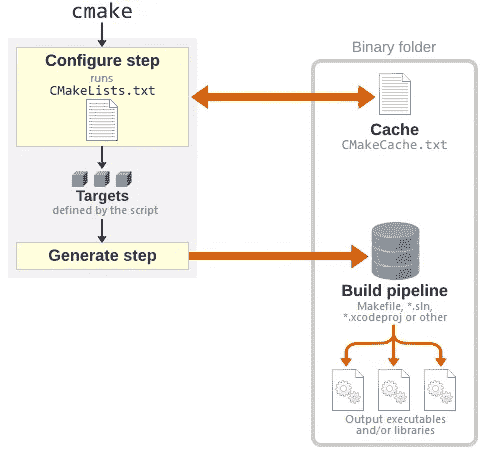

# 10 Cmake 提示和技巧

> 原文：<https://medium.com/codex/10-cmake-tips-tricks-7f00d407923d?source=collection_archive---------4----------------------->

## 让我们首先了解什么是建筑系统？

> 简而言之，buildsysytem 描述了如何使用自动化过程的构建工具从代码库构建项目可执行文件和相关库。

例如，Makefile 是一个 buildsystem，用作命令行生成工具或集成开发环境(IDE)的项目文件。为了避免维护多个这样的构建系统，项目可以使用用 CMake 语言编写的文件抽象地指定它的构建系统。



制作简单的流程图

# 构建阶段

完整的 CMake 构建由以下阶段组成:

1.  配置:CMake 执行 CMake 代码本身来创建一个构建配置。
2.  Generate: CMake 从配置中生成一个具体的构建系统(例如 GNU Makefiles 或者一个带有相关项目文件的 Visual Studio 解决方案)。
3.  编译:应用生成的构建系统最终编译并链接源代码。通常，CMake 本身并不参与此阶段，但生成的构建系统会检查是否有任何相关的 CMake 代码被更改，并在需要时触发另一次 CMake 配置运行。

# 提示和技巧

1.  add _ 子目录:根据文档，add _ 子目录应该只用于当前 CMakeLists 目录的子目录。但是有了特殊的考虑，你可以把它应用到当前目录之外的源，见[这里](https://stackoverflow.com/questions/7980784/cmake-add-sub-directory-which-is-not-sub-directory-on-real-%20directory#8349410)要考虑的事情。注意:add _ 子目录在作用域方面的行为与宏完全一样。所以要注意调用 cmakelist 的变量可能会被添加的 cmakelist 改变。
2.  aux _ source _ directory:aux _ source _ directory 将找到的源文件添加到传递的变量列表中。已经在变量列表中的源文件不变。如果您添加另一个带有 add_subdirectory 的 CMakeLists，该 CMakeLists 在其 aux_source_directory 调用中使用相同的变量，则必须特别考虑这一点。在这种情况下，变量累加所有源文件，因为 add _ 子目录没有自己的作用域。另外注意 aux_source_directory 不添加头文件。例如，如果您想应用 qt5_wrap_cpp 来调用头文件的 moc，这可能是一个问题。作为一种解决方法，使用 file(GLOB_RECURSE …直接搜索头文件。
3.  使用任意数量的参数调用函数或宏:可以使用任意数量的参数调用函数或宏，这些参数通过使用预定义变量${ARGV}或${ARGN}作为列表传递。＄{ ARGV }包含列表中的所有参数，而＄{ ARGN }仅包含未分配给命名参数的参数
4.  为 Visual Studio build 选择架构(x86 或 x64 ):如果在安装了 Visual Studio 2010 的 Windows 上调用 cmake 而不带任何其他选项，它会为 32 位版本(x86)创建项目文件。

> 要创建 64 位可执行文件，请相应地设置选项-G:

```
cmake -G "Visual Studio 10 2010 Win64" ..
```

> 由于 [CMake 3.13](https://stackoverflow.com/questions/28350214/how-to-build-x86-and-or-x64-on-windows-from-command-line-with-cmake#28370892) 有一个备选和首选选项-A 来选择平台架构:

```
cmake -G "Visual Studio 10 2010" -A x64 ..
```

不可能为两种架构都创建一个 VS 项目。如果你两个都需要，你应该创建两个构建文件夹，并用不同的体系结构设置每个文件夹。

5.“if”命令不起作用:用于确定是否应生成 Visual Studio 生成系统的 if 命令(if(MSVC))没有按预期起作用。事实证明，这需要一个预先的项目命令才能正常工作。因此，project 命令应该放在任何 include 命令之前(但是在 cmake_minimum_required 命令之后)。

6.由于错误而终止 CMake 运行:在出现致命错误后，CMake 不附带 exit 命令来终止 CMake 运行。用适当的消息终止 CMake 运行调用消息(FATAL _ ERROR“…”)。这将终止 CMake 运行，并在控制台中清楚地突出显示消息。

7.向 CMakeGUI 添加一个常规选项:option 命令允许向 CMake GUI 添加一个布尔选项，但不允许添加具有任意值的选项。添加非布尔选项是通过 set 命令及其缓存标志完成的，如 set docs 页面上的 Set Cache Entry 一节所述。除了一般的字符串，这样的选项可能是目录(路径)或文件(文件路径)类型。在这些情况下，CMake GUI 会提供一个目录/文件选择对话框。还可以提供可能的字符串值供选择。

8.调试技巧:带有 GNU Makefiles 的 Linux:

全局 make clean 会导致完全重建。如果您只想重新生成一个子目录，请转到您的构建文件夹中相应的子文件夹，并在那里执行 make clean，或者直接删除构建文件夹的子文件夹。将 VERBOSE=1 传递给 make 调用会让“make”打印出所有编译器和链接器调用。

9.包含保护:如果文件包含在几个地方，包含保护可以避免多次执行一个包含的文件。CMake 3.10 和更新版本为此提供了 include_guard 命令。对于较旧的 CMake，以下技巧会有所帮助。目标是全局定义的。如果包含的文件定义了一个名为 MyTarget 的目标，则将以下代码放在它的顶部:

```
if(TARGET MyTarget)
      return()
endif()
```

如果文件没有定义目标，您可以使用 add_custom_target 添加一个。如果不在其他地方使用，也不会有什么坏处。

10.CMake 和 VisualStudio:关于 Visual Studio 术语到 CMake 术语的映射，请参见[这里的](https://cognitivewaves.wordpress.com/cmake-and-visual-studio/)。

# 参考资料:

1.  [现代 CMake 简介](https://cliutils.gitlab.io/modern-cmake/)
2.  [制作参考文件](https://cmake.org/cmake/help/latest/)
3.  [有效的现代 CMake](https://gist.github.com/mbinna/c61dbb39bca0e4fb7d1f73b0d66a4fd1)
4.  [CMake 教程](/@onur.dundar1/cmake-tutorial-585dd180109b)

我希望至少这些建议中的一些能提供一些帮助，如果不是全部的话。请在下面的评论部分提供更多的建议。感谢您的阅读，如果这篇文章有用，请鼓掌。