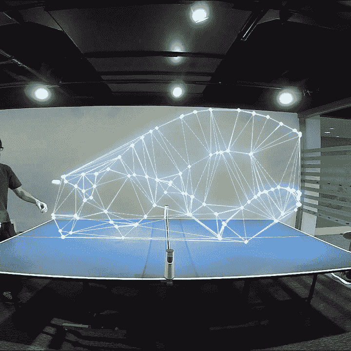

# 10 个计算机视觉创意

> 原文：<https://medium.com/codex/10-computer-vision-ideas-b13ebe0e4dfc?source=collection_archive---------1----------------------->

计算机视觉是机器学习的一个子集。很多时候，新用户会问他们如何开始使用计算机视觉。他们上课吗？看书？找教程？有这么多的途径可以开始，这可能是势不可挡的。而这取决于一个人的喜好和学习方式。我认为最好的方法是一头扎进去做点什么。找到你热爱的事情，开始做吧！

为了让你的创意源源不断，我整理了一份简短的计算机视觉项目清单，如果你需要一个起点，你可以利用它。下面是一些很棒的项目，突出了计算机视觉的一部分可能性。我希望通过阅读这个列表，你能从其中的一个或多个中得到启发。激发一个创造性的想法，你可以改变其中的一个，或者提出你自己的想法。

**计算机视觉项目概述**
1 .背景去除
2。为了好玩
3。动物
4。免提
5。可视化效果
6。用身体玩游戏
7。身体姿势检测
8。食物热量检测
9。魔方求解器
10。增强现实

**1。背景去除**

从图像中去除背景确实有广泛的应用。它非常适合向 photoshop 或其他图像编辑工具添加图像。有很多次，我需要分离出一个标志或物体，并将其添加到一个迷因或演示中。有相当多的开放项目利用了这个想法。查看下面可用的 github repos。我最喜欢的一个是 slack 机器人，它基于“爱德华剪刀手表情符号”来执行这个动作

Github 项目:[https://github.com/topics/background-removal](https://github.com/topics/background-removal)

**2。为了好玩**

计算机视觉项目并不总是必须有一个目的或为什么要做的原因。有时候做东西就是好玩。我非常兴奋地看到计算机视觉如何被应用到更有趣的游戏、玩具甚至艺术中。我真的相信，随着计算机视觉融入我们的现实，我们将在不久的将来看到艺术和游戏的未来发生变化。这个想法是基于一个视频教程，在这个视频教程中，用户不能够阅读手语，而是让它跟随他的指尖。

视频教程—[https://www.youtube.com/watch?v=01sAkU_NvOY](https://www.youtube.com/watch?v=01sAkU_NvOY)
Reddit 帖子:[https://www . Reddit . com/r/computer vision/comments/ouk 0 LV/when _ you _ get _ bored/](https://www.reddit.com/r/computervision/comments/ouk0lv/when_you_get_bored/)

**3。动物**

识别动物是机器学习的经典用例。从你不在家时照看你的宠物到确保你的宠物不会惹上麻烦。许多研究人员和学生还利用定制的计算机视觉模型来帮助拯救野生动物或进行野生动物研究。你认为如何利用定制模型来帮助动物保护？

这个例子的数据集似乎不再存在，但是在 Roboflow Universe 上有一个类似的数据集，例如一个[水族馆数据集](https://universe.roboflow.com/rajinder-kumar-m--math/aquarium-g74u2)

**4。免提**

一切似乎最终会变成免提或无线。这种类型的 CV 项目只是那种项目的自然发展。有一些非常酷的例子，可以创建不用手的计算机视觉程序来控制各种各样的物品。从乐器到游戏。接下来会是什么？免提操作系统？

项目网站:【https://handsfree.js.org/#installing 

**5。可视化**

这个项目是体育和艺术的结合，将两者融合在一起。这个例子跟踪乒乓球穿过桌子。然而，它也可以应用于许多其他运动。从英式足球到橄榄球、篮球或曲棍球，还有更多。这件事真正酷的地方在于，你也可以从中获得真知灼见。通过看到球去了哪里，人们可以学习如何在比赛中重新定位自己，允许更好的扣球，抢断和拦截，只是基于球在比赛中或对某个球队或对手的统计上可能去的地方。如果你想看这种计算机视觉项目的另一个例子。一定要看看这篇博文，它详细描述了 XXXXX [如何可视化足球比赛数据](https://blog.roboflow.com/ai-football-coach-playbook/)

乒乓球项目(付费课程):[https://note.com/tdsw/n/n7445bdbc907a](https://note.com/tdsw/n/n7445bdbc907a)足球数据
(免费):[https://blog.roboflow.com/ai-football-coach-playbook/](https://blog.roboflow.com/ai-football-coach-playbook/)

**6。用你的脑袋玩蛇**

博彩业正在迅速变化。我们如何控制视频游戏并与之互动一直在发展。从游戏机到电脑，再到手持设备，再到虚拟现实系统，接下来我相信会是计算机视觉。想象你是控制者。想象一下威尔拳击，但你手中没有控制器。没有什么能阻止你或束缚你。你觉得控制器会怎么进化？让我知道你的想法。

github:[https://github.com/paruby/snake-face](https://github.com/paruby/snake-face)

**7。身体姿势检测**

身体姿势是人类获得洞察力和更好地控制自己的另一种令人惊叹的方式。在计算机视觉的这个领域有很大的创新空间。举个例子，我希望看到一个无精打采的检测器，这样我就可以在坐下的时候改善我的姿势。这也是我从小玩体育时希望拥有的技术类型。

想象一下，练习你的运动，然后不仅可以回顾你自己的录像。但是无论你的状态是好是坏。通过确保你有良好和适当的状态，举重伤害可以大大减少。想象一个棒球运动员正在练习投球和击球。他们可以得到详细的例子，当他们的形式是关闭的，导致更少的权力。或者游泳者可以在练习之后或期间获得关于他们的划水形式的实时反馈。你能想到任何一项运动中，获得对个人状态的反馈会有所帮助吗？追踪运动员的运动可以改善他们的定位，这种运动怎么样？你想学习什么样的见解？

github:[https://github . com/tensor flow/tfjs-models/tree/master/pose-detection/src/pose net](https://github.com/tensorflow/tfjs-models/tree/master/pose-detection/src/posenet)

**8。食物热量检测**

卡路里，它们可能很美味，但也不健康。我不确定你是否曾经尝试过节食。但是以我的经验来看，节食一点也不好玩，但这不是重点。意想不到的部分和真正糟糕的是，几乎比吃不到你想吃的东西更糟糕的是你不得不做的持续跟踪。跟踪这个跟踪那个。写下你早餐、午餐和晚餐吃了什么，还有零食。累死人，超级费时间。然而，做这件事至关重要。如果你不记录你一天吃了什么，吃了多少卡路里，那么你就无法减肥。随着感恩节的临近，一个令人敬畏的项目将是建立一个卡路里估算应用程序。拍一张放满食物的盘子的照片，检测食物类型，然后在数据库中查找它们，得到每组食物的卡路里。您甚至可以更进一步，通过估计每种类型的服务数量以及增加输出的准确性。这是我在 reddit 上找到的一个闭源项目，但我链接了一个数据集，你可以用它来构建自己的数据集。

Reddit 帖子:[https://www . Reddit . com/r/computer vision/comments/or2s11y/I _ trained _ a _ model _ to _ do _ single _ photo _ calorie _ and/](https://www.reddit.com/r/computervision/comments/or2s1y/i_trained_a_model_to_do_single_photo_calorie_and/)
Github 数据集:[https://github.com/google-research-datasets/Nutrition5k](https://github.com/google-research-datasets/Nutrition5k)

**9。魔方求解器**

解决问题和玩游戏是一个伟大的计算机视觉项目。在这个例子中，用户 Herbert Kociemba 利用计算机视觉解决了一个魔方。这是一种流行的益智游戏，由 ernő·鲁比克于 1974 年发明。如果你有兴趣了解更多关于 Herbert 的 python 程序，一定要看看下面链接的 github 项目。

github:[https://github.com/hkociemba/RubiksCube-TwophaseSolver](https://github.com/hkociemba/RubiksCube-TwophaseSolver)

**10。增强增强现实(硬件)**

虽然不完全是计算机视觉，但我认为这个项目太酷了，更不用说。Triton 项目的 Gram over 一直在研究一种开源的可穿戴硬件。它利用现有技术创建了一个用户可以佩戴的增强现实耳机。这个开源项目真正酷的是，Gram 有可用的 3D 打印文件以及组装说明和软件指南！目前，该项目使用计算机视觉来检测佩戴者的手，以及他们在佩戴耳机时按下增强按钮的时间。我很兴奋地看到随着技术的进步和变得更加普遍，这将走向何方。

github:[https://github.com/atlee19/TritonProject](https://github.com/atlee19/TritonProject)克氏推特:[https://twitter.com/GrahamAtlee](https://twitter.com/GrahamAtlee)

我希望你喜欢这个计算机视觉项目和数据集的列表。希望它能启发你，或者引导你找到一个教程，教你如何做一些让你感兴趣的东西。如果你对这里没有列出的其他项目有想法，请在评论中或 twitter @once_upon_a_dev 上告诉我们。也许社区的另一个成员知道这样一个项目或数据集。如果没有，请随时开始开发您自己的！