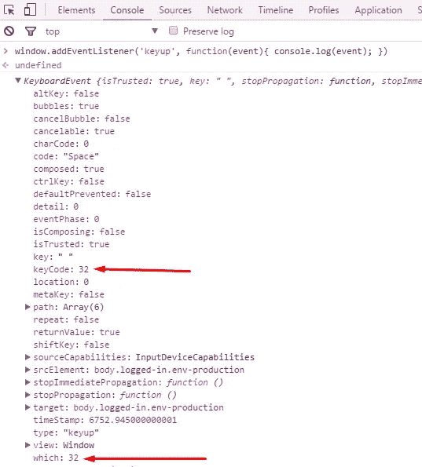

# 10 个快指——被黑

> 原文：<https://medium.com/codex/10-fast-fingers-hacked-b10903adca2a?source=collection_archive---------6----------------------->


10 个快速手指是一个网站，在这里你可以挑战你自己的能力(和其他人的能力)，用你的键盘快速打字。我试了一下，然后就沉迷其中，不知道为什么。我每天都打字。作为一名开发人员，我可以说，在开始工作之前，这可能是对您的手指很好的热身运动！

这里的代码是[这里的](https://github.com/ukaoskid/10fast-finger-hacked)。

# WPM 是什么？

**WPM** 是每分钟**字数**的缩写，所以，基本上，这个概念是不言自明的。为了测量这个因素，一个“单个单词”在 5 次击键中被标准化。这意味着每击 5 次键，你就写一个单词。例如，如果你输入`incredible`，从技术上来说，你写的是两个单词。

`incre (5) + dible (5) = 2 words`

一个好的打字员的平均速度是每分钟 50 到 80。现在你知道你是不是一个好孩子了。

## 记录

1.  最高的 WPM 比率是由 IBM 员工 Stella Pajunas-Garnand 拥有的。在 1946 年她达到了令人难以置信的 216 分钟的成绩；
2.  芭芭拉·布莱克本在耐力方面的每分钟得分最高。她用[德沃夏克简化键盘](https://en.wikipedia.org/wiki/Dvorak_Simplified_Keyboard)打出了**150 WPM**50 分钟，峰值 **212 WPM** 的成绩。

## 为什么要黑这个？

你知道，无聊是个坏伙伴。不，不，我只是在开玩笑。事实是，我有一群打字非常熟练的朋友，我们是两个蠢驴，所以，打败他们的唯一方法就是作弊。但是，嘿，别告诉任何人。

# 黑客

## 概念证明

由于要输入的单词不是图像，我们可以连接到 DOM 来获取每个单词的文本内容，并让我们的脚本在游戏输入字段中为我们输入。然后我们会通过触发`KeyboardEvent`来模拟空格键，让游戏跳到下一个单词。

## 绑定到游戏输入

使用浏览器开发工具，我们可以很容易地获得游戏输入字段的元素 ID。因为 jQuery 是在页面中定义的，所以很容易创建对它的引用:

```
**var** inputField = $('#inputfield');
```

## 模拟按空格键

每当用户在网页上按下一个键，就会触发一个`KeyboardEvent`。我们需要创建一个`keyup`类型的事件，并将其分配给空格键的键码，即 **32** 。为了获得这个值，我们可以使用一个简单的函数来记录一个`keyup`事件对象:

```
***window***.addEventListener('keyup', **function**(event) {
    ***console***.log(event);
});
```

如果我们按空格键，上面的脚本将使控制台日志变成一个`KeyboardEvent`。深入挖掘它的属性，找到我们需要的`keyCode`。



每次我们写完正确的单词，我们都会调用输入字段上的`.trigger()`方法，传递一个 [jQuery。类型为`keyup`的事件](http://api.jquery.com/category/events/event-object/)(与原生 DOM 事件非常相似)。我们将它存储一次，以避免在每个函数调用中重新创建它的实例:

```
**var** keyup = jQuery.Event('keyup');
keyup.which = 32;
```

## 用正确的词

因为`words`数组在全局范围内是可访问的，所以我们可以通过引用`window.words`来访问它。object 中的数组包含了你在运行过程中应该写的所有单词。它用于预测您应该“键入”的单词，以获得想要的结果。

## 延迟计算

延迟是一个单词和另一个单词之间必须经过的精确时间，以毫秒为单位。它是从达到您设置的结果所需的预期单词(`counter`变量)开始计算的。一次运行的标准时间为 60 秒，那么延迟计算为 59 秒，这样，最后一个“键入”的单词将总是准时。

```
**function** getDelay() {
    **return** ***Math***.ceil((59 / counter) * 1000);
}
```

## 模拟用户打字

一旦我们有了要输入的单词，我们将模拟在游戏输入栏中输入的每个字母。为了做到这一点，我们将使用`setInterval`，它每隔 N 毫秒执行作为第一个参数传递的函数，作为第二个参数传递。

```
**function** typeWordAndNext(word) {
    // split the word into an array of letters
    **var** chars = word.split('');
    **var** interval = setInterval(function() {
        **if** (chars.length) {
            /*
             * shift the chars array to remove the first letter it
             * and assign it to a variable in a single shot
             */
            **var** char = chars.shift();
            // update the input field value adding that letter
            inputField.val(inputField.val() + char);
        } else {
            // array is empty, clear this interval to stop its exec
            clearInterval(interval);
            // trigger the spacebar keyup to jump to the next word
            inputField.trigger(keyup);
        }
    }, 30); // type each letter every 30ms
}
```

# 参考

*   [https://en.wikipedia.org/wiki/Words_per_minute](https://en.wikipedia.org/wiki/Words_per_minute)
*   [https://en.wikipedia.org/wiki/Typing#Alphanumeric_entry](https://en.wikipedia.org/wiki/Typing#Alphanumeric_entry)
*   [https://en.wikipedia.org/wiki/Dvorak_Simplified_Keyboard](https://en.wikipedia.org/wiki/Dvorak_Simplified_Keyboard)
*   [http://www.owled.com/typing.html](http://www.owled.com/typing.html)