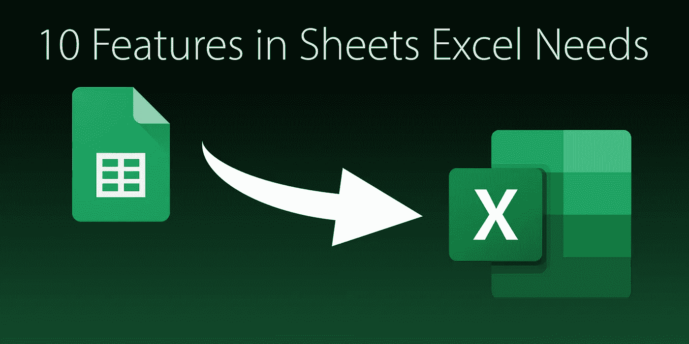

# Excel 需要工作表中的 10 个功能

> 原文：<https://medium.com/codex/10-features-in-sheets-excel-needs-9e868126856f?source=collection_archive---------3----------------------->

## 微软的竞争对手在几个领域表现更好

  E   xcel 是电子表格王国的庞然大物。在每个国家的长度和宽度，它至高无上。作为市场领导者，自 1995 年废除现已不存在的 Lotus 1–2–3 以来，该程序一直处于竞争的垄断地位。