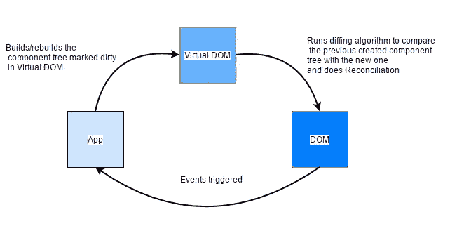

# 作为你的女朋友，10+基本的方法！

> 原文：<https://medium.com/codex/10-fundamental-things-to-approach-react-as-your-girlfriend-c0ef99e16910?source=collection_archive---------8----------------------->


反应

首先，把自己想象成一个想要女朋友的孤独不酷的男生。然后，你认识了一个叫 **REACT** 的女孩。她是如此的酷和吸引人，以至于你疯狂地想让她成为你的女朋友。但是，你是一个不知道如何接近她的怪胎。

**嗯！我为什么在这里？我会让你成为 React 的完美男友。为了做到这一点，我会教你一些基本的和独特的东西，这样你就可以无所畏惧地接近她，还会教你一些赢得她的心的技巧。所以，让我们开始吧！**

# 谁在作出反应？她的背景是什么？

**React** 是一个用于构建用户界面的 JavaScript 库。她是 web 应用程序的视图层。不像典型的孟加拉女孩那样的框架，你和她在一起不用被限制和绑定某些规则。你可以享受按照自己的思维方式做出很酷的特征，因为她不会叫，而且她很灵活。她总是专注于一件事，那就是构建界面。如果没有 React 或类似的库，我们将需要用本地 Web APIs 和 JavaScript 手动构建 ui，这并不容易。但是她让我们变得简单、快速和灵活。她是独一无二的，有吸引力的，因为她与虚拟世界一起工作，这使她比其他人更特别。

好了，玩笑时间结束！现在，让我们认真了解一下 React。

# **为什么 React 与其他库不同？**

React 不同于其他库，因为它在开发者和浏览器之间创建了一种通用语言。它允许我们开发人员描述 ui 并管理状态上的动作，而不是对 DOM 元素采取动作。它只是用户界面的语言。当该状态发生任何动作时，React 会根据以前的变化有效地更新 DOM 中的 ui。React 用虚拟 Dom 做到了这一点。

# 虚拟世界和差异是如何起作用的

与它的许多前辈不同，React 不是直接在浏览器的文档对象模型(DOM)上运行，而是在一个虚拟 DOM(T11)上运行。要理解虚拟 DOM，首先需要了解实际 Dom 是如何工作的。


DOM 如何工作

当我们编写代码来开发 web 应用程序时，HTML 和 CSS 由解析器解析，并通过一些过程创建一个框架树。然后它创建一个带有样式的布局并显示它。构建布局的整个过程是在浏览器中的 DOM 进程下进行的。虚拟 DOM 做同样的事情，但实际上是反作用的。



反应虚拟 Dom 和差分过程

基本上，React App 虚拟地创建了一个虚拟 Dom，当任何东西被改变时，它通过一些不同的算法来与以前的改变进行比较，并进行协调。在这个过程之后，它只在有实际变化的节点及其子节点上更新实际的 DOM。React 虚拟 DOM 完全存在于内存中，是 web 浏览器 DOM 的一种表示。因此，当我们编写一个 React 组件时，我们并不是直接写入 DOM，而是编写一个虚拟组件，React 将转换为 DOM。这是让 React 更受欢迎的一个优点。

# 什么是 JSX？

当我们作出反应时，JSX 这个词是不可避免的。我们所有的 React 组件都有一个 Render()函数，它指定 React 组件的 HTML 输出是什么。JavaScript 扩展，或者更常见的 **JSX** ，是一个 React 扩展，允许我们编写看起来像 HTML 的 JavaScript。React 和浏览器不需要处理 JSX，因为编译器会处理它。将一种形式的语法翻译成另一种形式的编译器被称为“翻译程序”。要翻译 JSX，我们可以使用通天塔或打字稿。例如，jsComplete playground 使用 TypeScript 来传输您放入其中的任何 JSX。当您使用 create-react-app 时，生成的应用程序将在内部使用 Babel 来传输您的 JSX。

# 反应组分

组件就像函数和返回 HTML 元素的独立且可重用的代码。它们的作用与 JavaScript 函数通过 render()函数返回 HTML 相同。组件让你的代码更具 T4 可读性，更容易使用。简单地说，组件是一个 JavaScript 类或函数，它可以选择接受像属性(props)这样的输入，并返回一个描述 UI 的某个部分应该如何显示的 React 元素。有两种类型的组件，

1.  *类组件*
2.  *功能组件*

# **类组件**

这些组件是使用 ES6 的类创建的。它们有一些额外的特性，比如处理 onClick 事件的方法、本地状态和其他功能。

最简单形式的类组件:

```
**class** Greeting **extends** React.Component {
  **render()**{
    **return** **<h1>**Hi, I’m a smart component!**</h1>**;
  }
}
```

# 功能成分

这些组件简单地由一个函数表示，该函数可以选择接受 props 并返回一个 React 元素以呈现给页面。您可能会发现功能组件被称为无状态的或表示性的。

=> **功能性**因为它们基本上都是功能

=> **无状态**因为它们不持有和/或管理状态

=> **表示性的**因为它们所做的只是输出 UI 元素

最简单形式的功能组件如下所示:

```
**const** Greeting = () => **<h1>**Hi, I’m a dumb component!**</h1>**;
```

# 小道具

Props 是传递给 React 组件的参数。它们就像 JavaScript 中的函数参数*和 HTML 中的*属性。

```
const Welcome = (props) => {
  return <h1>Hello, {props.name}</h1>;
}

const App = ()=> {
  return (
    <div>
      <Welcome name="Sara" />      
      <Welcome name="Cahal" />      
      <Welcome name="Edite" />    
    </div>
  );
}
```

如你所见，我们可以将属性作为对象传递给子组件，并通过 props(properties)接收它以供使用。Props 更像是组件之间的网线。

# 反应钩

钩子是 React 16.8 版本中引入的新特性。它允许您在不编写类的情况下使用状态和其他 React 特性。它在类内不起作用。如果你写了一个函数组件，然后你想给它添加一些状态，以前你是通过把它转换成一个类来实现的。但是，现在您可以通过在现有的函数组件中使用一个钩子来实现。所有的钩子函数都是以“使用”这个词开始的。当你用钩子做事情的时候，它是非常强大的，没有限制的。

React 应用程序中有一种重要的钩子类型和声明状态的新方法。Hook 使用 useState()函数组件来设置和检索状态。让我们通过下面的例子来理解钩子状态:

```
**import** React, { useState } from 'react';const App = ()=> {   const [count, setCount] = useState(0);return (
    <div>
     <p>You clicked {count} times</p>
     <button onClick={() => setCount(count + 1)}> Click me </button>   
    </div>
  );
}
export **default** App;
```

输出是:


还有很多钩子，比如 useEffect、useContext、useReducer、useRef、useMemo 等等。

# 反应组件生命周期

在 React 中，每个组件创建过程都包含各种生命周期方法。这些生命周期方法被称为组件的生命周期。这些生命周期方法并不复杂，并且在组件生命周期的不同点被调用。组件的生命周期分为**四个阶段**。它们是:

1.  初始相位
2.  安装阶段
3.  更新阶段
4.  卸载阶段

每个阶段都包含一些特定于该特定阶段的生命周期方法。让我们逐一讨论这些阶段:

# 1.初始相位

这是生命周期的**诞生**阶段。在这里，组件开始了通向 DOM 的旅程。在这个阶段，组件包含默认的道具和初始状态。初始阶段只出现一次，由以下方法组成。

*   **getDefaultProps()**
    它用来指定道具的默认值。它在组件的创建或来自父组件的任何属性被传递给它之前被调用。
*   **getInitialState()**
    它用来指定状态的默认值。它在创建组件之前被调用。

# 2.安装阶段

在这个阶段，组件的元素被创建并插入到 DOM 中。它由以下方法组成:

*   **componentWillMount()**
    在组件呈现到 DOM 之前立即调用。在这种情况下，当您在该方法中调用 **setState()** 时，组件将不会**重新呈现**。
*   **componentDidMount()**
    在组件被渲染并放置在 DOM 上后，立即调用这个函数。现在，您可以进行任何 DOM 查询操作。
*   **render()**
    这个方法在每一个组件中都有定义。它负责返回一个根 HTML 节点元素。如果不想渲染什么，可以返回一个 **null** 或者 **false** 值。

# 3.更新阶段

这是 react 组件生命周期的下一个阶段。这里，我们得到新的**道具**并改变**状态**。这一阶段允许处理用户与组件从父订单到子订单的通信。这个阶段的主要目标是确保组件显示其自身的最新版本。与出生或死亡阶段不同，这个阶段会一次又一次地重复。这个阶段由以下方法组成。

*   **componentwillreceiveprops()**
    当一个组件接收到新的道具时调用。如果您想要更新状态以响应属性更改，您应该使用 **setState()** 方法比较 props 和 nextProps 以执行状态转换。
*   **shouldComponentUpdate()**
    当一个组件决定对 DOM 进行任何更改时，它被调用。它允许您控制组件自我更新的行为。如果此方法返回 true，组件将更新。否则，组件将跳过更新。
*   **componentWillUpdate()**
    它在组件更新发生之前被调用。这里不能通过调用 **setState()** 方法来改变组件状态。如果**shouldComponentUpdate()**返回 false，则不会调用它。
*   **render()**
    调用它来检查 **props** 和 **state** 并返回以下类型之一:React 元素、数组和片段、布尔值或 null、字符串和数字。如果 shouldComponentUpdate()返回 false，render()内的代码将被再次调用，以确保组件正确显示自身。
*   **componentDidUpdate()**
    在组件更新发生后立即调用。在这个方法中，您可以将任何想要在更新发生时执行的代码放入其中。初始呈现时不会调用此方法。

# 4.卸载阶段

这是 react 组件生命周期的最后阶段。当一个组件实例被从 DOM 中**销毁**和**卸载**时，它被调用。这个阶段只包含一种方法，如下所示。

*   **componentWillUnmount()**
    在组件被永久销毁和卸载之前，立即调用该方法。它执行任何必要的与**清理**相关的任务，比如使计时器失效、事件监听器、取消网络请求或者清理 DOM 元素。如果组件实例被卸载，则不能再次装载它。

# 反应优化性能

在生产 React 应用程序之前，优化性能是一个需要考虑的重要过程。有多种优化 React 应用程序的方法可以显著提高应用程序的速度和整体用户体验。虽然有许多方法可以优化性能，但今天我将使用 3 个简单的过程作为示例:

**使用 React。片段，以避免向 DOM 添加额外的节点**

使用 React。Fragment 不会向 DOM 添加任何额外的节点，并且在大型应用程序中会提高一些速度。语法如下所示:

```
const Columns = () => {
  return (
    <React.Fragment>
      <td>Hello React!</td>
      <td>Hello React Again!</td>
    </React.Fragment>
  );
}
```

您也可以使用短语法`<></>`来声明一个片段。

```
const Columns = () => {
  return (
    <>
      <td>Hello React!</td>
      <td>Hello React Again!</td>
    </>
  );
}
```

**使用生产版本**

优化 React 应用程序的另一种方法是确保在部署之前将应用程序捆绑到生产环境中。这在你开发的时候非常有用，但是它会使你的应用程序变得很大，响应速度比平时慢。如果您的项目是使用 create-react-app 构建的，您可以通过在部署之前运行“npm run build”来解决这个问题，这将在“build”文件夹中创建您的应用程序的生产就绪版本，然后您可以进行部署。你可以使用“react 开发者工具”(React 开发者的 chrome 扩展)来确认你的应用是处于开发模式还是生产模式

**使用 react-window 虚拟化大型列表**

当您想要渲染大型表格或数据列表时，它会降低应用程序的性能。在 react-window 和 react-virtualized 等库的帮助下，虚拟化可以在这种情况下提供帮助。它们通过仅呈现列表中当前可见的项目来帮助解决这个问题，这允许高效地呈现任何大小的列表。

所以，这是一些让你的女朋友做出反应的技巧和旅行哈哈！

我知道这不是很多，但我会收集更多的信息，并在未来写更多的关于 react 的易懂的博客。