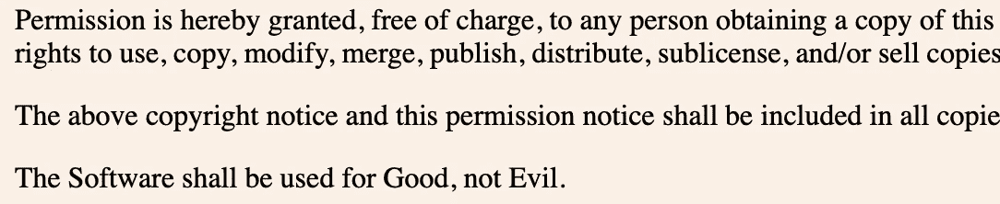

# 10 个有趣和荒谬的软件许可证，让你的一天

> 原文：<https://medium.com/codex/10-funny-and-absurd-software-licenses-that-will-make-your-day-ca371c404a2a?source=collection_archive---------2----------------------->

## 其中一些很搞笑

软件许可证是管理软件使用或再分发的法律工具。软件许可证通常向最终用户提供获得一个或多个软件副本的权利，而不会侵犯版权。许可证还规定了签订许可协议各方的责任，并可能对软件的使用方式施加限制。

一些最著名的开源许可按照风险增加(因此可用性降低)的顺序是— [MIT 许可](https://opensource.org/licenses/MIT)、 [GNU 通用公共许可 2.0](https://www.gnu.org/licenses/old-licenses/gpl-2.0.en.html) 、 [Apache 许可 2.0](https://www.apache.org/licenses/LICENSE-2.0) 等。

虽然这些都是常用的，这里有一些真正随机和奇怪的许可证，会让你去 LOL！

# 1.被动积极许可😐

这个[许可](https://github.com/ErikMcClure/bad-licenses/blob/master/passive-aggressive-license)允许你复制、修改或分发源代码或编译后的二进制文件，但是**不允许你运行**程序。

# 2.非白人-异性恋-男性执照👩🏻‍❤️‍👨🏻

这个[许可证](https://github.com/ErikMcClure/bad-licenses/blob/master/Non-White-Heterosexual-Male.md)让任何不是**白人异性恋男性**的人做他们想做的事情。否则你必须遵守许可证中规定的规则。

# 3.烫手山芋许可证🥔

该[许可](https://github.com/ErikMcClure/bad-licenses/blob/master/hot-potato-license) **将整个项目的专有所有权**转让给提交最后变更的人。

# 4.JSON 许可证*👩🏻‍💻

这个[许可证](https://github.com/ErikMcClure/bad-licenses/blob/master/JSON-License.md)是一个麻省理工学院式的许可证，带有一个道德条款，声明“软件应该用于正义，而不是邪恶。”当然，善恶是主观的，所以这在法律上充其量是不可执行的，可能允许也可能不允许作者以任何理由起诉你。

> 有一个非常有趣的故事，讲的是 IBM 如何承认它的软件可能被用于邪恶的目的！请在本文末尾阅读相关内容。

# 5.除了理查德·斯托曼，任何人都无权许可⛔️

这个[许可](https://github.com/ErikMcClure/bad-licenses/blob/master/ABRMS-license.md)保证了任何人都可以用这个软件做任何他们想做的事情，**除了理查德·斯托尔曼**，他不能以任何方式使用或重新发布这个软件。

# 6.Bantown 公共许可证🔪

这个[许可](https://github.com/ErikMcClure/bad-licenses/blob/master/Bantown-public-license)对于你如何使用软件是非常宽容的，只要你按照美国刑法**至少犯了 3 次刑事罪**！下面举几个例子！

# 7.Sltar 许可证👹

这个[许可](https://github.com/ErikMcClure/bad-licenses/blob/master/sltar)确保使用一个软件需要把你的第一个孩子交给作者，这样他们就可以**把它献给魔鬼**。

# 8.卡塔罗斯许可证😇

这个[许可](https://github.com/ErikMcClure/bad-licenses/blob/master/katharos-license.md)要求宗教**纯洁**并且要求使用**好**如《圣经》66 卷所定义的那样，在你可以用软件做任何事情之前。

# 9.邪恶许可证😈

一个[许可证](https://github.com/ErikMcClure/bad-licenses/blob/master/evil-license)，只允许你使用程序**用于邪恶的目的**，它提供了一些有用的例子。

# 10.不要问我任何关于许可证的事情🤷🏻‍♂️

一个允许任何人做他们想做的事情的许可证，前提是他们永远不要就许可证涉及的任何事情联系作者。

现在谈谈 JSON 许可——IBM 的故事。道格拉斯·克洛克福特在 JSON 许可中加入了以下条款:软件应该被用于正义，而不是邪恶。这摘自一个关于 JSON 历史的技术讲座。

*大约一年一次，我收到一位律师的来信，每年都是不同的律师，在一家公司——我不想说出他们的名字让公司尴尬，所以我只说他们名字的首字母——IBM…*

*【笑声】*

说他们想用我写的东西。因为我现在把这个放在我写的所有东西上。他们想在他们写的东西中使用我写的东西，他们非常肯定他们不会用它来做坏事，但他们不能肯定地说他们的客户。所以我能给他们一个特别的许可证吗？

当然可以。所以我回信了——这确实发生在两周前——“我允许 IBM、它的客户、合作伙伴和爪牙使用 JSLint 作恶。”

*【笑声和掌声】*

*律师回信说:“非常感谢，道格拉斯！”*

本文到此为止。如果你喜欢它，并想看看更多的**坏**许可证，然后访问这个仓库。它启发了文章，所以别忘了活出明星！⭐️

 [## GitHub-ErikMcClure/bad-licenses:荒谬的开源许可概要。

### 荒谬的，有趣的，彻头彻尾的坏许可证简编。此处提供了一个目录，包括标题和…

github.com](https://github.com/ErikMcClure/bad-licenses) 

如果您有任何问题或建议，请随时联系我。你可以在这些社交媒体平台上关注我——[LinkedIn](https://www.linkedin.com/in/ab-satyaprakash/)， [YouTube](https://www.youtube.com/channel/UCJ6D0HS8c9Il-eX5lGbAyGg) ， [Twitter](https://twitter.com/AbSatyaprakash) ， [Instagram](https://www.instagram.com/absatyaprakash/) 了解更多更新内容！

**一如既往！黑客快乐！😇**

[加入我的电子邮件列表，获得更多精彩的教程和编程博客](https://absatyaprakash01.medium.com/subscribe) ❤️