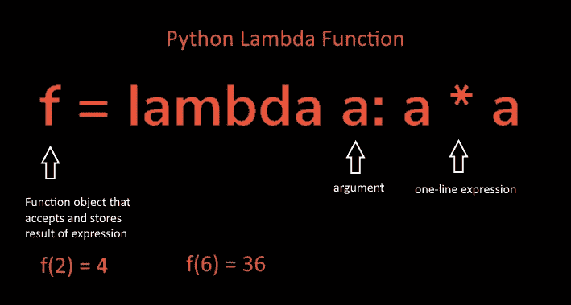

# 10 个用于 Lambda 函数的 Python 一行程序

> 原文：<https://medium.com/codex/10-python-one-liners-for-lambda-functions-4643bc5a9ea2?source=collection_archive---------1----------------------->

Python lambda 函数总结的一个例子。

## λ函数的背景

通常，Python 中的函数使用`def`语句。Python 还提供了生成函数对象的表达式形式。但是，它返回函数，而不是将函数赋值给 name。这就是为什么它们被称为*匿名*(未命名)函数或λ函数。这个名字的起源来自于 Lisp 语言中的一个类似的工具…