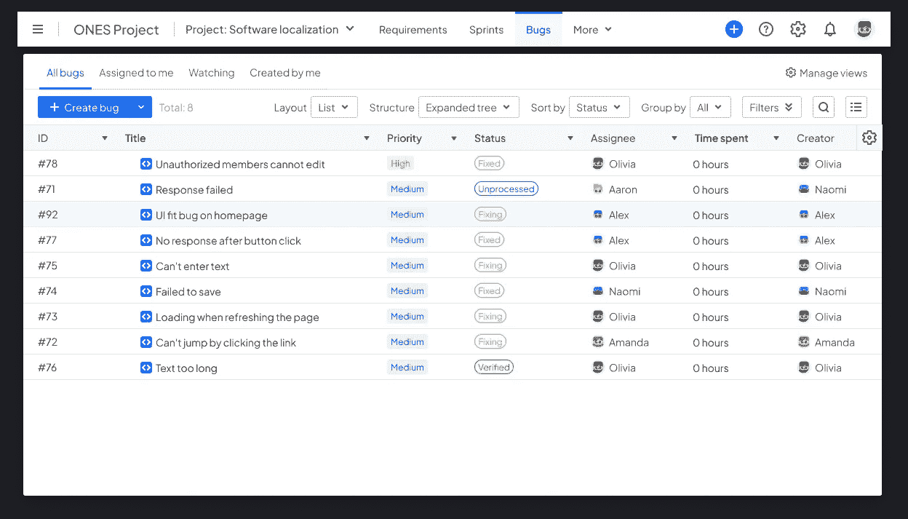
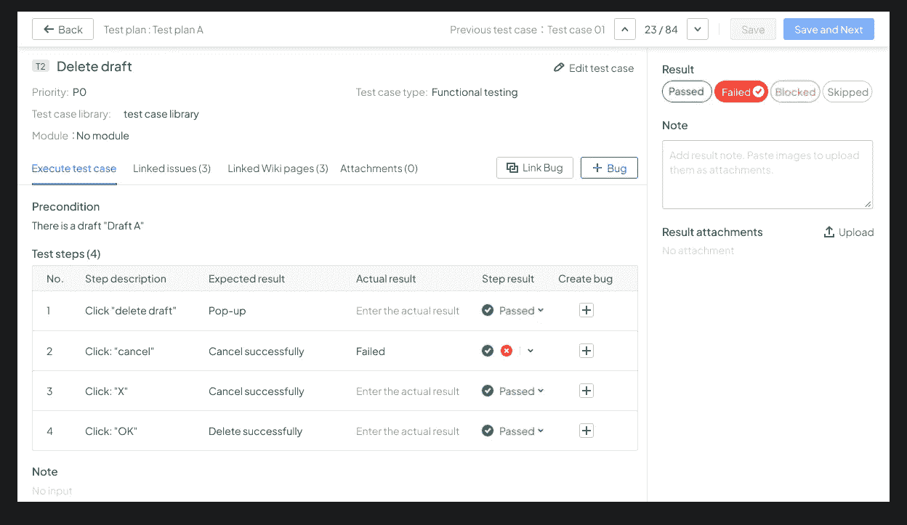
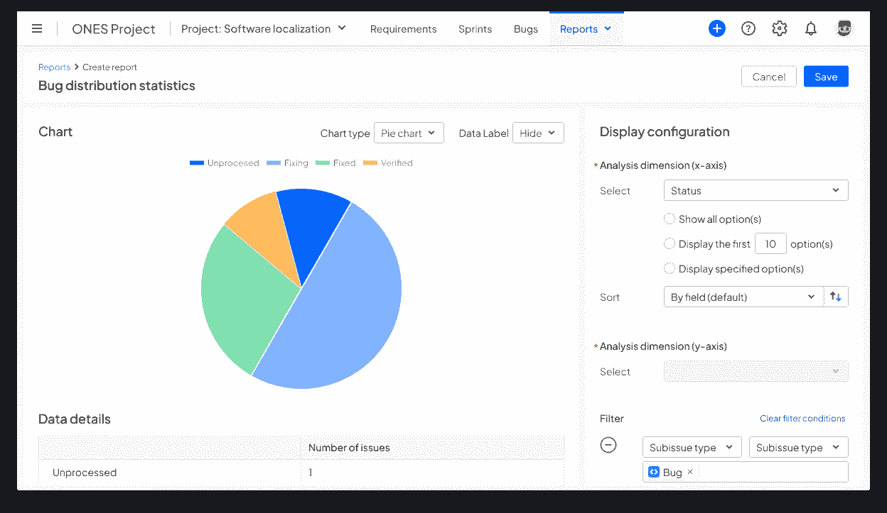

# 有效管理 Bug 的 10 个秘密

> 原文：<https://medium.com/codex/10-secrets-of-effective-bug-management-d8bdabd0f294?source=collection_archive---------6----------------------->

标准化的 **bug 管理**流程可以最小化 bug 的概率，缩短 bug 解决的时间，减少 bug 的负面影响。投资 [**bug 管理**](https://ones.com/products/testcase) 可以减少因缺乏标准化流程而造成的人力、财力、时间的浪费。

# Bug 预防

通常，越早检测到缺陷，风险可能越低。发现错误越晚，查找原因和修复错误的成本就越高，修复过程中出现新问题的可能性也越大。在需求分析和开发过程中，可以通过几种方式来防止错误:

## 1.在需求分析中

准确识别需求中是否存在风险、遗漏或不清楚的描述；确保开发和测试团队中的每个人都对需求有相同的理解；澄清任何疑问，并在第一阶段发现隐藏的错误。

## 2.在开发过程中

开发人员可以通过代码审查、单元测试和静态代码检查，在早期发现并修复问题。

# 缺陷识别

## 1.使用错误管理工具

测试人员基于现有的测试计划和测试用例执行测试。如果测试失败，它将被转换为一个 bug 并提交给开发人员。

bug 也可能来自用户或操作人员的反馈。使用集中的 bug 提交系统可以有效地管理来自多方的 bug，这也缩短了开发人员识别 bug 的时间。

## 2.识别真正的 bug

一旦提交了一个 bug，开发团队首先评估它是一个真正的 bug，还是仅仅是由缓存、不良网络连接或误操作引起的问题。如果不是，开发人员将其标记为“拒绝”，并将其发送回测试团队，他们应该重做测试或添加更多的错误信息。

# 错误修复

## 1.优先处理 bug

和大多数事情一样，收益递减规律也适用于 bug 修复:有限的资源应该投入到回报最高的 bug 修复中。因此，在修复之前，应该优先处理 bug。优先顺序通常由以下两个方面决定:

*   影响范围:可能受到影响的用户数量或系统功能。
*   严重性:错误的重要性，例如数据丢失或系统损坏。

## 2.同步错误状态

一旦确定了优先级，就可以根据定义的修复计划开始修复。当它完成时，修复信息应该通过 bug 管理工具及时地与测试人员和用户同步。

# 错误分析

Bug 分析旨在通过跟踪和分析 bug 产生的原因，反思 bug 产生的各个阶段，持续改进 bug 管理流程。缺陷分析报告由四部分组成:

## 1.错误描述

应该描述 bug 出现的环境及其影响。环境要有详细的图片或日志描述，影响要从多个维度分析。

## 2.Bug 重现路径

应该提供 bug 重现路径的完整描述，例如，在工作流程图中，清楚地指出每个步骤。

## 3.bug 的原因

可以使用 5W1H 方法(谁、什么、何时、何地、为什么和如何)来分析环境和 bug 重现路径，以确定 bug 的原因，并确定在未来的开发和测试过程中需要特别关注的区域。

## 4.反射

在微观层面，要检查 bug 是否已经解决，要进行全方位的代码验证，要运行相关模块的联动测试。而在宏观层面上，也应该总结过去类似的 bug 和相关的结构，以改进 bug 管理过程。

*原载于 2022 年 11 月 12 日*[*【https://blog.ones.com】*](https://blog.ones.com/10-secrets-of-effective-bug-management)*。*