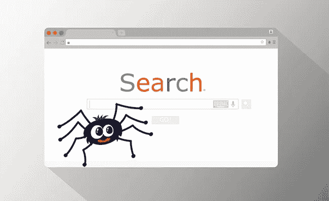
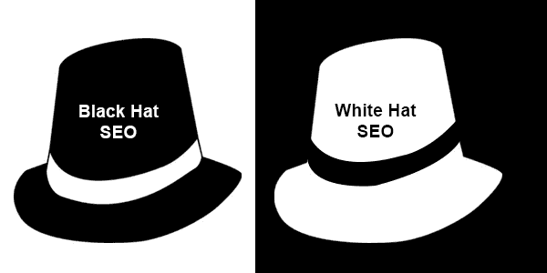

# 初学者应该知道的 10 个 SEO 术语

> 原文：<https://medium.com/codex/10-seo-terms-beginners-should-know-c1501267c2c5?source=collection_archive---------12----------------------->

# 1.搜索引擎优化

SEO 是基于对搜索引擎的吸引力和可见性来优化内容，以便网页可以被搜索引擎选择。SEO 主要用于提高有机列表的排名。我用 SEO 这个术语来描述我推荐的技能，但是它们中的许多也可以归入搜索引擎营销(SEM)的范畴。SEM 是通过搜索的所有技术，SEO 只是其中的一部分。现在很多广告主或者企业，比如厦门二手网，资讯，医疗等。，通过搜索竞价排名进行营销，属于 SEM.1 领域

在 [Unsplash](https://unsplash.com?utm_source=medium&utm_medium=referral) 上 [Merakist](https://unsplash.com/@merakist?utm_source=medium&utm_medium=referral) 拍摄的照片

# 2.搜索引擎蜘蛛

爬虫在网上漫游，寻找要添加到搜索引擎索引中的列表。爬虫有时也被称为网络爬虫或机器人。为有机列表优化你的页面也是为了引起爬行者的注意。

[搜索引擎蜘蛛](https://www.wordtracker.com/academy/seo/site-optimization/google-site-indexing)

# 3.黑帽搜索引擎优化

使用垃圾技能来欺骗搜索引擎。黑帽 SEO 使用伪装、欺诈和窃取来获得 SERPs 中的高排名。

[黑帽 SEO vs 白帽 SEO](https://marketingspecial.medium.com/what-is-black-hat-and-white-seo-and-white-hat-vs-black-hat-seo-technique-f6202e404deb)

# 4.白帽搜索引擎优化

优化你的网站的正确方法是让它对用户更好，吸引爬虫的注意。在白帽 SEO 中，任何能带来良好用户体验的东西都被认为是对 SEO 有益的。

# 5.关键词

搜索营销人员希望搜索者作为搜索请求经常输入的特定单词或短语。

# 6.关键词密度

也称为术语密度，它是特定搜索请求的术语在网页上所有术语中的比率。例如，如果您想要一个 200 字的页面，其中包含关键字“found ”,并且该字在页面上出现了 12 次，则该字在页面上的关键字密度为 6% (12/200)。搜索引擎通常认为关键词密度为 6-7%的页面是非常高质量的页面。(关键词密度较高的页面有作弊嫌疑。)

# 7.关键词加载，关键词填充

一种欺骗技术，通过这种技术，关键字被过度使用，只是为了吸引搜索引擎。

# 8.关键词放置

也称为术语位置，衡量网页上单词位置的价值。在网络上，所有的词并不都是平等的。页面标题或者舞台标题中的单词比文本舞台中的单词更重要——这些单词的位置就是它的度数。

# 9.关键词突出

它是对网页上词的位置和方向的一种度量，表明对搜索引擎的价值。最突出的关键词位置是页面标题的第一个字，因为标题放在了最好的位置；

# 10.关键词、关键术语和关键短语

关键词、关键术语和关键短语是网站在搜索引擎结果页面(也称为 SERPs)上排名的依据。根据站点的受众，您可以选择单个单词、单词组合或整个短语。

如果有人有兴趣知道他们的网站在谷歌上的表现，或者他们想在谷歌上排名靠前。我每个月都做免费的搜索引擎优化审计，给他们的网站提供改进和增加流量的建议。如果感兴趣，请发邮件给我你的网站。