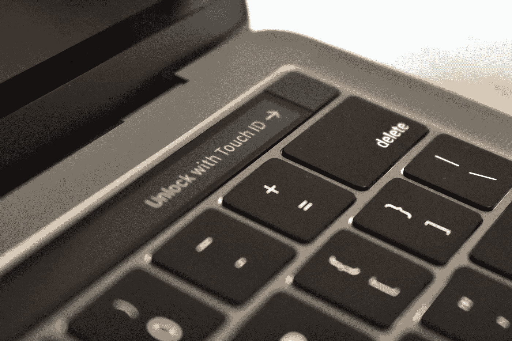

# 保护 Mac 的 10 个简单步骤

> 原文：<https://medium.com/codex/10-simple-steps-to-secure-your-mac-4a7971770280?source=collection_archive---------8----------------------->

无论你是 Mac 的长期用户，还是刚刚接触苹果发布的最新机型，遵循以下 10 个安全步骤将有助于保护你的 Mac。

本文适用于 Mac OS Monterey 和 Mac OS Ventura，并且可能在将来仍然有效。

保护您的 Mac

## I .配置您的触控 ID