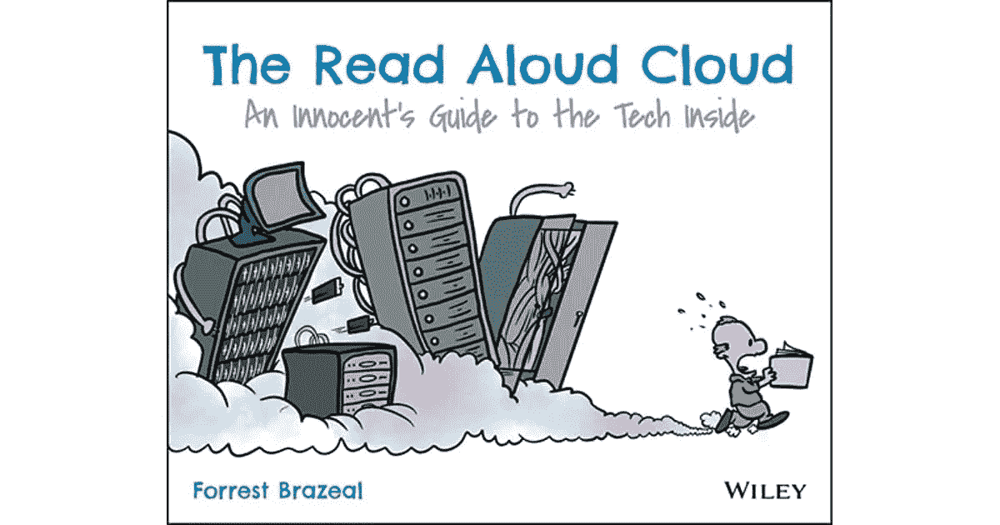
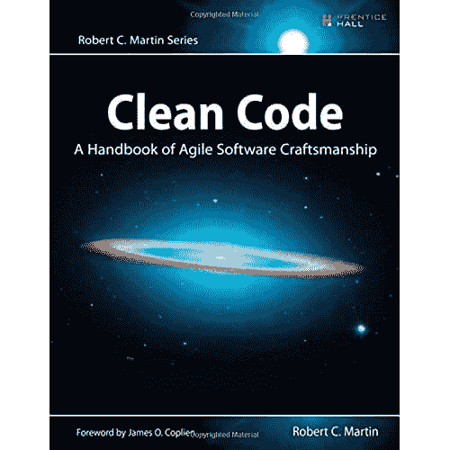
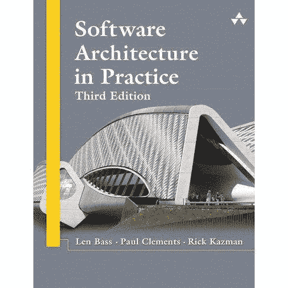
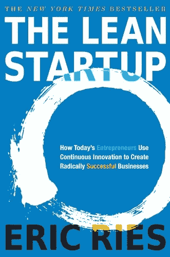
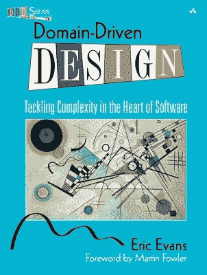
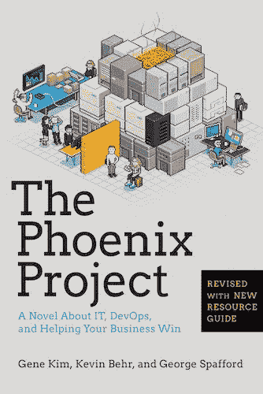
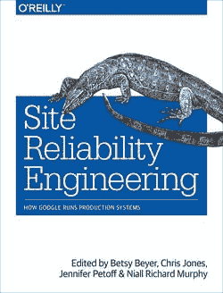
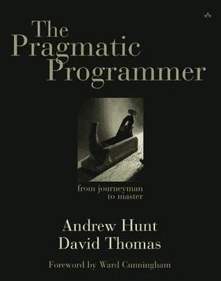
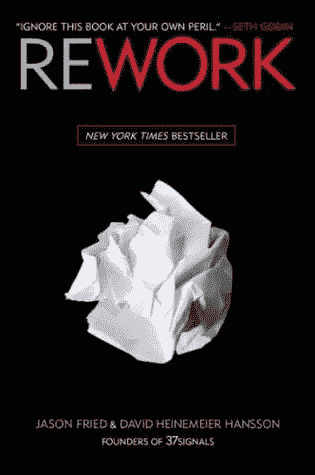
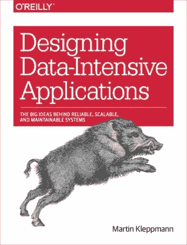

# 2021 年你应该阅读的 10 本软件工程书籍

> 原文：<https://medium.com/codex/10-software-engineering-books-to-read-in-2021-181a4f093e60?source=collection_archive---------0----------------------->

## 软件工程书籍

## 关于下次禁闭时读什么的建议

随着 2020 年尘埃落定，新的一年开始，很明显，我们将再次在室内度过年初的大部分时间。还有什么比学点东西，读本书更好的方式来度过呢？

在这篇文章中，我将与你分享 10 本你应该在 2021 年阅读的书，如果你对软件工程感兴趣的话。有些书是相当技术性的，但总的来说，清单应该对任何人都是开放的。这份清单并不是按照从好到坏的顺序排列的，而是按照这些书出现的顺序排列的。我们开始吧！

# 《朗读云》

从一些轻松的东西开始，*Forrest Brazeal 的朗读云*将自己描述为*一个了解内部技术的天真指南。*如果你从未听说过“云”及其含义，这本书就是为你准备的！

《朗读云》作者[阿甘厚颜无耻](https://twitter.com/forrestbrazeal?s=20)

这本书完全用韵文和漫画写成，解释了云是如何在引擎盖下工作的，以及人们如何保持它的工作。这听起来可能有点傻(有时确实如此)，但这本书确实很好地解释了技术概念，即使你没有这方面的背景知识。这也是一个很好的谈话开始，向你的父母或配偶解释你整天在电脑前做什么是很棒的。

# 干净的代码

罗伯特·c·马丁(更为人熟知的名字是“鲍勃叔叔”)的《干净的代码》被许多人认为是软件开发人员的经典读物。这本书提炼了什么是干净的代码以及如何编写它。干净的代码很重要，因为这是我们对抗混乱的唯一武器。如果你曾经发现自己在无数个重写遗留代码库的项目中，却发现自己又在写一堆乱七八糟的东西；这本书给你。

罗伯特·c·马丁[编写的干净代码](https://twitter.com/unclebobmartin?s=20)

虽然我要引用作者的话来警告你:“*读这本书的时候做好努力的准备。这不是一本你可以在飞机上读，在着陆前读完的感觉良好的书。这本书会让你很努力很努力。”*

# 实践中的软件架构

不管你的角色是什么，在你职业生涯的某个时刻，你都会遇到软件架构。这是一个复杂的领域，有很多问题:象牙塔建筑师、T2、大泥球、瀑布项目的趋势等等。这就是为什么我认为让人们接受超越设计模式的软件架构实践教育更加重要。

Len Bass、Paul Clements 和 Rick Kazman 的《软件架构实践》

*实践中的软件架构*是对软件架构的极好概述。这不仅仅是一本教你微服务如何工作的“模式”书。相反，这本书关注的是您可以用来构建架构的过程和技术:与利益相关者讨论，需求如何与架构相关，以及如何就架构进行交流。因为本质上，这就是架构的全部内容:传达驱动*为什么*构建系统的需求，以及*如何*构建系统来实现这些需求。

这本书更像是一本参考手册，不应该从头到尾读一遍。这本书的序言中有一本读者指南，根据你的背景，列出了你应该阅读的章节。

# 精益创业

作为软件工程师或开发人员，您最关心的是构建以最有效的方式解决问题的系统。但是你有没有想过，你正在构建的东西实际上可能没有解决一个真正的问题，因此是不必要的？

《精益创业》作者[埃里克·里斯](https://twitter.com/ericries?s=20)

在这个前提下，*精益创业*提出了一种方法来开发新的和创新的产品，并仔细考虑你是否在做正确的事情。不是所有的公司都是创业公司。然而，创新项目和部门甚至在大型组织中也可以学习和应用创业技术。这本书邀请你后退一步，看看更大的图景，作为工程师，当我们专注于解决一个特定的问题时，我们往往会忘记这个图景。

# 领域驱动设计

另一个经典，Eric Evans 写了一本书，讲述如何使你的软件设计与你正在解决的问题领域的心智模型相匹配。领域驱动设计位于软件开发的本质:解决商业问题。

领域驱动设计:解决软件中的复杂性

这本书涵盖了如何思考问题领域，你用来谈论它的语言，以及你如何组织。你的软件来反映你对它的理解。结合干净的代码和软件架构，这些技术应该在每个软件工程师的工具箱中，以解决软件的实际问题。

# 凤凰计划

比尔是 Parts Unlimited 的 IT 经理。星期二早上，在开车去办公室的路上，比尔接到了首席执行官的电话。

该公司的新 IT 计划，代号为凤凰项目是至关重要的零件无限的未来，但该项目是大规模超出预算和非常晚。首席执行官希望比尔直接向他汇报，并在 90 天内解决这个烂摊子，否则比尔的整个部门将被外包。

吉恩·金、凯文·贝尔和乔治·斯帕福德的凤凰计划

*凤凰计划*讲述了一个偏离轨道的 IT 组织的故事，以及让它回到正轨的流程。这本书是关于 IT 运营的，我知道这并不是最令人兴奋的话题。但是*凤凰计划*采用了一个干巴巴的主题，并把它变成了一个可以理解的叙述。这又一次是关于后退一步，看看更大的图片，超越那些花哨的绿地项目，并考虑你写的软件将如何被运营部门维护和使用。

# 现场可靠性工程

在前一本书的趋势中，*站点可靠性工程*也关注设计和开发之后的软件生命周期。SRE 解释了谷歌的运营方式，他们授权开发者拥有他们开发的软件的日常运营。

网站可靠性工程:谷歌如何运行生产系统

目标是在希望尽可能快地交付产品的开发团队和不希望在生产中出现任何问题的运营团队之间架起一座桥梁。在这一系列文章中，谷歌网站可靠性团队的主要成员解释了他们对整个生命周期的承诺是如何以及为什么使该公司成功地构建、部署、监控和维护了世界上一些最大的软件系统。

# 务实的程序员

务实的程序员涵盖了广泛的主题，从个人对工作和职业发展的责任到保持代码灵活性和可维护性的架构技术。

安德鲁·亨特和戴维·托马斯的《实用程序员》

如果我列表中的其他书看起来有点小众，那么*实用程序员*给出了软件工程领域的一个更大的图景，并触及了其他书所涵盖的许多更详细的主题。

# 修订

*《返工》*是这份名单中较轻的一本书。这本书不像传统小说，因为它没有真正的叙事。这本书更多的是作者在 37Signals 工作期间收集的见解。

Jason Fried 和 David Heinemeier Hansson 返工

37Signals，现在被称为 [Basecamp](https://basecamp.com/) 是世界上较小但也是最著名的网络公司之一，部分原因是他们发明了一个叫做 Ruby on Rails 的小框架。考虑到这种故意小公司和大名气的公认奇怪组合，*返工*的作者提供了关于当今工作和商业状况的独特观点和见解。

# 设计数据密集型应用程序

在当前的软件工程时代，数据无处不在，数据为王。越来越重要的是，不仅要设计好的应用程序，还要从这些应用程序中创建和捕获数据流，以获得业务洞察力。

设计数据密集型应用程序

设计数据密集型应用程序提供了一种小型的数据工程百科全书。它相当详细地涵盖了广泛的主题，并讨论了数据密集型分布式系统的许多原则和问题。鉴于数据变得越来越重要，提高你在这方面的知识肯定是有用的。

# 结论

这就是我推荐你在 2021 年作为软件工程师阅读的 10 本书。清单上的一些书是我过去读过的，其中一些是我打算来年读的。我希望这个列表能激励你拿起这些书中的一本，学习一些新的东西。如果你对自己的书有任何建议，请在评论中提出来，我很乐意听到它们！

## 关于作者

*Brecht 是 Qargo* *公司的一名软件工程师，他在该公司从事下一代运输和物流云软件的开发工作。*