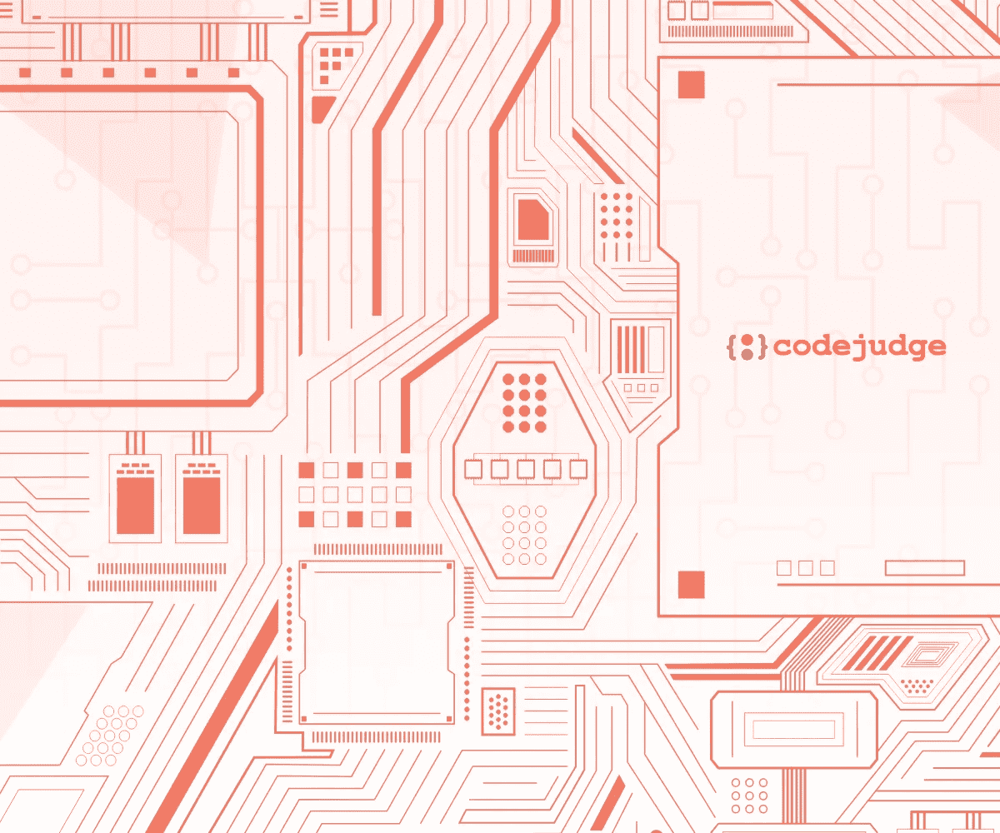

# 你应该知道的 10 个系统设计面试问题

> 原文：<https://medium.com/codex/10-system-design-interview-questions-you-should-know-a9843baddd9f?source=collection_archive---------3----------------------->

系统设计是艺术:)

> 系统设计面试是高级软件工程师和开发人员招聘过程中不可或缺的一部分；他们不仅决定了自己的知识水平，而且对做出招聘决定非常有帮助。

**TL；博士:** *系统设计面试有助于招聘经理全面了解候选人的系统架构和设计知识。高级候选人的技术知识水平和技术领导技能通过这些面试来确定。一些常见的系统设计面试问题涉及负载平衡、网络和协议、代理、缓存、数据库、上限定理、吞吐量、延迟等概念。，*

在这篇博客中，我们将关注以下几点:

1.  **什么是系统设计面试？**
2.  **如何进行系统设计面试？**
3.  **面试中常见的系统设计概念。**
4.  **10 个常见系统设计面试问题列表。**

> 您知道软件行业对全栈开发人员和应用程序开发人员有很高的需求吗？——**下面更多关于** [**破解全栈开发者面试**](/codex/crack-a-full-stack-developer-interview-in-5-simple-but-doable-steps-c4c3ec9ad57a)**&**[**顶级应用开发者技能**](/@sameer_cj/top-qualities-that-help-you-become-or-spot-a-rational-application-developer-87930c09ab8d) 。

# 什么是系统设计面试？

涉及系统设计或软件设计任务、评估和测试的编码面试可以称为“系统设计面试”。

系统设计面试通常是高级工程师和开发人员面试过程的一部分，旨在评估候选人的系统架构知识和设计技能。

系统设计面试通常要求申请人计划、创建一个大纲并开发一个面向解决方案的原型系统，该系统可以解决整体或部分问题。

鉴于系统设计访谈的开放性，它们不仅仅是关于编码解决方案，因为它们涉及系统组件中更大更复杂的部分。主要目的是评估翻译大规模系统相关问题的技术知识和流利程度，以建立可行的解决方案。

> 招聘已经发生了变化，如果你想在 2022 年及以后招聘员工，你必须适应以下五个招聘流程的变化。

# 如何进行系统设计面试？

系统设计面试是评估高级职位的工程师和开发人员的最佳方式，因为它提供了对候选人的经验和技能的迫切需要的洞察力。

这里有几点可以帮助你在提取应聘者知识水平的同时，简化面试流程。

## 选择一个你非常熟悉的系统

系统设计面试的主要目的是测试候选人的知识、技能和经验。鉴于这些面试的开放性，谈话通常会持续一个小时或更长时间。

选择您曾经使用过的系统是明智之举，因为这样您将了解所有组件、功能、故障模式、限制、网络协议和设计流程的其他重要元素。

此外，这种方法可能会对候选人解决问题的思维过程提供一些有趣的观察，以便与你或你的团队的解决方案进行比较。

## **从一个简单的设计问题开始**

面试的前几分钟应该让候选人感到舒适，因为放松的候选人会表现出最好和最真实的表现，因为焦虑水平会下降。

因此，最好从简单和小规模的设计问题开始面试，以了解他们的基本技能、项目级知识和经验。

在请候选人回答之前，有必要确保你们两人对问题的看法一致。

一旦氛围设置好，候选人开始解决和设计，你应该做以下工作:

*   尝试理解开发人员的思维过程，即询问他们如何以及为什么做出某些决定。
*   通过提问相关问题，大致了解候选人的系统架构知识。
*   观察候选人的技术交流水平，即注意候选人能够清楚地表达问题和解决方案的程度。
*   最后，请候选人证明他们的解决方案，这证实了他们的知识水平，资历和经验。

## **慢慢提高复杂程度**

由于面试的第一部分是要弄清楚候选人的综合技能，面试的后半部分应该侧重于评估候选人对系统设计组件的深入了解。

这时你应该问更多的技术问题，并期待候选人的详细解释。然而，这应该是一个双向对话，涉及不断剖析概念和想法。

你应该问一些关于设计模型的非常具体的问题，当你完成面试时，充分了解候选人的能力水平是很重要的。

> 使用 Codejudge 的 [***现场编码面试平台***](https://codejudge.io/interviews/) ，面试**全栈开发人员、后端 Rest 开发人员、前端开发人员、移动应用开发人员、开发运营工程师**等，该平台已被证明对做出明智的招聘决策非常有用。

# 面试中常见的系统设计概念

**1。负载平衡**

负载平衡通常用于在多个计算系统之间分配和划分工作负载。在 web 上，负载平衡将网络流量分散到不同的服务器上。

这通常会减轻服务器的压力，并通过减少延迟问题来提高服务器的效率，同时提高性能。负载平衡在稳定大多数互联网应用程序并确保其功能方面起着关键作用。

**2。网络&协议**

网络通过代码适应机器通信，协议是网络中信息交换所基于的过程。网络协议充当监控机器和软件之间通信的门控机制。

**3。缓存**

缓存用于加速数据访问。通常，用于跨系统运行虚拟操作的数据存储在主存储器中。但是，在持续使用的情况下，数据会被转移到一个称为缓存的临时存储中。

从缓存中存储和检索数据的过程称为缓存。

**4。代理人**

在计算系统中，代理是存在于客户机和服务器之间的程序；它本质上是一个中介服务器。这是代理的核心含义。代理在设计复杂系统时很有帮助，因为它们可以处理很多不一定要由主服务器完成的任务。

**5。数据库**

根据数据库模型组织数据被称为数据库设计。通常，设计者决定应该存储什么数据以及数据元素如何工作。有了这些知识，就可以将数据放入数据库模型中。

**6。上限定理**

CAP 定理，也称为 CAP 原理，可用于解释具有复制的分布式系统中的一些计算要求。该工具使系统设计者在设计包含网络数据的共享系统时意识到必要的调整。

CAP 代表一致性、可用性和分区容忍度。

*   复制组件之间的一致性。
*   数据交换操作系统的可用性。
*   系统在网络分区出现故障时的分区容差。

除此之外，人们可能希望看到来自诸如**吞吐量、延迟、散列、发布者-订阅者消息传递和端点保护**等概念的问题。

> 有关这些主题的详细解释，请参阅关于 freecodecamp.org 的[本文](https://www.freecodecamp.org/news/systems-design-for-interviews/)

# 10 个常见的系统设计面试问题

1.  你会如何设计一个网址缩短服务？
2.  你能解释一下创建全球文件共享或存储系统的过程吗？
3.  你如何设计一个交通控制系统？
4.  你能解释一下你会如何设计一个拼车系统吗？
5.  为什么网络协议和代理被认为是系统设计的基础部分？
6.  数据库如何影响系统的可伸缩性和速度？
7.  您能说出一些用于在服务器上或服务器外传输大量数据的技术吗？
8.  你能设计一个 Instagram 克隆吗？——(或 F(M)AANG 克隆)
9.  你能解释一下创建一个聊天或信息系统的过程吗？
10.  设计一个电子商务网站最重要的组成部分是什么？

# Codejudge 直播编码面试平台系统设计面试

Codejudge 的实时编码面试平台是一个开发人员和招聘人员友好的工具，提供 SQL 和系统设计框架问题以及 20 多种语言的编程问题。招聘经理将获得一个独特的表现档案，它描述了候选人解决问题的技能、调试、代码可读性、代码格式，以及对开发人员在工作场所的职能角色的概述。

> 了解更多关于 [Codejudge 的现场编码面试平台](/@sameer_cj/live-coding-interviews-simplified-with-codejudge-469d773126ad)。

> [**用智能科技聘请智能科技人才！**](http://codejudge.io/)