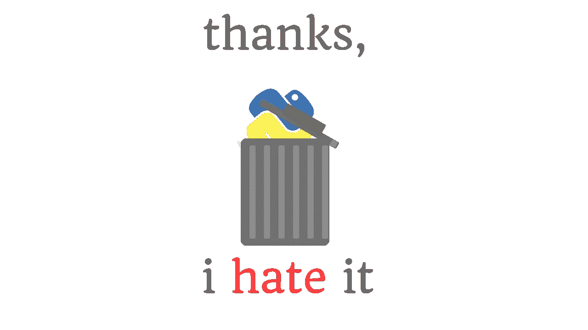

# 我讨厌 Python 的 10 件事

> 原文：<https://medium.com/codex/10-things-i-hate-about-python-9ea86d437f8b?source=collection_archive---------1----------------------->

## 我对 Python 编程语言的主观和客观问题。

(图片由作者提供)

那些密切关注我博客的人可能知道我最喜欢的编程语言是一门非常年轻的语言，大约十年前出自麻省理工学院，Julia。然而，情况并非总是如此，我的编程之旅实际上始于十多年前的 Adobe ActionScript 2.0…