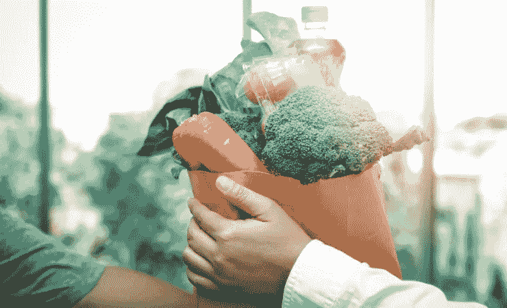
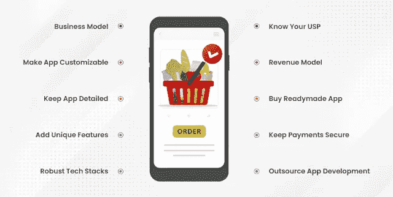
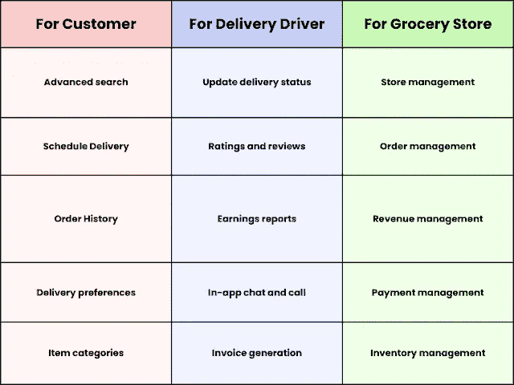

# 进入杂货应用程序开发之前要记住的 10 个技巧

> 原文：<https://medium.com/codex/10-tips-to-remember-before-entering-grocery-app-development-7c8983b5a577?source=collection_archive---------15----------------------->

在线杂货交付应用程序

你想通过一款应用程序让顾客轻松快速地获得家居用品并将其送到家门口，从而在杂货交付领域大展拳脚吗？这篇文章是给你的。

这些解决方案帮助顾客快速获得家居用品，除了帮助商店提高知名度之外，它们的受欢迎程度也成倍增长。这导致其在市场上的估值成倍增长。目前，该解决方案的 CAGR 将达到 25.3%，受欢迎程度将大幅上升。

这是投资杂货交付应用程序开发的主要原因。它将实现商店管理任务的自动化，并提高可见性。因此，这对传统杂货店来说是一种变相的恩惠，因为它为它们提供了数字化运营的灵活性。

然而，开发过程是详尽的。它需要坚持一些步骤，并记住一些提示。我们在下面的文章中为你概述了它们。这将有助于你深入了解如何通过一个结构良好的应用程序做大。

在此之前，我们会给你一个市场统计的概念。

## 杂货配送应用的市场统计

当你计划建立一个网上杂货店来数字化你的传统超市设置时，你必须准备一些东西。你也应该检查市场统计数据，了解他们近几年的表现，并了解他们的发展将如何为你创造奇迹。

我们在下面的指针中收集了一些关于这些解决方案的有趣事实。检查他们-

*   2021 年，该应用的估值为 2857.0 亿美元。
*   到 2030 年，这些应用的市场规模将达到 21607 亿美元。
*   2022 年至 2030 年，全球在线杂货市场将以 25.3%的 CAGR 扩张。

这些数字证明，该解决方案对传统超市来说是塞翁失马，焉知非福。因此，拥抱杂货应用程序开发。这样做将确保如下所列的优点。

## 杂货交付应用程序开发的优势

当你将[杂货交付应用开发](https://www.groceryappclone.com/)用于你的传统超市设置时，你将获得一系列的好处——下面列出了一些。看看他们。

*   为顾客提供无忧无虑的购物体验。
*   改进商店执行库存、商店和账单管理任务的方式。
*   降低超市的基础设施和雇佣成本，因为应用程序可以处理同样的问题。
*   通过展示与以往购物活动相匹配的产品来个性化客户体验。

知道建立一个网上杂货店的优势，记住开发过程是详尽无遗的。这需要记住十条。下面来看看吧。

# 开发杂货交付应用程序时要记住的 10 个技巧

杂货交付应用程序开发技巧

## #1:明智地选择商业模式

有两种流行的模型形式

*   仓库模型，在该模型中，物品被储存在仓库中，并创建存储库。
*   商店提货模式，在线应用提高了商店和超市的知名度。

请确保您了解这两种模式，并确定使用哪种模式可以让您无缝地满足客户和业务需求。

## #2:使应用程序可定制

使用像机器学习这样的技术，你可以让你的应用程序可定制化。这将让顾客始终通过您的解决方案获得独特的购物体验。

**你可以通过**来完成

*   针对注重健康或素食主义者的应用细分。
*   通过使结帐过程和购物车的产品添加完美无瑕。

## #3:保持应用程序详细

尽可能让你的应用程序信息丰富，这将让透明感在客户心中占据上风。因此，尽可能详细地保存不同产品的信息，以便最终用户了解它们的用途、优点等。

## #4:添加独特的功能

当你进行杂货交付应用程序开发时，除了专注于制定详细的解决方案，还要包括一些独特的功能。这将允许用户、送货人员和商店从该解决方案中获得最大的优势。

**这里有一些你可以考虑的特点。**

## #5:选择强大的技术堆栈

为了确保应用程序在没有崩溃的情况下完美运行，请使用强大的技术堆栈。

以下是一些你可以在开发杂货店送货应用程序时使用的:

*   对于推送通知— Twilio。Push.io
*   短信和电话验证— Twilio
*   支付——brain tree、PayPal
*   数据库— MongoDB，邮件黑猩猩集成
*   实时分析—思科 Apache Flink

另请阅读:[用应用程序改变杂货店运营——了解 7 个原因](https://www.groceryappclone.com/blog/know-reasons-why-your-store-need-grocery-delivery-app/)

## #6:了解你的 USP

要像专业人士一样进入杂货应用程序开发流程，在那里您有一个简化杂货交付的应用程序，请了解您的独特卖点或 USP。

这将使客户对你开发的应用保持最大程度的参与，并增加收入。
**需要坚持一些步骤-**

*   研究竞争对手
*   检查客户需求及其对所用应用的满意度
*   确定竞争对手的解决方案是否解决了客户关注的问题

## #7:做好收入模式选择

你必须非常了解收入模式。这是因为你的应用程序的最终目的是帮助你利用利润。因此，明智地选择模型。

**下面是一些特别受欢迎的——**

*   商店和送货司机在高峰时段、节日等送货或客户送货的佣金。
*   商店在应用程序上的广告费用。
*   向客户收取的订阅费。

确保了解这三者，并选择一个符合您的业务要求，以看到您的利润飙升。

## #8:购买现成的杂货交付应用程序

为了在杂货交付应用程序开发期间保持预算完整，请购买现成的杂货交付应用程序。这将缩短应用程序构建的时间，尤其是当您从头开始构建时。

由于该应用程序已准备就绪，企业也将能够根据未来的需求进行修改，以满足客户的需求。

你需要检查它的坚固性，确定它没有瑕疵。这将提高用户的参与度，并允许杂货配送服务通过它完美地进行。

## #9:努力确保支付安全

当你建立一个杂货递送应用程序时，确保数据安全和支付安全。因此，利用安全的支付网关。这将无缝地实现目标。

**这里有一些你可以使用的-**

*   贝宝
*   种类
*   布伦特里

## #10:外包杂货应用开发

在杂货交付应用程序开发期间，你考虑的最后一个关键步骤是在海外完成服务。这一步将派上用场，因为成本将大大节省。

要了解该公司是否值得信任，请执行以下操作-

*   访问在线门户网站查看客户评论
*   了解开发人员的技能，了解公司的参与模式
*   检查投资组合

一旦你明确了这些领域，与该公司联系，看看你的应用程序开发之旅取得成果，并看到收入并排飙升。

## 开发杂货交付应用程序的预计成本

在进入杂货配送 app 开发流程之前——关注成本因素。因此，开发一个杂货交付应用程序的估计成本在 10，000 美元到 30，000 美元之间。根据应用程序的复杂性和位置，价格会上涨。因此，保持设计简单，并获得每小时的费用以及隐藏的费用。这将在杂货应用程序开发过程中以最佳方式保持您的财务完整。

## 包扎

随着按需杂货交付应用程序见证了其受欢迎程度的顶峰，拥抱杂货交付应用程序的开发是必要的。众所周知，需要是发明之母；借助应用程序，您可以满足消费者的需求，并简化杂货配送服务。请记住将这些要点放在手边，或者联系离岸的杂货交付应用程序开发公司。这会让你的利润飙升。