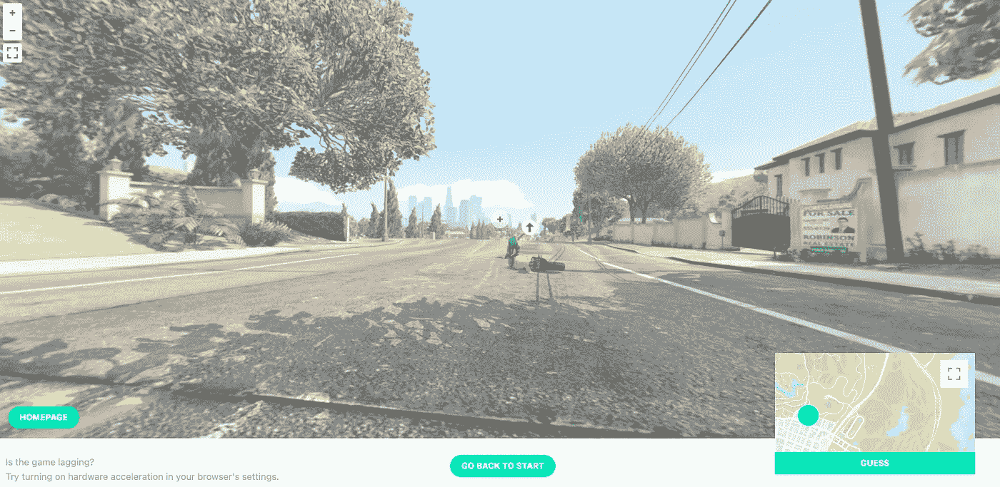

# 当我作为一名程序员在工作中感到无聊时，我经常使用的 10 个网站

> 原文：<https://medium.com/codex/10-websites-that-i-always-use-when-i-get-bored-at-work-as-a-programmer-e7de250208ad?source=collection_archive---------10----------------------->

## 我打赌你也会喜欢它们的

作者捕获的图像

一直工作会耗尽你的精力。有几天你会感到疲倦或不想工作，因为你认为你的工作很单调。我经常遇到这种情况，但当我感觉到这种情况时，我会访问这些网站，并从中获得一些乐趣。

## 1.办公自动化设备