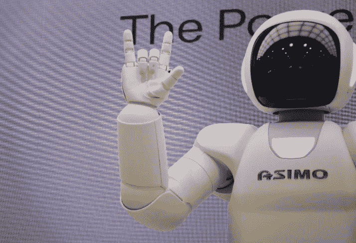

# 人工智能已经掌握的 11 种人类行为

> 原文：<https://medium.com/codex/11-human-behaviors-ai-has-already-mastered-ffd0fe20804b?source=collection_archive---------11----------------------->

## 包括五种感官

在 [Unsplash](https://manage.wix.com/dashboard/f2c19c2d-435a-4b5e-a5f8-914461c4ffac/social-posts/composer) 上由附身摄影拍摄的照片

曾经被认为是“未来派”的东西现在是我们日常生活中最现实的一个方面。自从现代计算技术出现以来，科学家和创新者一直试图开发一种能像人一样思考的计算机。为了使人类的思想和决策成为一个机械的过程，算法和…