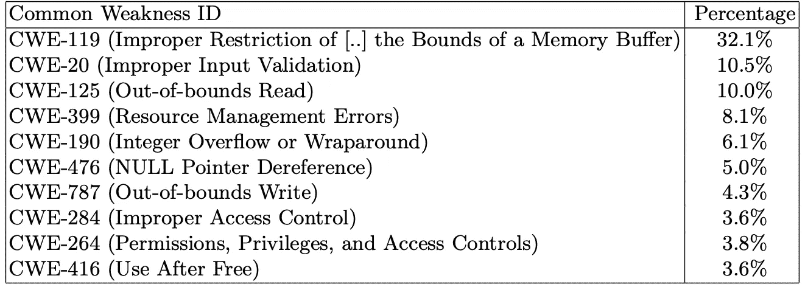
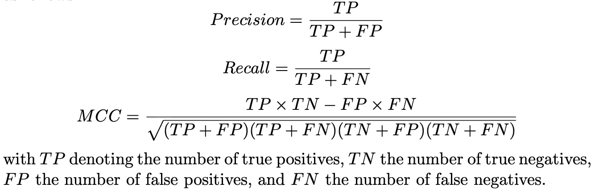
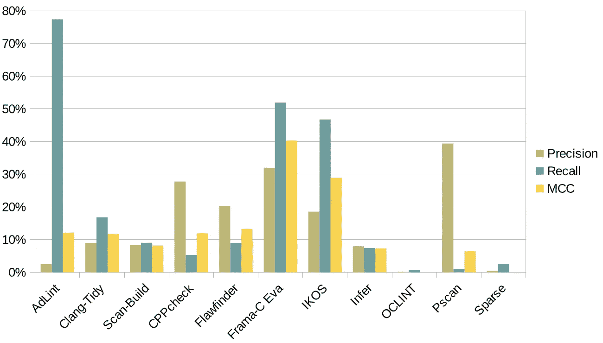

# C 语言的基准静态分析工具

> 原文：<https://medium.com/codex/11-static-analysis-tools-for-c-4fe5f63c18a5?source=collection_archive---------8----------------------->

## 关于在 C/C++的 SARD Juliet 测试套件上评估 11 个用于 C 编程语言的开源通用 SAST 工具的报告。

图片由来自[像素](https://www.pexels.com/@pixabay)的 Pixabay 提供

你是开发商吗？如果是这样，你可以理解我的问题:

> *作为一名软件开发人员，如果我使用某种静态分析工具，我能对代码的安全性有什么期望？*

从这个角度来看，SAST 工具也可以被看作是开发人员的一种“保险”:“如果我运行这个工具，我的代码基本上是安全的”。

# 项目动机

有各种各样的工具，无论是商业的还是开源的，都或多或少地声称要做“安全性分析”。从对 Debian Linux 发行版中的故障模式和漏洞的初步调查开始，我发现一半的漏洞是与内存管理相关的编码错误，其次是与资源管理相关的错误、被污染的输入和有风险的值。因此，我决定使用 Juliet 测试套件作为我的评估数据集，因为它以相似的权重覆盖了这些弱点。由于各种各样的工具和技术可能会让开发人员感到困惑，很明显，对他们的能力进行评估是可取的。 [Juliet 测试套件](https://nvlpubs.nist.gov/nistpubs/SpecialPublications/NIST.SP.500-326.pdf)是专门为评估 SAST 工具的能力而开发的，包含 100k 个文件中的 64099 个测试用例。该套件涵盖了 100 多个不同的弱点，包括所有主要的软件故障模式，并满足了具有地面真实性和统计显著性的要求。因此，精度和召回指标是适用的。

下表根据 NVD 严重性分数的总和，列出了 C 包的前 10 个 CWE。显然，“缓冲区溢出”仍然是 C 程序中的主要缺陷，其次是其他几个与内存相关的漏洞。为了提供更全面的概述，还映射了与 C 相关的 CWE 到 [CWE 层级](https://cwe.mitre.org/data/definitions/888.html)的软件故障模式(SFP)视图的簇。

以 C 为主要语言的 Debian 软件包中的十大漏洞

# 合成测试案例的评估程序

对于所有工具，在进行这项研究时，Ubuntu 18.04 LTS 的最新稳定版本是在英特尔 i7–6600 u CPU @ 2.60 Ghz 下的虚拟化环境中选择的，磁盘大小为 150GB，内存为 16GB。因为我们的兴趣是只考虑工具的召回率和精确度，而不是它们的资源使用情况，所以没有为基准测试实现工具的资源控制。

逐个文件地对数据集运行工具，并记录工具报告。工具报告被收集在数据库中用于进一步处理。将工具的发现与 Juliet 测试套件清单文件进行比较，通过文件和行号为测试用例指定准确的缺陷位置。如果一个工具的发现和一个关于报告位置的测试用例相匹配，我认为这是一个真正的肯定。如果一个工具报告了另一个位置，我认为这是一个误报。根据测试用例是代表“好的”还是“坏的”代码，所有未报告的位置被视为真的或假的否定。注意，我以这种方式假设条件否定的总和等于所有测试用例的代码行。这与原始程序相反，在原始程序中，条件否定的总和等于测试用例的总和。在这种情况下，与默认的 Juliet 测试套件过程的 50:50 的机会相比，获得真阳性或真阴性的概率应该更现实。虽然，这是以惩罚在不同位置报告正确错误的工具为代价的，否则就奖励报告所有错误缺陷类型的工具。使用真/假阳性/阴性的计数，计算工具的[精度](https://en.wikipedia.org/wiki/Precision_and_recall)、[召回](https://en.wikipedia.org/wiki/Precision_and_recall)和马修斯相关系数( [MCC](https://en.wikipedia.org/wiki/Matthews_correlation_coefficient) )。通过 F 分数平均精确度和召回率，这样的工具将获得合理的排名。

> 为了弥补这一点，我使用了 MCC 而不是 F 分数。这种方法也不利于在不同代码位置报告预期漏洞的工具，以及发现预期缺陷以外的其他缺陷的工具。

使用的指标，即精度、召回率、MCC，定义如下:

与 F 分数相比，MCC 奖励更多的真阴性分数。*这不利于报告每个位置的高噪声工具*。当处理不平衡数据集时，通常建议使用 MCC，这是漏洞的常见情况。

# 要显示的结果

下图显示了在 Juliet 测试套件上测试的所有 11 个 SAST 工具的测量精度、召回率和 MCC。显然，这些工具的精确度有所不同。关于召回，一些工具几乎什么也没发现(OCLINT)，而其他工具发现了所有测试漏洞的 50%以上(AdLint，Frama-C)。关于精确度，有一些工具几乎每两个发现中就有一个是真阳性(Pscan ),还有一些工具，开发人员必须通过数百个发现才能得到一个真阳性(OCLINT)。特别是两个工具显示了精确度和召回率之间的差距。Pscan 似乎在某些类型的漏洞方面非常专业，因此它发现的漏洞召回率很低，但精确度很高。AdLint 工具显示了良好的召回率，但这是以不良的精度为代价的。事实上，AdLint 为大约 1/8 的测试套件产生了警告，总共产生了 80 万个警告。请注意，报告每一行代码为漏洞的工具可以获得 100%的召回率。

最后，我们可以观察到，精确度和召回率的不同特征导致一些工具的 MCC 几乎一致。因此，AdLint、Clang-Tidy、CppCheck 和 Flawfinder 的准确性几乎不相上下，而声音工具 Frama-C 和 IKOS 则非常出色。这一结果与相关工作[1，2，3，4]中的发现一致，其中 Frama-C 的排名相似。IKOS 没有可比性，因为它没有包括在这些评估中。其他据报道准确性较好的工具是 Clang 和 CppCheck。在这个实验中，我证实了 CppCheck 的高精度和 Clang 的合理回忆。

Juliet 测试套件的精度、召回率和 MCC 指标

# 下一步是什么？

开发一个作为开放标准的基准测试套件，工具开发人员和安全专家可以加入其中，以促进现实的 SAST 工具基准测试，这将是一个普遍的兴趣。为了应对基准和工具的快速过时，建立 SAST 工具的定期和自动化评估，例如，模拟软件验证社区中的类似工作，将是一个有价值的贡献。在评估中包括更多的 SAST 工具，特别是软件验证器，我故意选择从我的评估中排除，也将允许绘制一个更广泛的图片。然而，我相信这项研究可以成为一个有价值的构建模块，为 c 语言创建一个更大的 SAST 工具的状态

总之，根据这项研究，我可以确定 Frama-C 是被评估的工具中最好的，尽管它并没有特别关注安全性。另一个声音工具 IKOS，之前还没有在 Juliet 测试套件上评测过，表现类似，在我的基准测试中排名第二。虽然我的评估考虑了该工具在所有其他 SFP 集群上的性能，但未来工作的前景是进行更具选择性的分析，仅考虑工具声称的漏洞类型。

复制包在[在线](https://github.com/RohanKrishnamurthy/sastevaluation)可用。

# 参考

1.  阿鲁苏艾，美国，Ciobacă，̧.南部、Craciun，v .、Gavrilut，d .、Lucanu，d .:C/c++代码中漏洞检测的开源静态分析工具比较。(2017)在:SYNASC。第 161-168 页。IEEE 计算机学会
2.  Chatzieleftheriou，g .，Katsaros，p .:测试驱动静态分析工具以寻找 C 代码漏洞。(2011 年)载于:COMPSAC 年研讨会。第 96-103 页。IEEE 计算机学会
3.  陆，b，董，w，尹，l，张，l:为有效的程序分析评估和整合不同的缺陷发现器。(2018)年:日。计算机科学讲义，第 11293 卷，第 51-67 页。起拱石
4.  Moerman，j .，Smetsers，s .，Schoolderman，m .:评估开放源码静态分析工具的性能。(2018)学士论文，荷兰拉德布大学。