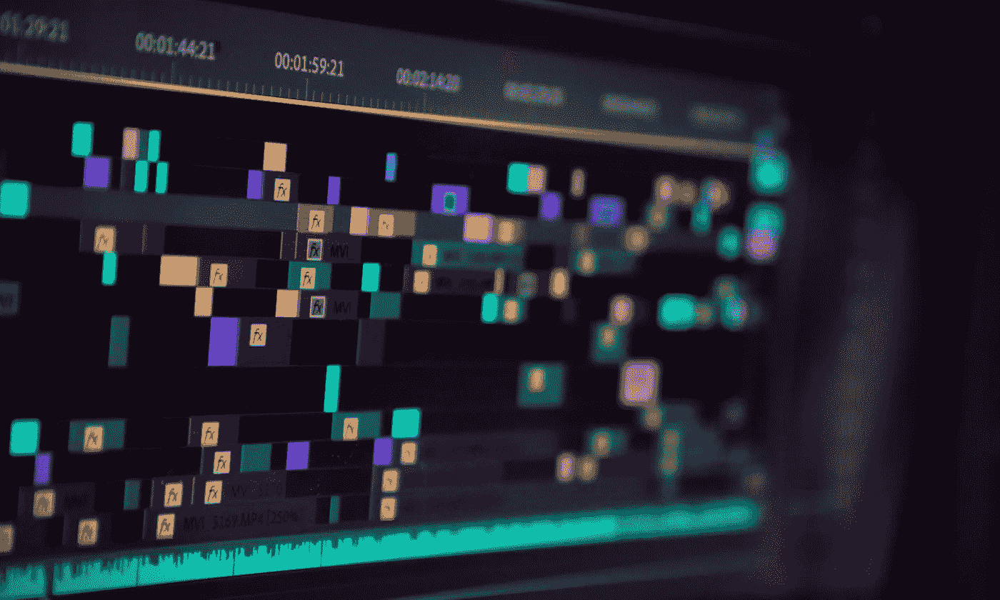

# 我从创建自己的 SaaS 中学到的 11 件事

> 原文：<https://medium.com/codex/11-things-i-have-learned-from-creating-my-own-saas-bfcc0c212214?source=collection_archive---------4----------------------->

两年前，我开始创建我的软件即服务产品。我决定做这件事，因为我一直想尝试做点自己的事。一开始，只有一个想法。它花费了大量的时间、精力和研究，才使产品达到目前的状态。当时，我在计划发布的市场上找不到类似的产品。

整个产品创作过程教会了我很多东西。以下是我在创造自己的产品时学到的**前 11 件事。**

## **1。不要事事亲力亲为**

每个企业/公司最初至少由两个、三个甚至四个角色组成。在软件开发的世界里，这些人可能是——设计师、开发人员、销售人员、产品所有者。聪明点，尽可能快地委派工作和任务，这样你就可以专注于你知道或你想知道的事情。两个大脑比一个聪明，两个人比一个人能做更多的工作。不同的技能、思想、关系、头脑风暴的想法仅仅是你不应该一开始就放弃和别人一起创业的一些原因。如果有更多的人认为这个想法是好的，额外的帮助总是受欢迎的。

如果你设法建立良好的团队精神，并在一个团队或团体中适当地组织自己，产品的质量、执行的效率和实现项目所需的时间将会提高。

由于我更倾向于技术(软件开发)，整个业务对我来说是未知的。我作为一名开发人员开始构建一个产品。我意识到独角戏很难演。有很多工作，每个角色都有不同的角色和视角。我决定这次尝试一下“产品负责人”的角色。我不再是这个项目的主要开发者。

## **2。做你的研究**

虽然乍一看，你的想法可能看起来像一个新的 facebook、instagram 或 slack，但很可能类似的东西已经存在。这并不一定是坏事，但你必须探索它到底是什么。

*   已经有这样的产品了吗？
*   是不是少了什么？
*   怎么才能改善呢？
*   为什么有人会用你的产品而不是他们的？

另一方面，不管一个产品是否存在，重要的是检查是否有人对它感兴趣。

**定义你的受众**。做你的研究，找出最常使用该产品的年龄组、地理位置、行业和性别。让用户界面/UX 适应他们。

## **3。你不需要马上知道所有问题的答案**

你永远不会知道所有问题的答案。重要的是你首先定义你的观众认为重要的项目。事情肯定会改变，准备好改变并拥抱它。你必须意识到**你不可能取悦所有人**。每个人都有自己的产品愿景。一个人需要特定的功能，另一个人不喜欢设计，第三个人在用户体验上有困难。即使是最大的公司都有这方面的问题，你怎么能没有呢？你才刚刚开始做生意。

如果所有的目标都不明确，如果你没有最现代的设计，或者如果你选择不使用尖端技术，不要因此而气馁。

## **4。反馈很重要**

试着尽快得到它。如果可能的话，在开发之前尝试一下。如果你有一个可点击的设计或线框，和几个朋友分享你的想法。或者更好的是，与你不认识的人分享它们——因为不认识你的人更可能是客观的，同时你不会让熟人知道你正在做一些事情——因为这有时会很尴尬，你会发现一些“朋友”只是在等待你的错误。

不是每个人都喜欢这个想法。从中吸取教训。

获得高质量的反馈是必须的。你让更多的人参与到故事中，听取其他人的意见，并提出许多可以改进产品的问题。

**知道如何接受批评也很重要。不是每个人都会喜欢你做的事情或你做事的方式。你需要知道如何从每个反馈中获取精华。**

## **5。将 MVP 限制在少数功能上**

你已经分析了市场并收集了反馈。对功能进行优先级排序并找出那些不会经常使用的、可能是多余的或价值较低的功能。为了让产品尽快可用，尽量将它限制在较少的功能上以节省时间(如果发布时间是你的关键项目)。较低优先级的项目更有可能在将来被更改、添加、删除或修改。

显然，你可以通过额外的发布和版本来增加功能，但是重要的是，用户甚至在你完成所有工作之前就开始熟悉这个平台。

## **6。设定最后期限**

我想强调交货时间是最重要的事情之一。我发现自己处于这样一种情况，尽管产品是功能性的，但根据我的测量，产品并不“完美”。几个星期甚至几个月，我试图让它达到我完全喜欢的程度——这是不可能的。**改进产品的工作是一个持续的过程**，不断有可能增加用户界面形式的变化、增加功能或改变现有的功能。但是**如果没有人使用这个产品，为什么要这么努力呢？**

此时，需要真实用户的反馈。他们是使用产品的人，他们的意见很重要。

因此，有必要设置一个截止日期，要么按时间定义，要么按功能定义。一旦所有被定义为重要的项目都实现了，就到了第一次发布的时候了。

## **7。创建时间表——设定每日、每周和每月可衡量的目标**

我身后有一堆未完成的项目，因为我相信你们大多数人都是这种情况。我认为，除了没有设定具体的截止日期之外，主要原因是产品本身的规格不佳，以及我没有设定必须达到的短期目标。

想象一下，你的主要目标是减肥 80 公斤，跑 50 公里，举 150 公里，在你选择的运动中成为全国冠军。这些都是大而长远的目标，站在起跑线上看，似乎很遥远，很难，甚至高不可攀。

最终目标必须是让你走出舒适区。但是要得到它，你不能马上跳出你的皮肤。你需要设定可实现的目标，这些目标会引领你走向不可实现的目标。循序渐进。在每个可衡量的目标之后，你可以奖励自己，休息一下，或者庆祝一下。你也可以修改到目前为止你做了什么，你是怎么做的，是否有办法使这项工作更容易或做得更好。

## **8。思考你将如何营销、推广和销售产品**

如果你创建的服务不是免费的，这是最重要的一项。

营销销售产品。每个人都知道。如何为你的 SaaS 做营销？方法有很多。这在很大程度上取决于地理位置、用户类型和服务本身。因为我不是营销专家，所以我对这个领域一无所知，但我知道有必要以某种方式推广产品。这里有一些方法可以让你的 SaaS 接触到观众:

*   营销活动
*   社交网络上的付费促销
*   社交网络上的账户管理
*   奖励、折扣、免费促销
*   寒冷的河段…

## **9。查看商业模式是否适用于不同的领域**

我已经为这个 SaaS 工作了大约两年。最初，这个地区没有竞争。现在，我看到市场上大约有 4 到 5 个竞争对手。该产品专注于企业对企业的协作。虽然我仍然支持有一个更好的销售方式，**我已经注意到我可以将这种通用模型应用到更小的企业和客户**(企业对客户)。

此外，在 UI / UX 和不同数据模型的形式上稍作修改，该模型的适用范围更广(适用于其他几个行业)。当然，这不是必须的，**有时候甚至不可能**。但是如果你想再试一次——万一这个产品不能实现或者你想扩大你的业务；不用从头开始整个程序也不错。

## **10。不要后悔投资你的产品或你自己**

我相信我们很多人都遇到过这样的情况，我们需要买一些东西，这些东西要么稍微贵一点，要么实用性有问题。不要后悔投资你的产品或你自己。有多少次你出去吃更贵的晚餐，穿不必要的昂贵衣服，买最新的科技产品(笔记本电脑，手机)？

投资自己一次，你就创造了一生的经历。无论是一门课程，一本书，一个数据集，一个订阅服务来帮助你到达你的目的地。即使你最终不需要它，你也可以用它来帮助别人。

## **11。可以关闭**

有时候停止工作是有益健康的。尤其是如果这是你的副业。你有一份固定工作，并且在业余时间额外工作。休息是进步的关键。最重要的是你身体健康，思维敏捷。当你发现自己需要休息，或者不确定该做什么以及如何继续时，是时候暂停一下了。

要回到正轨，良好的工作生活平衡是必要的。休假实际上是令人向往的——忘记那些没有社交生活的人的建议，永远不要旅行和工作。这在短期内是可行的。对于较长的生命周期来说，它是不健康的。花时间在大自然中，和家人在一起，看电影，看书，玩电脑和棋盘游戏。社交，组织晚餐，邀请参加自发的聚会。你的大脑和身体会感激你。

## 结论

为了成功，你必须成为一个多面手。不要害怕尝试。能结出果实的是你的想法。这是一次你不会失去的美丽的冒险和经历——要么你因为经历和人际网络而变得更富有，要么你的产品会被很多人使用。

你可能会发现你的产品看起来和你刚开始的时候完全不同——软件开发过程就是这样。目标变了。趋势在变。朝着你的目标努力，保持饥渴，享受创造属于你的东西。