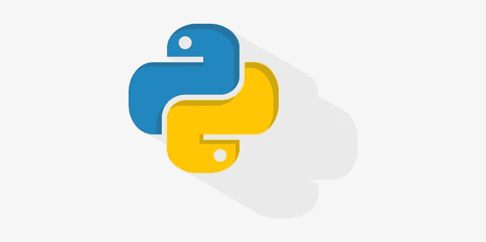

# 学习 Python 相对于其他语言的 12 个优势

> 原文：<https://medium.com/codex/12-advantages-of-learning-python-over-other-languages-5af018509604?source=collection_archive---------20----------------------->

## 你想知道学习 Python 相对于其他语言的 12 个优势吗？请继续阅读，看看为什么 Python 可能是最适合你的语言。

说到编程语言，Python 是当今最流行的语言之一