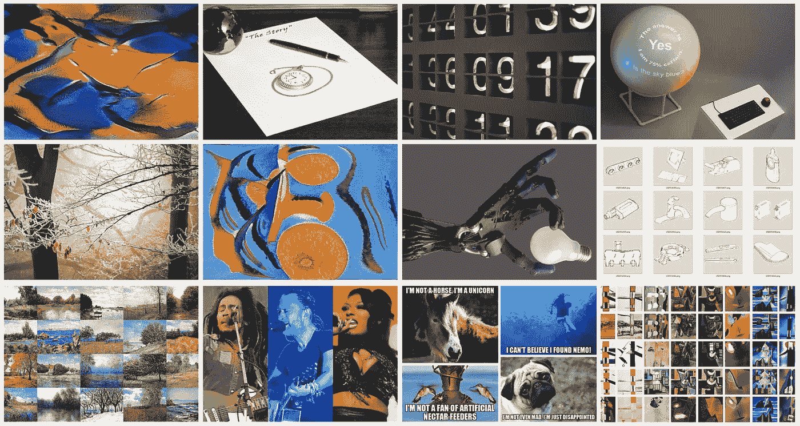

# 在创意项目中使用人工智能的 12 个技巧和诀窍

> 原文：<https://medium.com/codex/12-tips-and-tricks-for-using-ai-in-creative-projects-38885d3f271?source=collection_archive---------3----------------------->

## 以下是我在研究和开发人工智能系统创造艺术、音乐和散文一年后学到的一些经验

所有图片均由作者提供，除了 [alexkerhead](https://www.flickr.com/photos/alexkerhead/) 的故事、 [Nick Hillier](https://unsplash.com/@nhillier?utm_source=medium&utm_medium=referral) 的数字、 [Ales Krivec](https://unsplash.com/@aleskrivec?utm_source=medium&utm_medium=referral) 的霜树、wikimedia.org[的理查德·格林希尔和雨果·埃利亚斯](https://commons.wikimedia.org/wiki/File:Shadow_Hand_Bulb_large_Alpha.png)的机器人手、 [USPTO](https://www.uspto.gov/learning-and-resources/official-gazette) 的设计专利、艾迪·马林的鲍勃·马利、[克里斯](https://commons.wikimedia.org/wiki/File:Thom_Yorke_Austin_Texas_2016_(cropped).jpg)的汤姆·约克、阿尔弗雷德·马罗奎因[的梅根·赛恩](https://commons.wikimedia.org/wiki/File:Megan_Thee_Stallion_BBWM_Awards_2019.jpg)和 Meme

我花了 12 个月的时间在 Medium 上研究和写作人工智能(AI)和机器学习(ML)。这篇文章包含 12 个提示和技巧，你…