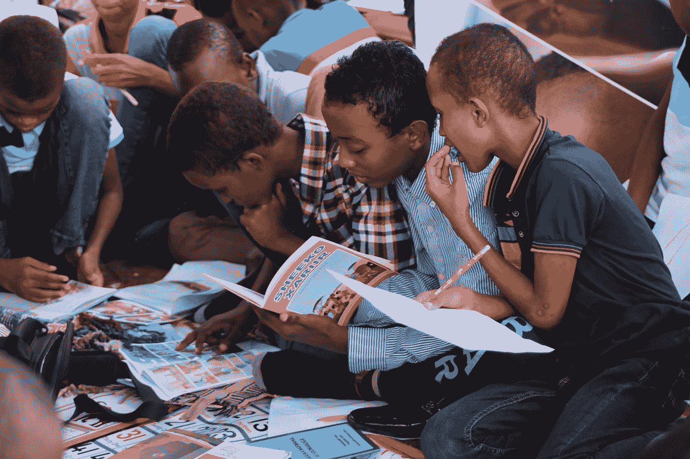

# 13 条编程规则，这是我多年编程后自学的

> 原文：<https://medium.com/codex/13-programming-rules-that-i-taught-myself-after-years-of-coding-54b2917025e7?source=collection_archive---------1----------------------->

## 从中吸取教训。

伊斯梅尔·沙拉·奥斯曼·哈吉·迪里尔在 [Unsplash](https://unsplash.com?utm_source=medium&utm_medium=referral) 上拍摄的照片

我遇到或交谈过的大多数程序员总是有一些可以让其他程序员受益的东西可以分享。例如，它可以是一种工具，一种他们从项目工作中学到的经验。

对我来说，我主要分享了我知道的和日常使用的工具，但我也想分享…