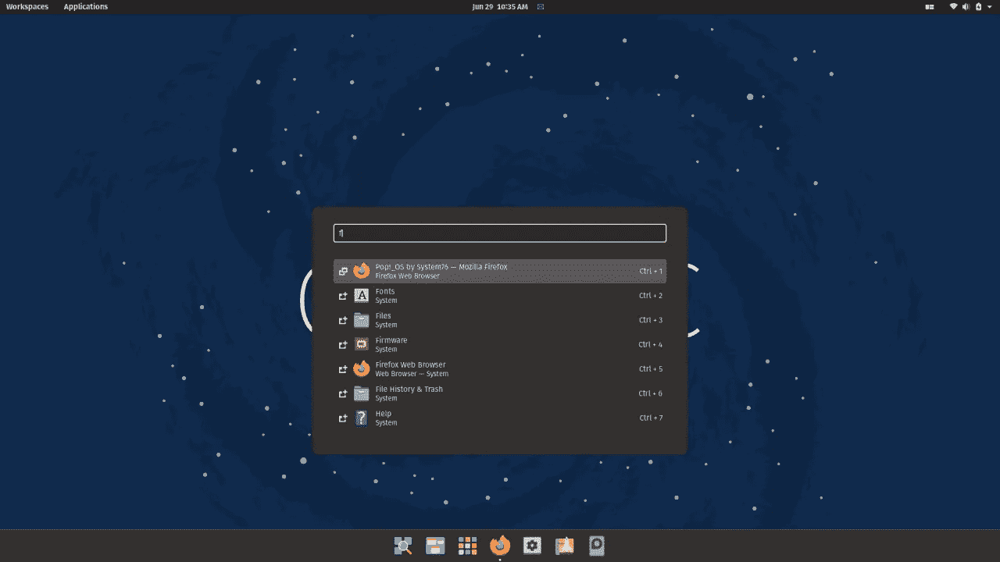

# 生活中需要 Linux 的 13 个理由

> 原文：<https://medium.com/codex/13-reasons-why-you-need-linux-in-your-life-6cb8a51a9bb5?source=collection_archive---------14----------------------->

图片来源:[https://blog.system76.com/](https://blog.system76.com/)

这是一个繁忙的星期一早晨。你在不停地写那份过期的报告。同时，你甚至可能有几集<insert favorite="" tv="" show="" here="">没有被下载。就在你要完成事情的时候，突然你的屏幕熄灭了。死亡的蓝屏。哦，我真讨厌那个讨厌的屏幕。如果有办法解决这个问题就好了。当然，您可以扫描病毒和故障…</insert>