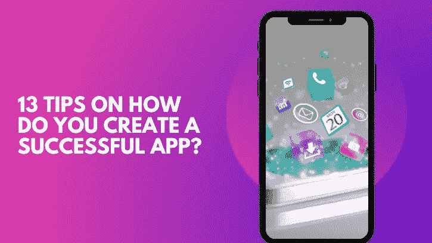

# 创建成功的移动应用程序的 13 个技巧

> 原文：<https://medium.com/codex/13-tips-for-creating-a-successful-mobile-application-8fa5ec839747?source=collection_archive---------15----------------------->

# **简介**

开发人员每天都在创建几个移动应用程序。外面的每个人都竞相打破常规。但不幸的是，由于一些明显的错误，一些最好的应用失去了接触观众的机会，因此被列入了失败的移动应用名单。这就是我们制作这篇博客的原因，其中包括创建有效移动应用程序的 13 条指导原则。为了确保您的移动应用程序的成功，我们建议从头到尾阅读这篇文章。

# **如何创建一个成功的应用程序的 13 个技巧？**

图片:作者

## **目标受众:**

目标受众定义了应用程序的目的。每个应用程序的目标受众是不同的。在创建任何移动应用程序之前，你需要首先分析你的受众。我们理解可能需要一段时间才能到达正确的受众。

为了找到你的目标受众，你可以试着追踪哪一群受众在使用你竞争对手的应用。

## **雇佣专门的团队:**

你必须 [**根据你的应用需求雇佣一个专门的开发团队**](https://jumpgrowth.com/mobile-app-developers/) 。您的开发人员必须了解构建应用程序所需的技术和工具。在创建应用程序之前，您必须创建一个列表，其中包括您需要的开发人员和测试人员的数量、您想要用来创建应用程序的技术类型以及其他所有重要的内容。

## **流畅的用户界面:**

用户喜欢平滑的用户界面。为此，您必须正确选择您的技术。简单易用的界面对于企业对企业和企业对消费者的移动应用都至关重要。这种用户界面设计也可以帮助你吸引新客户。

## **性能和响应时间:**

应用程序的性能应该尽可能高，而响应时间应该尽可能低。如果您的应用程序已经完成，那么您应该执行各种测试，如性能测试和安全性测试，以确保您的应用程序的性能。

## **客户的数据安全:**

如果您的应用程序需要客户数据，那么您需要确保您的应用程序不能违反任何安全性。您必须确保您的客户提供给您的数据必须与您的应用程序一起保存。您可以执行安全测试和渗透测试等测试方法来检测应用程序中的任何风险和威胁。

## **第三方集成:**

第三方应用不仅能提升用户体验，还能提高移动应用的留存率。

**让我们用一个例子来理解这一点:**

假设您准备了一个提供在线食品或杂货的应用程序。您可以在应用程序中包含的最合适的第三方应用程序是支付应用程序。它为您的用户提供了使用您的应用程序中包含的 2-3 种支付方式中的任何一种的灵活性。这样，你就很有可能创造了一个成功的移动应用。

## **经常寻求反馈:**

您必须根据客户的反馈更新您的移动应用程序。要获得反馈，您可以安排在线调查。如今，人们也在借助社交媒体渠道向客户寻求帮助。为了确保您的移动应用程序的成功发展，您还可以检查客户的反馈，并根据他们的喜好进行更改。你也可以问关于界面或者你想要什么，你想在你的反馈中给我们这类问题打分吗？

## **适当投放广告:**

你应该正确地宣传你的应用程序。广告将有助于用户参与。你简单的步骤可以改变你成功的图景。如果你的申请得到适当的宣传，结果将如你所愿。

## **寻求行之有效的营销策略:**

即使你有一个优秀的应用程序，但如果你没有使用正确的营销策略，那么它到达你的客户那里的机会就很小。为了制定您的营销计划，您可以查看竞争对手的应用营销计划。你也可以借助社交媒体渠道，清楚地了解如何以及需要发布哪些信息才能达到预期效果。

## **提供您的应用程序的免费功能:**

向您的客户免费提供一些功能是很棒的，因为这将有助于更多的客户参与。它会让你的用户迷上你的应用程序。Gmail 和 Zoho 应用程序是移动应用程序的两个好例子。Gmail 给你 15GB 的免费存储空间，但它会开始要求你升级。

## **经常升级您的应用:**

这是一个成功的应用程序的关键组成部分之一。我们用于开发移动应用程序的技术正在不断改进。因此，升级你的应用程序就成了一件强制性的事情。它还防止外来攻击，并加强其安全性。

## **不要忘记应用分析:**

对您的应用程序进行分析，可以提供您可能无法直接从任何其他来源获得的信息。在分析报告中，您可以找到下载和卸载您的应用程序的确切人数，包括其他详细信息，如哪个是最受欢迎的功能，哪个不是。

## **离线数据存储功能:**

你也可以做一些你的竞争对手没有做的独特的事情。例如，您可以添加一个功能，用户可以下载他们的数据，然后即使没有互联网也可以随时使用。这些类型的功能有助于让您的客户满意。

**结论:**

我们希望这些信息对您有用。在这个博客的帮助下，你现在可以更好地理解一个成功的应用程序的关键组成部分，以及可能对你的应用程序的成功产生负面影响的漏洞。如果你想详细讨论任何技巧，我们总是在这里与你谈论如何从零开始制作一个应用程序的**。**