# 像 CSS flex 一样灵活的 14 个步骤！

> 原文：<https://medium.com/codex/14-steps-to-flex-like-css-flex-3ce0ab3f79a7?source=collection_archive---------4----------------------->

## 立即伸缩！

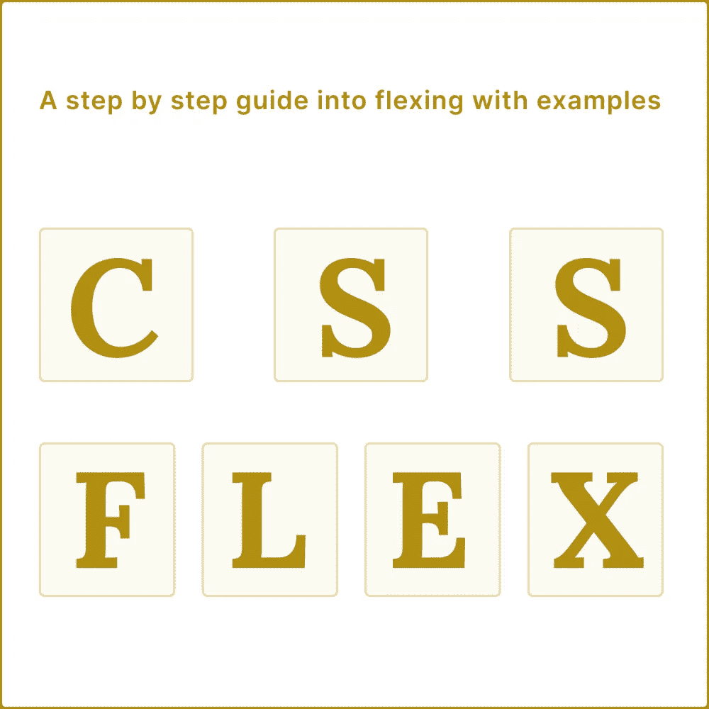

## 背景

如今，我们对任何东西都有一个应用程序。科技市场有很多产品可以帮助我们满足需求，但不知何故，我们并不喜欢我们看到的每一件产品。有些应用感觉流畅友好，有些感觉……嗯，有点过时。我们使用的每个应用程序都要经历多个步骤，从市场分析到 UI/UX，再到开发平台。每一步都有很多要照顾，但是对于我们这些前端工程师来说，主要关心的是开发过程。我们必须把那些疯狂的设计翻译成代码。好笑吧？我们必须考虑逻辑，当然，在需要的时候，还要为网络和移动设备调整这些界面。在第三方库的帮助下，如 Bootstrap、Skeleton、布尔玛等，它们提供了布局和 UI 组件的工具，我们可以处理接口。当然，这是一个选择，因为这些库大多数都有相同的基础，Flexbox。因此，对于布局，您可以仅使用 Flexbox 实现相同的结果。一个良好的 Flexbox 知识基础会给你必要的技能，将你看到的几乎所有东西翻译成代码。让我们不要欺骗彼此，我们都研究了如何使一个 div 居中，如何对齐两个项目，没有解释的空白，等等。你知道为什么吗？因为我们过于依赖那些第三方库，而错过了它们建立的基础。

## 为什么你应该灵活

Flexbox 旨在提供一种更有效的方式来布置、对齐和分配容器中物品的空间，即使它们的大小未知和/或动态。flex 布局背后的主要思想是让容器能够改变其项目的宽度/高度(和顺序)，以最好地填充可用空间(主要是为了适应各种显示设备和屏幕大小)。flex 容器扩展项目以填充可用空间，或者收缩项目以防止溢出。最重要的是，与常规布局(基于垂直的块和基于水平的内嵌)相反，flexbox 布局与方向无关。虽然这些对于页面来说工作得很好，但是它们缺乏支持大型或复杂应用程序的灵活性。

## 术语

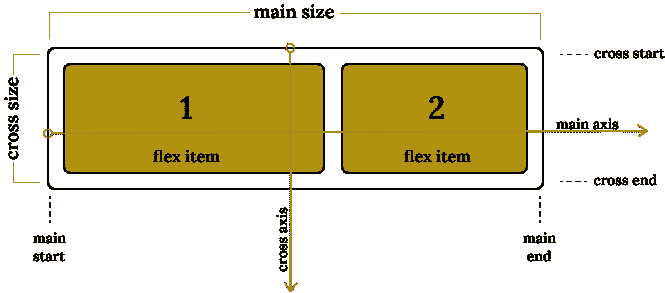

Flexbox 是一个包含一组属性的模块。有些属性是在容器上设置的，有些是在子容器上设置的。柔性布局基于“柔性流向”。项目沿着主轴或横轴排列。

*   *主轴* —伸缩容器的主轴是伸缩项目排列的主轴。
*   *main-start | main-end* —柔性项目从 main-start 到 main-end 放置在主轴上。
*   *主要尺寸* —柔性容器的宽度或高度，取决于柔性项目的柔性流向。
*   *横轴* —垂直于主轴的轴称为横轴。重要的是要明白横轴是我们设置好主轴后的副轴。它的方向可以是垂直的或水平的。这同样适用于主轴。
*   *交叉开始|交叉结束* —柔性项目从交叉开始到交叉结束放置在交叉轴上。
*   *横向尺寸* —伸缩项的宽度或高度，无论哪个在横向尺寸中，都是该项的横向尺寸。

# Flexbox 属性

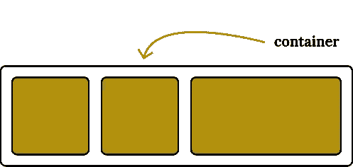

**1。显示**

这定义了一个 flex 容器。它为其所有直接子代启用 flex 内容。

```
.container {
  display: flex; */* or inline-flex */*
}
```

**2。** **伸缩方向**

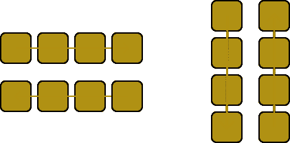

这将建立主轴，定义放置在 flex 容器中的 flex 项目的方向。就这么想吧，我是要水平还是垂直摆放物品？

```
.container {
  flex-direction: row | row-reverse | column | column-reverse;
}
```

*   *行(默认)* —从左到右。
*   *排-反转* —从右到左。
*   *列* —柔性项目从上到下垂直放置。
*   *列-反转*-自下而上。

**3。柔性包装**

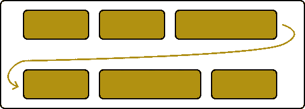

flex 项目的默认行为是尝试将所有项目放在一行中。通过包装容器，我们可以将 flex 项目排列成多行。

```
.container {
  flex-wrap: nowrap | wrap | wrap-reverse;
}
```

*   *nowrap(默认)* —这是 flex 容器的默认行为。所有项目将在一行。
*   *换行* —柔性项目将沿横轴从上到下换行。
*   *缠绕-反向*——与缠绕相同，但从下到上。

**4。柔性流**

应用伸缩方向和伸缩卷绕属性的快捷方式。

```
.container {
  flex-flow: column wrap;
}
```

flex-flow 的默认值是 row 和 nowrap。

**5。调整内容**

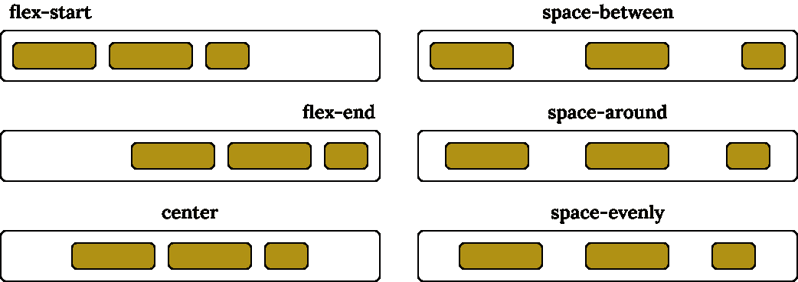

这定义了伸缩项如何沿主轴对齐。当需要在容器中分配空间时，它可能会帮助您将一个元素居中或用于更复杂的场景。

```
.container {
  justify-content: flex-start | flex-end | center | space-between | space-around | space-evenly | start | end | left | right ... + safe | unsafe;
}
```

有一组值可以用于属性`justify-content`,但是我将解释最常用和最有用的值。

*   *flex-start* —物品在容器中的一行/多行的开始处组合在一起。
*   *柔性末端* —物品在容器中的一行/多行末端组合在一起。
*   *居中* —项目沿容器中的一行/多行居中。
*   *space-between* —项目沿直线均匀分布，第一个项目和最后一个项目将放置在直线的边缘。
*   *环绕空间* —所有项目周围的空间相等。
*   *空间均匀* —空间从沿线的每个项目均匀分布。

**6。对齐项目**

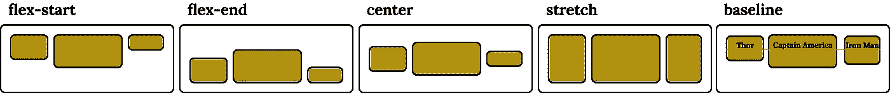

这定义了如何在当前行上沿横轴排列伸缩项目。把它想象成横轴的`justify-content`版本。

```
.container {
  align-items: stretch | flex-start | flex-end | center | baseline | first baseline | last baseline | start | end | self-start | self-end + ... safe | unsafe;
}
```

有一组值可以用于 align-items 属性，但我将解释最常用和最有用的值。

*   *弹性起点* —项目被放置在横轴的起点。
*   *flex-end —* 项目放置在横轴的末端。
*   *居中* —项目在横轴上居中。
*   *拉伸* —物品被拉伸以装满容器。
*   *基线* —项目对齐，如其基线对齐。

7。对齐内容

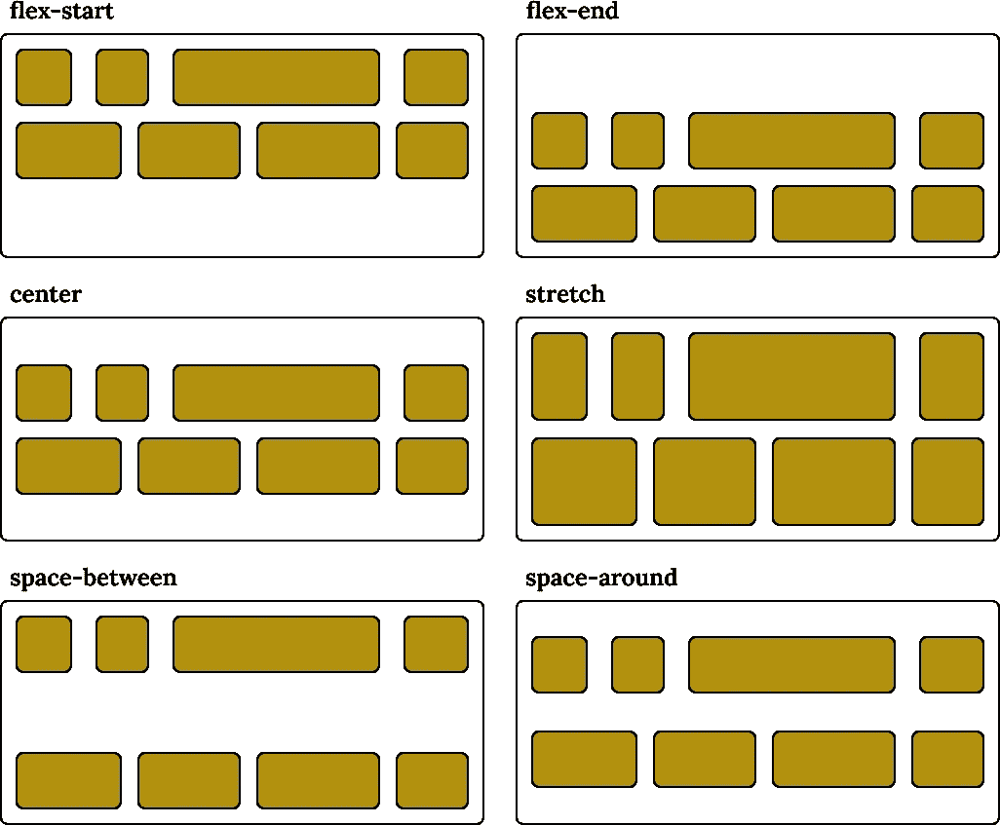

`align-content`沿横轴对齐容器的线条。为了实现这一点，我们需要多行容器。

```
.container {
  align-content: flex-start | flex-end | center | space-between | space-around | space-evenly | stretch | start | end | baseline | first baseline | last baseline + ... safe | unsafe;
}
```

对于`align-content`属性，我们可以使用一组值，但是我将解释最常用和最有用的值。默认行为是所有项目都处于默认位置，就像没有设置任何值一样。

*   *flex-start* —项目在容器的开始处分组。
*   *柔性末端* —物品在容器末端分组。
*   *居中* —物品在容器中居中。
*   *拉伸* —线拉伸以填充容器。
*   *space-between* —项目均匀分布在容器中，第一行在容器的开始，最后一行在容器的结尾。
*   *空格环绕* —项目以相等的间距均匀分布在每行周围。

**8。间隙、行间隙、列间隙**

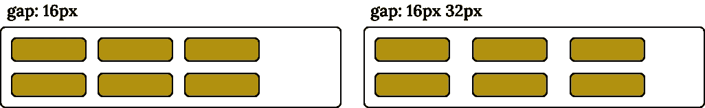

gap 属性控制伸缩项目之间的间距。

```
.container {
  display: flex;
  gap: 16px;
  gap: 16px 32px; /* row-gap column gap */
  row-gap: 16px;
  column-gap: 32px;
}
```

当我们只为`gap`指定一个值时，它同时适用于`row-gap`和`column-gap`。同样，我们可以通过使用`row-gap`或`column-gap`来设置它们。

# 子属性

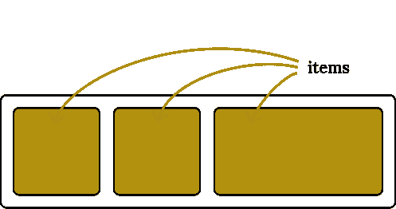

**1。订单**

`order`属性被设计成在*有序组*中排列项目。这意味着为项目分配一个代表其组的整数。然后，根据该整数的视觉顺序，从最低值开始放置这些项目。如果多个项目具有相同的整数值，则在该组中，项目按照来源顺序排列。

例如，我有 5 个弹性项目，并按如下方式分配`order`值:

*   来源项目 1: `order: 2`
*   来源项目 2: `order: 3`
*   来源项目 3: `order: 1`
*   来源项目 4: `order: 3`
*   来源项目 5: `order: 1`

这些项目将按以下顺序显示在页面上:

*   来源项目 3: `order: 1`
*   来源项目 5: `order: 1`
*   来源项目 1: `order: 2`
*   来源项目 2: `order: 3`
*   来源项目 4: `order: 3`

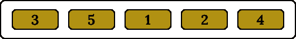

**2。弹性增长**

此属性指定 flex 容器中有多少剩余空间应该分配给项目(flex 增长因子)。剩余空间是 flex 容器的大小减去所有 flex 项目的总大小。如果所有兄弟项目具有相同的`flex-grow`因子，则所有项目将获得相同份额的剩余空间，否则，将根据不同`flex-grow`因子定义的比率进行分配。

```
.item {
  flex-grow: 2; /* default 0 */
}
```

**3。伸缩**

这定义了伸缩项在必要时收缩的能力。

```
.item {
  flex-shrink: 2; /* default 1 */
}
```

**4。弹性基础**

这定义了分配剩余空间之前元素的默认大小。

```
.item {
  flex-basis: content | auto; /* default auto */
}
```

`auto`关键字使用项目的宽度和高度。`content`关键字根据内容设置项目大小。

**5。柔性**

这是`flex-grow`、`flex-shrink`和`flex-basis`合起来的简写。第二和第三个参数(`flex-shrink`和`flex-basis`)是可选的。你应该记住默认值是`0 1 auto`，但是如果你设置了一个单一的值，比如`flex: 2`，它将被解释为以下值:`flex-grow: 2; flex-shrink:1; flex-basis: 0%;`

```
.item {
  flex: none | [ <'flex-grow'> <'flex-shrink'>? || <'flex-basis'> ]
}
```

6。自我校准

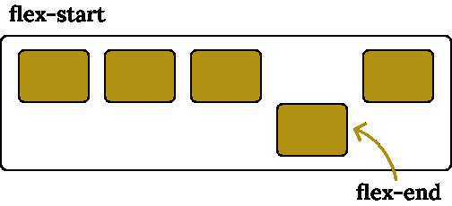

为`align-self`设置一个值将覆盖从容器配置继承的该 flex 项目的默认对齐。

```
.item {
  align-self: auto | flex-start | flex-end | center | baseline | stretch;
}
```

就是这样！请分享这篇博文来传播知识。如果你想探索更多，并尝试使用 flexbox，请享受我以学习 flex 为唯一目的制作的工具:[https://flex . better . network/](https://flex.better.network/)

如果你觉得这篇文章对:D 有意思，请在 Linkedin 上加我