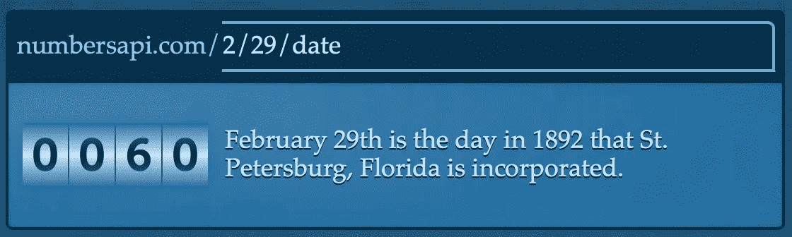

# 15 个有趣的 API，供你在 2022 年的下一个编码项目使用

> 原文：<https://medium.com/codex/15-fun-and-interesting-apis-to-use-for-your-next-coding-project-in-2022-86a4ff3a2742?source=collection_archive---------0----------------------->

## 确保你都尝试过了

作为开发人员，我们都会编写代码或遇到一些非常独特的项目。从黑客马拉松到兼职事业，我们喜欢在工作之外构建东西。但有时，我们可能缺少想法，或者只是有一个想法，但不希望从头开始编写代码。这就是公共 API 可以帮助我们的地方。


在这篇特别的博客中，我整理了一份令人敬畏的 API 列表，你可以看看并在你的下一个项目中使用。谁知道呢，你可能会做出一些令人愉快和奇妙的东西！

# 什么是 API？

如果你不知道 API，API 代表**应用程序编程接口**。它是两个或多个软件进行通信的一种方式。

例如，谷歌有一个 API，可以让你获得关于地图的信息，Twitter 有一个 API，可以让你以编程方式发送推文。通常，API 都有很好的文档来帮助人们无缝地使用它们。

> 你也可以阅读更多关于 REST APIs 的[，特别是在这里的博客](/codex/the-rest-architecture-why-you-might-have-entirely-missed-it-d45adf3ed981)！

# 有趣的 API

这里让我们列出所有的 API，它们大多只是为了好玩，可以用来给你现有的网站和应用程序添加幽默或极客的东西。

## [1。口袋妖怪 API](https://pokeapi.co)

这是一个可以在一个地方访问所有口袋妖怪数据的 API。它每个月服务超过 250，000，000 个 API 调用！你可以用一个口袋妖怪的名字发送一个请求，然后它会发回一个包含他们所有信息的 JSON 响应。

因为这个不需要 API 键，你可以直接在你的浏览器中尝试。让我们找找口袋妖怪，同上—

```
[https://pokeapi.co/api/v2/pokemon/ditto](https://pokeapi.co/api/v2/pokemon/ditto)
```

*我能马上想到的一个简单有趣的副业是****pokédex****！*

## [2。敏捷 API](https://agify.io)

你如何从一个人的名字看出他的年龄？这里有一个你可以使用的有趣的小 API。Agify 用于根据一个人的名字来预测其年龄。每天最多可免费使用 1000 次。您可以在您的浏览器中尝试以下功能—

```
[https://api.agify.io?name=michael](https://api.agify.io?name=michael)
```

## [3。钻孔 API](http://www.boredapi.com)

例如，这是你可以添加到你的个人网站上的东西。无聊的 API 确保用户永远不会感到无聊。当被请求时，它用一个随机的活动来响应用户。你甚至可以自定义类型和参与人数！

## [4。查克·诺里斯 API](https://api.chucknorris.io)

这是一个免费的 JSON API，用于手动管理 Chuck Norris 事实。它还拥有 Slack 和脸书信使集成！例如，您可以检索一个 JSON 格式的随机 chuck 笑话—

```
[https://api.chucknorris.io/jokes/random](https://api.chucknorris.io/jokes/random)
```

## [5。数字 API](http://numbersapi.com/#42)

一个关于数字的有趣事实的 API。它提供了关于数字的琐事、数学、日期和年份。例如，如果我查找 2 月 29 日的日期事实，我会得到以下结果。



## [6。狗 API](https://dog.ceo/dog-api/)

这是互联网上最广泛的开源狗狗图片集合。你获取随机的狗图片，获得所有品种的列表，获取特定品种的随机照片，查看一个品种的所有子品种，甚至提交你自己的狗的照片！例如，在你的浏览器中试试这个—

```
[https://dog.ceo/api/breeds/image/random](https://dog.ceo/api/breeds/image/random)
```

## [7。漫威 API](https://developer.marvel.com)

漫威漫画 API 允许各地的开发者访问漫威庞大的漫画图书馆的信息——从 70 年前开始。然而，对于这个 API，您需要生成一个密钥。你可以在这里寻找任何东西，比如人物，故事，特定系列的创作者等等。

# 有趣的 API

这些 API 提供了一组更有用的数据或功能，您可以将它们集成到有意义的项目中。

## [8。NASA 开放 API](https://api.nasa.gov)

现在，这些是一堆超级惊人的 API，有大量的用例。目标是使应用程序开发人员能够方便地获取包括图像在内的 NASA 数据。有一个名为每日天文图片的 API，每天从太空返回一张新的图片，一个用于获取火星天气的 API，以及一个仅用于火星漫游者照片的 API。

## [9。SpaceX API](https://github.com/r-spacex/SpaceX-API)

SpaceX 和埃隆·马斯克对太空探索的贡献简直不可忽视。SpaceX API 是一个 REST API，用于发射、火箭、核心、太空舱、Starlink、发射台和着陆台数据。然而，这一个是非官方的。

## [10。其余国家](https://restcountries.com)

考虑构建一个需要世界不同国家数据的应用程序？这是你需要的 API。在捐款的支持下，这个免费的 API 提供了这个国家的货币、首都、地区、语言等信息。尝试在你的浏览器中了解印度的一切。

```
[https://restcountries.com/v3.1/name/India?fullText=true](https://restcountries.com/v3.1/name/India?fullText=true)
```

## [11。开放天气 API](https://openweathermap.org/api)

你以前一定见过这个。这个 API 提供了超过 200，000 个城市的天气数据。您还可以使用 API 来访问应用程序的历史天气数据，例如，执行一些分析或预测。

## [12。Polygon.io API](https://polygon.io)

您可以从 Polygon.io API 获得各种财务数据，如股票报价、历史数据等等。他们还有一个获取加密货币信息的 API。

## [13。新闻 API](https://newsapi.org)

如果您希望在项目中包含新闻数据，这应该是要使用的 API。全世界有超过 500，000 名开发人员在使用这个 API，它可以帮助从网络上的新闻来源和博客中定位文章和突发新闻标题。

## [14。COVID19 API](https://covid19api.com)

在**数字海洋**的支持下，这个 API 已经服务了超过 7.5 亿个请求。它通过一个简单的 API 免费提供对 COVID19 上数据的访问。人们可以使用它来构建仪表板和移动应用程序，或者集成到其他应用程序中。数据来源于约翰霍普金斯大学 CSSE 分校。

## [**15。地图框 API**](https://docs.mapbox.com/api/overview/)

作为谷歌地图的替代品，MapBox 为四个不同的*服务*提供 API:**地图**、**导航**、**搜索**和**账户**。

> 我写了许多关于这些 API 的博客，还在 YouTube 上制作了视频。

[](/nerd-for-tech/navigation-with-mapbox-for-flutter-apps-313687778686) [## 针对 Flutter 应用程序的地图框导航

### Mapbox 是谷歌地图平台的强大替代品

medium.com](/nerd-for-tech/navigation-with-mapbox-for-flutter-apps-313687778686) [](/nerd-for-tech/turn-by-turn-navigation-with-mapbox-16f874567b3c) [## 使用地图框的即时路线导航

### 让我们来探索一下 Mapbox 强大的导航 SDK

medium.com](/nerd-for-tech/turn-by-turn-navigation-with-mapbox-16f874567b3c) 

# 荣誉提名奖

GitHub 上的**公共 API**提供了一个用于软件和 web 开发的免费 API 集合列表。知识库有将近 198k 的恒星！⭐

请务必通过下面的链接查看—

[](https://github.com/public-apis/public-apis) [## GitHub-public-API/public-API:免费 API 的集合列表

### 免费 API 的集合列表。在 GitHub 上创建一个帐户，为 public-API/public-API 开发做贡献。

github.com](https://github.com/public-apis/public-apis) 

如果您有任何问题或建议，请随时联系我。您可以在这些社交媒体平台上关注我— [LinkedIn](https://www.linkedin.com/in/ab-satyaprakash/) 、 [YouTube](https://www.youtube.com/channel/UCJ6D0HS8c9Il-eX5lGbAyGg) 、 [Twitter](https://twitter.com/AbSatyaprakash) 、 [Instagram](https://www.instagram.com/absatyaprakash/) 了解更多更新内容！

**一如既往！黑客快乐！😇**

[加入我的电子邮件列表，获得更多精彩的教程和编程博客](https://absatyaprakash01.medium.com/subscribe) ❤️