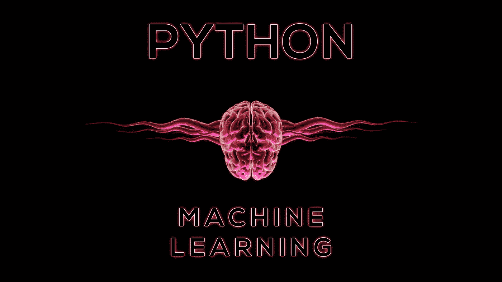

# 你需要 Know🧠的 15 个机器学习 Python 库

> 原文：<https://medium.com/codex/15-python-libraries-for-machine-learning-you-need-to-know-f62e8073dbc1?source=collection_archive---------0----------------------->

## 我花了太长时间来写这篇文章

有多少次你不得不找一个 Python 的库来帮你做机器学习项目？很有可能，你经常有这样的经历！有这么多可用的 Python 库，选择正确的库并不容易。