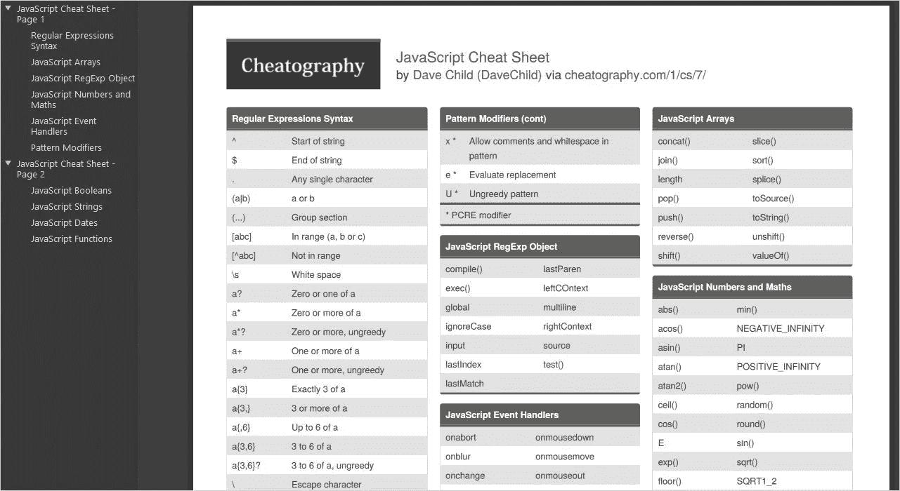

# 面向开发人员和学生的 16 个有见地的 JavaScript 备忘单

> 原文：<https://medium.com/codex/16-insightful-javascript-cheat-sheets-for-developers-and-students-933a366a8e7a?source=collection_archive---------3----------------------->

> JavaScript 是一种广泛使用的编程语言。

根据 W3Techs 的数据，互联网上 97.4%的网站都将 JavaScript 作为客户端编程语言。

它是一种创建于 1995 年的高级脚本语言，也称为 JS。JavaScript 是一种多范例编程语言，可用于以函数式、命令式或事件驱动式编写代码。它还包括处理文本、数据结构、正则表达式和文档对象模型(DOM)的 API。

JavaScript 在各种应用程序中使用，包括:

1.  *WebSocket 或 Ajax 用于加载网页内容。*
2.  *2。浏览器游戏，网页动画。*
3.  *3。控制流媒体的播放。*
4.  *4。创建弹出窗口、页面重定向和其他功能。*
5.  *5。谷歌、YouTube、脸书、Expedia、Overstock 和更受欢迎的网站都使用 JavaScript。*

因此，如果你是一名 JavaScript 开发人员，你会很熟悉在工作中忘记一个概念的场景。这是因为要记住所有的原则几乎是不可能的，当你迷路的时候，你最终只能在网上或者你身边的书上翻来翻去。这既费时又让人恼火。

但是不要担心，我们已经为您准备了一些有趣的 JavaScript 备忘单。他们将帮助 JavaScript 开发者以及学习这门语言的新手。

检查他们！

[**Codecademy**](https://www.codecademy.com/learn/introduction-to-javascript/modules/learn-javascript-introduction/cheatsheet) :这个简单的 JavaScript 备忘单涵盖了所有细节和语法。它从快速介绍开始，然后深入研究条件、函数、数组、范围、循环、对象、迭代器、类、模块、承诺、异步等待、浏览器编译和兼容性、库、布尔、数据实例和许多其他主题。

[**SheCodes**](https://www.frontendcheatsheets.com/javascript)**:**这是一个有用的参考列表，包括 JavaScript 字符串、变量和其他重要属性。他们提供了每个部分的语法，您也可以复制并粘贴到您的项目中，使事情变得更加简单。变量、数据类型、结构、警报和提示、if-else 语句、数组、循环、数字、日期、对象、函数、调试、选择器、事件、AJAX 和元素操作都包括在内。

[**Chea tography**](https://cheatography.com/davechild/cheat-sheets/javascript/)**:**Dave Child 的快速指南可以在网上找到，也可以直接从网站下载。JavaScript 方法、函数、正则表达式、XMLHttpRequest 对象、模式修饰符、RegEx 对象、事件处理程序、数组、布尔值、日期和字符串都包括在内。如果您忘记了一些功能，需要快速回忆起来，这很有用。

cheat ography—JavaScript cheet sheet

[**HTMLcheatsheet.com**](https://htmlcheatsheet.com/js/)**:**对于希望在某些 JavaScript 原则上领先一步的开发人员和编码人员来说，这真是一笔财富。它概述了所有的基本，中级和高级原则，并组织其语法和例子，以便更容易理解。页面脚本，包括外部 JavaScript 文件、函数、操作 DOM 元素、循环、if-else 语句、变量、数据类型、字符串、事件、数字和数学、日期、数组、全局函数、正则表达式、错误、承诺等等。

[**website setup**](https://websitesetup.org/javascript-cheat-sheet/)**:**在这个网站上，您可以获得完整的文本和 PDF 形式的 JavaScript 备忘单。它讨论的主题包括在站点中包含 JavaScript、调用外部 JS 文件，包括注释、变量、数据类型、对象、数组、运算符、函数、循环、字符串、方法、表达式、量词、算术和数字、日期和时间、DOM 模式、事件、动画、错误等等。

[**现代 JavaScript**](https://github.com/mbeaudru/modern-js-cheatsheet) **:** 这个 GitHub JavaScript 备忘单可以帮助你快速解决项目中出现的困难。您还会发现作者的一些建议，以及一些您可以参考的其他资源。变量声明、箭头函数、参数、销毁、数组方法、扩展操作符、承诺、模板文字、导入/导出、类、关键字、异步 Await、Truthy/falsy、生成器、静态方法和变形都包含在备忘单中。

****:**您可以将此页面保存在浏览器中，并在有疑问时随时返回，因为它会提醒您在处理 JavaScript 项目时需要的一些重要特性。它涵盖了 JavaScript 的基础知识，如数组属性和方法、布尔属性和方法、数学属性和方法、字符串属性和方法、DOM 事件、核心 DOM、DOM 节点、RegExp、浏览器原则和图形。**

**[**编码忍者**](https://www.codingninjas.com/blog/2021/04/04/javascript-cheat-sheet-for-a-new-developer/) **:** 如果你刚开始接触 JavaScript 或者是一个新的开发者，当你在写的时候忘了什么的时候，这个备忘单就派上用场了。它可以帮助您记住数据类型、基本术语、对象、函数、变量和范围、运算符、强制、真/假、生成变量、循环、浏览器属性、DOM、自动继承属性、内置对象和承诺。**

**[**Ilovecoding.org**](https://ilovecoding.org/blog/js-cheatsheet)**:**这份 13 页的 JavaScript 备忘单提供了你交互理解 JavaScript 所需的全部内容。它将带你从基本的想法到复杂的 JavaScript，带有适当的语法、解释和词汇。最好的部分是你可以一次或单独下载全部 13 页。它包括数据类型、对象、基本词汇、函数、操作符、强制、循环、构造函数、这个关键字、ES6+、DOM API 和其他主题。**

**[**Codepen**](https://codepen.io/davidicus/details/trhme)**:**另一个有用的备忘单是这个 JavaScript 快速参考，它包含了各种主题和示例。使用 DOM，函数和 JS 都是它的一部分。您可能会学到如何访问 DOM 元素、获取子节点或父节点、构建新的 DOM 元素、添加元素、添加/移除/检查/切换类、添加/移除数组项和对象属性、条件、循环、事件和计时器等等。**

**[**Vanilla JavaScript**](https://vanillajstoolkit.com/reference/)**:**一个 JavaScript 方法、辅助函数、插件、样板、聚合填充和学习资料的库。**

**[**node . js Cheatsheet**](https://github.com/LeCoupa/awesome-cheatsheets/blob/master/backend/node.js)**:**该 cheat sheet 描述了每个代码的含义，以便您在使用它们之前知道它们是做什么的。控制台，计时器，模块，进程，事件，实用工具，以及更多的功能包括在内。**

**[**Reactcheatsheet.com**](http://reactcheatsheet.com/)**:**网站详细解释了 React，包括代码示例。阅读每种方法的文档会让你对语言和特性有一个完整的理解。**

**[**交互式 JavaScript ES6、ES2016、ES2017 cheatsheet**](https://es6cheatsheet.com/)**:**这好像是 ES6、ES2016、es 2017 的交互式 cheat sheet。他们给出了一系列例子来展示当前 JavaScript 的关键组件。所有的代码都是可修改和可运行的，所以你可以随心所欲地尝试。**

**[**JavaScript 快速参考**](https://codepen.io/davidicus/details/trhme) **:** 无论你是在处理 DOM、JS，还是函数，这个备忘单都概述了方法的用途。**

**[**一张图中的 JavaScript**](https://github.com/coodict/javascript-in-one-pic)**:**这个思维导图图形的目标是帮助程序员获得语言的概述，同时也使其易于本地化和识别语法的微妙之处。**

## **结论**

**我希望附带的 JavaScript 备忘单可以帮助您在编程时记住一些重要的思想。只需将它们保存或保存在浏览器中，并在遇到困难时随时参考。**

**程序员可用的更多备忘单:**

*   **[JavaScript 数组备忘单](https://gist.github.com/ourmaninamsterdam/1be9a5590c9cf4a0ab42)**
*   **[普通 JavaScript 快速参考](https://gist.github.com/thegitfather/9c9f1a927cd57df14a59c268f118ce86)**
*   **[Ember.js 备忘单](https://gist.github.com/dreikanter/8b1e1cf05534febd9e00)**
*   **[Node.js 备忘单](https://github.com/LeCoupa/awesome-cheatsheets/blob/master/backend/node.js)**
*   **[Molecular.js 备忘单](https://github.com/LeCoupa/awesome-cheatsheets/blob/master/backend/moleculer.js)**
*   **[Feathers.js 备忘单](https://github.com/LeCoupa/awesome-cheatsheets/blob/master/backend/feathers.js)**