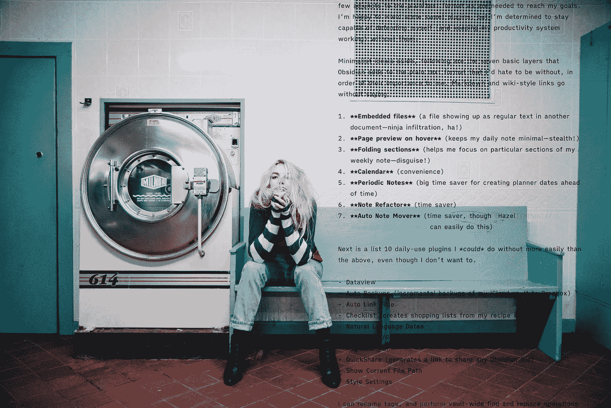

# 我邀请了 17 个黑曜石特性进入我的自主纯文本世界

> 原文：<https://medium.com/codex/17-obsidian-features-ive-invited-into-my-autonomous-plain-text-world-4b6f34e37343?source=collection_archive---------0----------------------->

## 只有当你的笔记独立于任何一个应用程序时，你才是真正的数字自由

根据 [jumpstory](https://jumpstory) 的许可使用的照片。作者添加的纯文本。

忍者战士必须学习的第一项技能是太极，或徒手格斗。如果没有这个技能和附带的武器，杖、飞刀和炸药将毫无意义