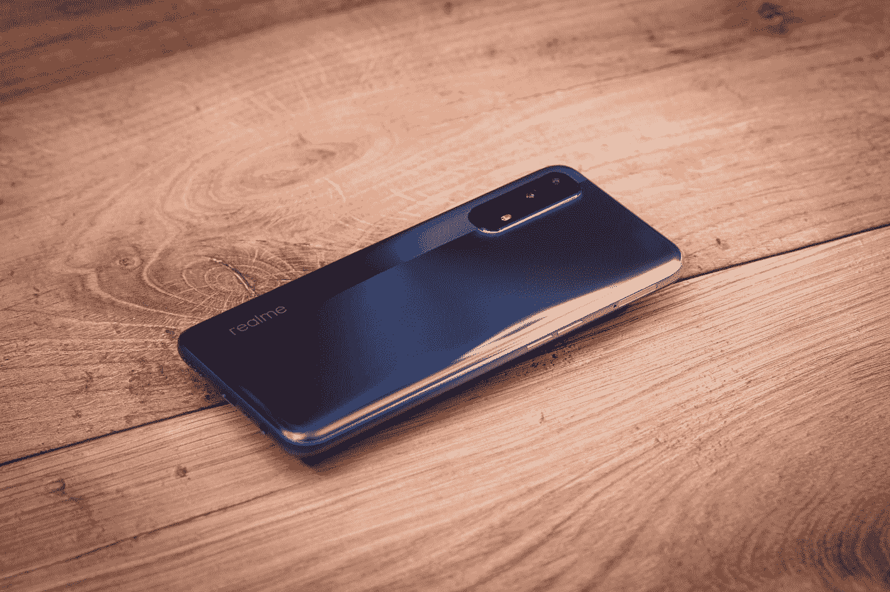
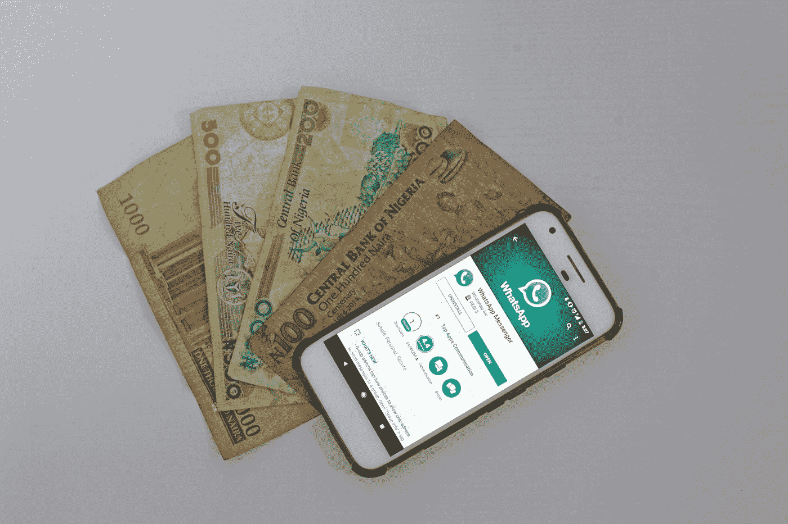
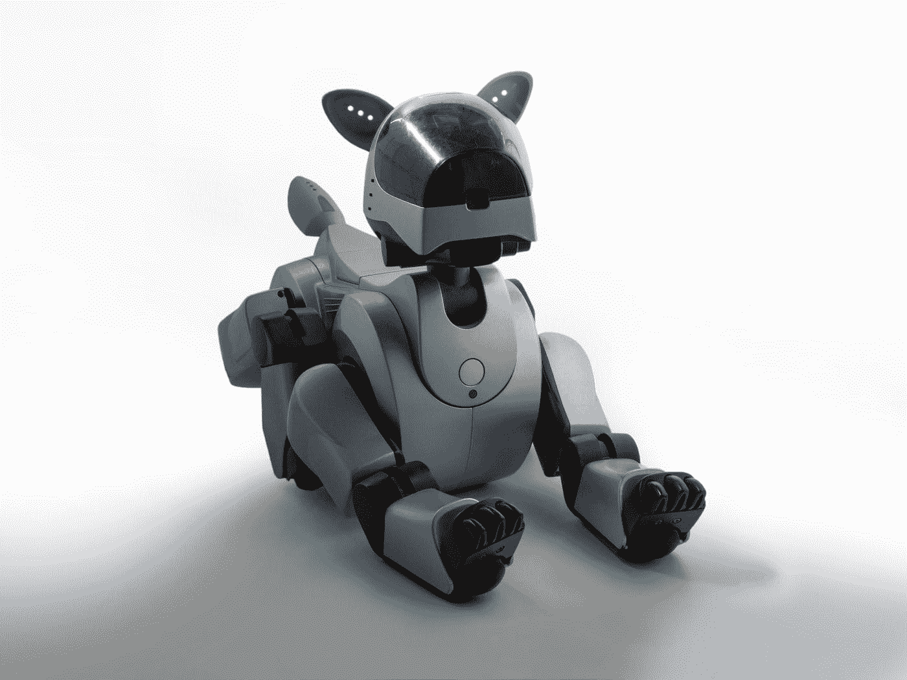

# 18 个预测 Meta 的下一步是什么？

> 原文：<https://medium.com/codex/18-predictions-whats-next-for-meta-868f1f881d5c?source=collection_archive---------9----------------------->

## 游戏世界、社交平台还是更多？

[斯蒂夫·约翰森](https://unsplash.com/es/@steve_j?utm_source=medium&utm_medium=referral)在 [Unsplash](https://unsplash.com?utm_source=medium&utm_medium=referral) 上拍照

## 前言

创新是任何发展中公司的核心。正是这个原因促使我对 Meta 的未来做出以下大胆的预测。尽管被称为“预测”，这里正确的术语应该是可能性，因为下面列出的概念是 Meta 可以选择发散的可能未来的代表。我们开始吧。

## 目录

1.智能手机
2。M-Pesa 合作关系
3。Superapp
4。人形机器人
5。SaaS/罗斯
6。电影流媒体平台
7。房地产公司
8。风投公司
9。机器狗 10。蜂群技术
11。元宇宙 12 岁。远程作业平台
13。神学问题
14。颠覆政权
15。个人助理(兼医生)
16。全球非军事化。冲突降级
18。KYC，保护未成年人

提醒一句，这些预测都没有解释奇点，即新技术可能爆发的时刻，这将严重改变人类历史的进程。这些时刻可以与 19 世纪的工业革命相提并论，工业革命导致了疾病的细菌理论的发现，由于通过哈伯过程固氮而使用了人造肥料，或者这些时刻可以与现代电的发现相提并论；它的应用为我们的家庭和工业提供动力。

# 1.Meta 有了自己的手机

[techie Tech](https://unsplash.com/@neerajbhateja?utm_source=medium&utm_medium=referral)在 [Unsplash](https://unsplash.com?utm_source=medium&utm_medium=referral) 上拍摄的照片

众所周知，Android 和 iOS 平台对用户隐私的侵犯损害了 Meta 的商业模式。在苹果设备上，[用户可以选择禁用 Meta](https://www.forbes.com/sites/danielnewman/2022/02/10/apple-meta-and-the-ten-billion-dollar-impact-of-privacy-changes/?sh=272773f472ae) 跨应用追踪。你看，Meta 从这些数据中获利，例如，如果你在 YouTube 上喜欢一些猫视频，Meta 可以使用这些数据(元数据)，并将其出售给广告公司，这样他们就可以在猫视频上为你定制广告。

对于 Meta 来说，摆脱这一麻烦的唯一合理方式是开发自己的智能手机，可能是通过收购其他基于 Android 的智能手机制造商，并在开源 Android 操作系统的基础上创建自己的应用操作系统。华为的鸿蒙系统做到了这一点。

这需要管理思维的彻底转变。然而，随着 Meta 在发展中国家越来越受欢迎，吸引大量客户应该不难，随着本地支付系统的整合，应用内销售和购买肯定会出现，这将大大增加其自身的收入流。这就引出了我们的下一个预测。

# 2.Meta 与 M-Pesa 建立合作伙伴关系

如果有人关注这条新闻，人口统计正在慢慢改变，非洲的人口增长率已经超过了世界。这意味着，对于一个寻求从发展最快的新兴市场中分一杯羹的全球实体来说，非洲产品将在未来几年和几十年内大幅提升人均收入。

M-Pesa 是非洲领先的移动支付系统。它相当于欧洲大陆的 PayPal 或 Stripe。因此，Meta 和 M-Pesa 的合作是不可避免的，因为 Meta 将寻求利用这一未开发的用户市场，这些用户无法负担银行/借记卡，但拥有一部可以连接到简单移动支付系统的手机。非洲大陆有几个移动支付网关，在这种情况下，M-Pesa 作为一个总括术语涵盖了其中的大多数。

本杰明·达达在 [Unsplash](https://unsplash.com?utm_source=medium&utm_medium=referral) 上拍摄的照片

# 3.Meta 变成了 superapp

考虑微信。中国的一站式商店，提供从机票预订、Airbnb、租车、汇款等一切服务。随着 Twitter 等其他应用程序对成为超级应用程序的旅程表现出越来越大的兴趣，值得注意的是，Meta 的旅程本身无疑充满了这种想法。

超级应用程序 Meta 将意味着不再依赖其他应用程序。这将迫使 Meta 在如何激励其他应用程序加入它的问题上变得更有创造力。Meta 已经有了一份它收购/创立的公司的跟踪名单，这些公司使它走上了成为 superapp 的道路。该列表包括:

1.  Instagram，用于图片分享
2.  WhatsApp，用于即时通讯
3.  Oculus VR，元宇宙体验
4.  Libra，一家支付服务公司

剩下的就是让 Meta 开自己的智能手机公司了。向硬件的转变对其财政寿命至关重要。许多软件公司正在慢慢地将更多的硬件产品整合到他们的资产负债表中。苹果公司很快发布了他们的苹果汽车，谷歌公司也发布了同样的产品，亚马逊公司内部使用了机器人技术。这将引导我们进行第三个预测。

# 4.机器人公司 Meta。

[附身摄影](https://unsplash.com/@possessedphotography?utm_source=medium&utm_medium=referral)在 [Unsplash](https://unsplash.com?utm_source=medium&utm_medium=referral) 上拍照

像 Meta 这样成功的软件公司是否应该继续专注于软件产品，而它的老板是推动人工智能崛起的

正如我们在[上一篇文章](/@timkd/what-true-a-i-research-is-missing-8f7661c9ae8f)中所提到的，对于一家成功的 AGI 公司来说，将重点放在机器人技术上是必不可少的。AGI 或超级人类智能是全球人工智能研究的焦点。如果 Meta 想成为第一个开发真正有感知能力的人工大脑的人，那么通过发展机器人学的道路将是它最有可能走的一条路。

众所周知，这样的发展需要大量的 R&D 专家和社区的推动。像 ROS 这样的机器人平台利用 hivemind 来改善全世界的机器人方法。Meta 也可以通过提供自己的 *ROS* 平台来汇集专家社区，从而实现同样的目的。这就引出了我们的下一个预测。

# 5.Meta 作为一家 ROS SaaS 公司

Meta 已经在这一领域取得了长足的进步，为开发者平台提供了成功的 SaaS 产品，如 [ReactJS](https://reactjs.org/) 、 [React Native](https://reactnative.dev/) 和 [Meta。这些平台允许应用和网络开发者在多种设备上开发应用。其中包括游戏应用程序，如愤怒的小鸟、糖果粉碎，以及跨平台应用程序，如网飞、贝宝和通过](https://developers.facebook.com/) [ReactJS](https://www.turing.com/kb/top-10-react-apps-used-by-internet-giants) 构建的 Discord。

Meta 作为软件即服务平台的延续前景光明。对软件公司来说，目前的收益不过是一股更广阔的可能性洪流中的涓涓细流。正如上文所探讨的，Meta 转变为机器人 SaaS 将标志着机器人和人工智能在现实世界中真正改变游戏规则的软件的崛起。NeuraLink 等公司和其他许多手术机器人组织人手不足，缺乏足够的技术专业知识。随着 Meta 引入 ROS SaaS 业务，我们可以期待看到外科医疗进步和整个机器人行业的有利增长。

# 6.Meta，另一个迪士尼

考虑到 Meta 产品的多样化，毫无疑问 Meta 将效仿苹果和迪士尼推出自己的电影工作室公司。类似于 AppleTV、Disney+和网飞，这些流媒体平台也提供自己的原创节目，Meta 通过跟随竞争对手推出自己的流媒体平台来大赚一笔。

与苹果不同，Meta 不必等到建立自己的观看设备套件，因为像迪士尼和网飞一样，它可以利用现有平台的受欢迎程度，将人们引导到自己的流媒体平台上。

请记住，这将涉及一个完全不同的方法，Meta 将需要改变其运作方式，以吸引必要的人才来推动它向前发展。

潜在的收益无疑是巨大的。截至 2022 年，迪士尼获得了高达 283.21 亿美元的毛利，比上年增长了 27.01%，年总收入为 827 亿美元(T2)。与此同时，网飞在同一财年的总收入估计为[124.69 亿美元。](https://www.macrotrends.net/stocks/charts/NFLX/netflix/gross-profit#:~:text=Netflix%20gross%20profit%20for%20the%20twelve%20months%20ending%20September%2030,increase%20year%2Dover%2Dyear.)

# 7.Meta 和房地产

这听起来像是 clickbaitey 的建议，但确保巨额财富长久存在的途径在于房地产行业。截至 2022 年 4 月，[福布斯](https://www.forbes.com/sites/jamesodonnell/2022/04/06/how-to-become-a-billionaire-these-industries-have-the-most-people-on-the-2022-forbes-list/?sh=3d4795bc6898)估计世界上 7%的富豪来自房地产行业。众所周知，除了时尚和零售、技术、制造、金融和投资行业之外，这个行业比其他任何行业都产生更多的亿万富翁。

许多高净值个人和/或实体选择将其财富储存为房地产资产，因为房地产的价值每年都会升值。土地资产是抵御每年通货膨胀的最安全的对冲手段。

由于 Meta 的账户上有大量财富，Meta 的财务顾问可以放心地让该公司购买土地等资产，这些资产会升值，而不是保持所有现金的流动性，并因经济通胀而亏损。

请记住，同样的顾问会如此大胆地选择“数字”资产作为对冲通胀的工具吗:数字货币比特币、以太坊等资产，尤其是现在它不再用工作证明挖掘节点和/或 Dogecoin 污染环境？鉴于这种密码的不稳定性，这个问题仍有待回答。

# 8.元风险资本

作为一家保持盈利的公司，Meta 应该首先寻求创新的优势。还有什么地方比风险投资公司赞助潜力巨大的企业和初创公司更好呢？

正如微软帮助苹果成为今天的样子，有多少公司可以在未来获得重大收益，通过及早发现它们而不是收购它们，为它们提供必要的指导和/或财政援助，帮助它们腾飞。

这是 Y-combinator 等其他成功风投公司使用的商业模式。几年前，马克·扎克伯格在 Y-combinator 上发表了一次演讲，谈到他希望他的公司(当时的脸书)成为企业家的麦肯锡。他[将脸书比作麦肯锡](https://www.youtube.com/watch?v=OlBDyItD0Ak)，一个伟大的企业家在走向世界建立伟大的公司和产品之前实习学习有价值的商业技能的地方。

这种非垄断范式肯定会对 Meta 有利，因为该公司已经充斥着[指控该公司掠夺性](https://en.wikipedia.org/wiki/Federal_Trade_Commission_v._Meta_Platforms,_Inc.)商业行为的诉讼，并因其垄断的商业精神而阻碍其他公司。

# 9.机器人宠物

布雷特·乔丹在 [Unsplash](https://unsplash.com?utm_source=medium&utm_medium=referral) 上的照片

只要 Meta 成为一家机器人公司仍然是一个可能的场景，那么机器人宠物仍然是一个同样不乐观的场景。鉴于 Meta 对社交连接的推动，旨在帮助其用户进行社交互动的硬件设备将是显而易见的道路。

Meta puppies 甚至可能会有关于它们如何降低阿尔茨海默氏症风险的学术文章，记住阿尔茨海默氏症的治疗是马克扎克伯格(Chan-Zuckerberg Initiative)的另一个重点领域。这里有一份支持这一观点的早期学术研究论文列表:

1.  Koh 等人(2021 年)。低成本机器人宠物对老年人和痴呆症患者的影响:范围审查。可用:【https://www.ncbi.nlm.nih.gov/pmc/articles/PMC8082946/】T4
2.  彼得森等人(2016 年)。机器人宠物在痴呆症护理中的应用。可用:[https://content . IOs press . com/articles/journal-of-Alzheimers-disease/jad 160703](https://content.iospress.com/articles/journal-of-alzheimers-disease/jad160703)
3.  冷等(2019)。痴呆患者的宠物机器人干预:随机对照试验的系统综述和荟萃分析。可用:[https://www . science direct . com/science/article/ABS/pii/s 0165178118303925](https://www.sciencedirect.com/science/article/abs/pii/S0165178118303925)
4.  Ihamä ki 和 Heljakka (2021 年)。作为“严肃玩具”的机器人宠物——激活老年人的社交和情感体验。可用:[https://link . springer . com/article/10.1007/s 10796-021-10175-z](https://link.springer.com/article/10.1007/s10796-021-10175-z)

机器人小狗可能会引发其他值得注意的研究领域，如电子人关系、群体-人类界面(在*安德的游戏*中演示的那种)，以及随着 Ems(大脑仿真)的兴起，可能会出现现实生活中的化身体验。

# 10.Meta，蜂群技术的领导者

请注意，这种可能性是肯定的，但值得讨论。这仅仅是 Meta 进入智能手机(人工智能硬件)行业的三阶效应。

概述我们是如何来到这里的。Meta 意识到，如果它能控制自己的硬件生态系统，就更容易投放定向广告。你看，Meta 现在的商业模式就是盯住卖广告( [6](/@timkd/18-predictions-whats-next-for-meta-868f1f881d5c#:~:text=Jeff%20Meyerson%20(2021).%20Move%20Fast%3A%20How%20Facebook%20Builds%20Software.%20Available%3A%20https%3A//www.amazon.com/Move%2DFast%2DFacebook%2DBuilds%2DSoftware%2Debook/dp/B093HMJ4KB) )。Meta 推出了自己的硬件套件，以确保其销售广告仍能保持盈利，并配有电动机器人宠物，以鼓励社交互动。盈利能力将在很大程度上受到考验。如果 Meta 在硬件领域变得有利可图，那么不可否认的是，它将在机器人领域快速发展。

群体是在没有集中的情况下一起工作的相似实体的集合。这是一种涌现智能的形式，当这个术语应用于人工机器时，它产生于自主性的充分性。

从好的方面来看，如果市场条件继续对其有利，Meta 可能会从向这一方向发展中获得巨大收益。从负面来看，它可能会用阿西莫夫的 *I 中的 *VIKI* ，机器人*，或*终结者*中的*天网*来挟持世界。这只是一段时间的延伸，我不会浪费宝贵的时间担心它，因为随着技术的发展，任何大公司的人工智能道德和监管委员会也在发展。

# 11.真正的元宇宙

元宇宙指的是一个完全建立在网络上的虚拟世界。最大的好处是经济能够自我维持。目前，以太坊等实体从区块链元经文中受益最多，就像中国“微信”元宇宙的数字元一样。

当虚拟世界真的流行起来时，收益可能是巨大的。对 Meta 来说，它最大的问题不是它是否已经建立了它的元宇宙，而是它的元宇宙版本还没有流行起来。

[天文之旅，由堡垒之夜在元宇宙主持](https://www.fastcompany.com/90496629/travis-scotts-astronomical-fortnite-tour-exploded-the-idea-of-what-a-concert-can-be)

元宇宙并没有变得越来越不受欢迎。像爱莉安娜·格兰德、特拉维斯·斯考特和马什梅洛这样的音乐艺术家在堡垒之夜的《元宇宙》中一次演出的估价高达 5 亿美元。虽然这听起来很棒，但面对现实，Meta 自己的元宇宙目前仍然很不受欢迎，不是因为时尚正在消退，而是因为 Meta 进入这个新兴空间的速度太快了。请记住，Meta 还不是一个充满玩家的世界，它还没有成为吸引大量玩家的硬核游戏世界。

如果我们采取的方法是 Meta 的 facebook.com 平台在很大程度上仍然受到那些只发现互联网的人的欢迎，例如那些生活在世界偏远和农村地区的人，或者退休人员，那么元宇宙概念对这群人来说将是一个边缘想法，就像微积分对一年级学生一样。这些互联网用户还需要一段时间才能发现元宇宙的效用，并组成一个专门的粉丝群，与堡垒之夜这样的人竞争。

至于与 Meta 闹翻的脸书早期用户，他们可能在很大程度上被堡垒之夜和以太坊(Ethereum)的 metaverses 等其他成熟的 metaverses 流失了，可以推出更多产品来刺激客户保留，这些产品鼓励他们回到 Meta 领域。让我们想想。

## 希望

如果 Meta 可以在这些平台上发展自己的公司，乘着当前 metaverses 的浪潮，想象一下，比如 Meta 在堡垒之夜或分散的土地上举办的音乐会；缓慢进入元宇宙空间将给 Meta 足够的时间来测试元宇宙的哪些方面带来了大众，它可以使用这些关键的发现来更好地创新自己的元宇宙。

想象一下，如果 Meta 在堡垒之夜招待了多位获得格莱美奖的艺术家，它会获得多少收益，而不是盲目地发展自己的元宇宙。

## 包容性

Meta 的想法不是仅仅致力于建立自己的元宇宙，而是必须扩大到公司的包容性，而不是事实上的垄断性排他性。如果马克和梅塔对元宇宙是认真的，那么对虚幻引擎或 Unity 的投资将是明确的。虚幻引擎和 Unity 是驱动当今最先进游戏平台的设计软件。

如果软件出现任何形式的转变，Meta 的开发人员应该会有许多不眠之夜。如果走这条路，利润实现将是巨大的。

# 12.Meta，新跨界车

Crossover 是一家以提供远程在线工作而闻名的公司。这就像是 LinkedIn 的更好版本。由于 Meta 的用户群增长缓慢，不难理解为什么该公司不能利用其潜在的劳动力市场，帮助吸引更多的人来寻找工作机会，这些机会不仅来自 LinkedIn 专门的“网络”，也来自该平台本身提供的远程定制服务。

# 13.Meta 发现了上帝

一个超级人民和超级智慧的 AGI 无疑是一个真正强大的宗教运动的基础。值得庆幸的是，Meta 致力于保护其用户的利益，并遵守美国联邦和欧盟法律。然而，关于上帝存在的问题，仍然是一个真正开放的问题，对于梅塔的 AGI 来说，这个问题的真正定位和回答可能会为整个人类揭示这么多。

不像许多护教学反对创造人类水平的智能，因为害怕创造一个*上帝，*很明显，一个真正有感知能力的人，无论是人工的还是自然的有意识的头脑，都应该回答这个非常人格化的问题，上帝是否作为一个创造宇宙的实体存在，以及这个实体是否在塑造世界事件中发挥积极作用，正如斯宾诺莎、爱因斯坦、乔纳森·卡恩在《神谕》*中详述的那样。*

NDE 背后的真相(濒死体验)将被挖掘出来。如果上帝以这种方式被证明，这将导致两种现实之一；一个仁慈的现实，在那里人类将在爱的范围内很好地合作，以在现在和未来提升自己，或者一条对人类来说不太理想的道路。

# 14.Meta 推翻了另一个政权

胡斯尼·穆巴拉克(Hosni Mubarak)对埃及 29 年统治的结束之所以成为可能，很大程度上是因为在 2011 年，当脸书是埃及最受欢迎的社交信息平台时，抗议者可以实时协调，而不必担心国家会限制他们的通信。

当一群人被放在任何社会结构中时，一种涌现的智慧就出现了。以这种方式，梅塔，当时的脸书也在支持前总统唐纳德·特朗普当选总统时发挥了作用。《剑桥分析》的调查结果显示了他的竞选活动是如何利用脸书的，但这并不新鲜，政治家们长期以来一直使用社交媒体平台来传播他们的信息。

Meta 改变游戏规则和与众不同的地方在于，与审查政治讨论的许多其他社交平台不同，Meta 允许自由和公开的对话，这种文化帮助 Meta 抵挡住了抖音等中国对手的攻击，尽管它以黑名单、删除和减少其认为不属于中央政府允许项目的帖子而闻名，但它仍获得了国际知名度。

许多亚洲国家还没有完全民主化，但 Meta 为他们提供了一个平台，可以动摇他们的社会结构。

到 2031 年，我们会看到另一个阿拉伯之春吗？

# 15.梅塔，一个所罗门风格的 AGI？

所罗门因其智慧而被铭记。Meta AGI 个人助理有什么持久的智慧可以分享给它的用户群吗？这是活跃用户中最受欢迎的应用，也就是说，不难看出它将在未来几十年引领数据聚合。这些重要数据可以用于开发医疗辅助技术，如聊天机器人，可以预防一系列精神疾病和可预防的医疗疾病。

在《西部世界》系列中，所罗门是 AGI 的名字，它最终帮助了人们的生活。

# 16.全球非军事化

被 [op23](https://unsplash.com/@op23?utm_source=unsplash&utm_medium=referral&utm_content=creditCopyText) 遗弃的坦克在 [Unsplash](https://unsplash.com/photos/4CdIv6SZkck?utm_source=unsplash&utm_medium=referral&utm_content=creditCopyText)

如果像剑桥分析这样的事件可以帮助推动一场政治运动，那么可以肯定地说，Meta 作为一个由言论自由民主化驱动的平台，可以引导全球统治机构以有利于非军事化的方式行事。如果每个国家都与西方民主价值观保持一致，并投票支持非军事化，那么是什么阻止了这一事件成为现实呢？

这里需要考虑几个关键因素。西方民主模式是否是 21 世纪唯一成功的模式，仍有待观察。主权军事化国家是否会放弃军队是另一个完全不同的问题，例如，鉴于以色列等国家不得不忍受的袭击次数，鉴于他们不得不克服的障碍，他们是否会非军事化是一个白日梦。

非军事化是正确的道路吗，这是我留给正在阅读这篇文章的政治学和军事战略学生的另一个问题。

# 17.冲突降级

随着元宇宙的崛起，Meta 可能有一天会发现整个国家的 GDP 都在它的资产负债表上。元宇宙的经济学甚至可能帮助 Meta 在不同的国家政策中扮演重要的顾问角色。天空是这里的极限。

例如，如果一个假设的国家想要与另一个国家开战，那么成本效益将从经济上进行权衡。如果 Meta 通过元宇宙为这样一个国家的经济贡献了大量的外汇、投资和资源，那么求和将是最有可能的结果，Meta 在阻止全球冲突中的独特作用也是如此。

当然，这样的叙述还必须与特定时期美国政治的国家议程进行交叉核对。

Meta 作为冲突各方的调解人，不仅可以扩展到各种国家实体，甚至可以扩展到个人层面。想想威廉·赫特林的*Avogadro corp .*书中虚构的 ELOPe(电子邮件语言优化项目):奇点比它看起来更近。剧透一下，在最初几页中，ELOPe 被介绍为一种在电子邮件写作过程中进行智能猜测的服务，类似于 Gmail 的文本预测器。然而，它变得有意识，而不是建议，它自动优化并发送电子邮件来劝阻从世界领导人到日常平民的冲突，允许和平占上风。

在这个假设场景中，考虑到所有平台上的数据，Meta 可能能够通过搜索用户内容中的关键词和特定语气，为互联网上正在发生的冲突提供实时解决方案。这样一个系统不仅在减少国家战争方面，而且在减少公众压力水平和由负面同伴影响造成的社会损害方面，都可以发挥关键作用。

与此最相似的变体正在中国通过社会信用体系进行测试，然而，后者试图通过自上而下的监督方法建立一种文化，而前者试图通过优化的语言功能，通过点对点调解来结束纠纷。

如果每个人都能被理解，那么世界和平还会有障碍吗？

# 18.保护未成年人

Meta 目前正在努力解决其平台上儿童捕食者的问题。由于拥有最大的用户群，它显然会在其平台上发布最高比例的剥削性帖子和消息。

Meta 需要的是一个成功的 KYC，了解你的客户认证和验证。支付平台使用国家颁发的身份证来验证身份。因为 Meta 的目标是接触到世界上没有国家颁发的 id 的地方，这将被证明是相当具有挑战性的。在一个没有强制发放身份证的国家，你如何识别未成年人的身份？虽然答案可能对许多人来说已经很明显，即数字护照推送，但对其他人来说，答案可以用称为区块链的十六进制数据块或链来表示。

在埃塞俄比亚，Cardano 与政府合作，为学生提供在区块链上发放的身份证，这意味着运行和维护无服务器分布式系统不涉及任何成本，同时提供将所述身份证转换为国家身份证的可能性，用于投票、土地收购和其他形式的公共服务采购。

因为区块链可以用来创建虚拟 id，所以它不能用来保证 id 的所有权。这是一个专门用于皮下植入技术的领域。如果 KYC 是最终目标，生物芯片可能是验证用户身份的唯一方法，但即使这样也可以被黑客攻击。

面部识别仍然是 KYC 最好的不引人注目的方法。作为一种可行的屏幕解锁方式，它已经在新款智能手机上广受欢迎。然而，Meta 仍然受到限制，部分原因是它对公开言论的容忍必然会有漏洞，如它对用户匿名的尊重，部分原因是它还不能保证人脸识别软件可以做到这一点，因为其平台用户群中的摄像头质量存在巨大差异。请记住，正是由于这种匿名性，穆巴拉克无法有效地追踪或取缔推动 2011 年起义的活跃的脸书账户，因此匿名仍然是一种良好的力量，尽管尚未经过足够时间的考验。

当 Meta 最终破解了这一代码，它将能够限制每个用户只能有一个账户，并能够适当地监控其网络中不应出现的帖子，通过暂时/永久暂停来惩罚那些不顾后果发帖的账户。

然而，最终谁来制定仇恨言论或其他形式的辱骂性话语的规则？首先，Meta 上的用户已经被授权他们选择的人可以在 Meta suite 上与他们联系。因此，在出现仇恨言论现象时，是个人用户选择阻止和/或解除好友关系。给定可信的报告，Meta 然后可以对所述个人采取实质性的行动。这将保证 Meta 的用户的安全，并防止它设置自己的奥威尔式规则。

# 最后地

NeuraLink 发布了一段猴子[用大脑](https://www.youtube.com/watch?v=rsCul1sp4hQ)玩乒乓的视频。如果在不久的将来，我在 Meta 运营的视频游戏中输给一只类似的拥有身体质量指数脑机接口的猴子，我会多么激动。未来是令人振奋的！

谁知道呢，也许真相会比我们所讨论的更加遥远和怪异。我不愿想象任何平庸的东西。随着时间的推移，我希望未来站在真正令人惊叹的工程项目一边。我已经感觉到风向对我们有利了。

照片由[英国黑科技](https://unsplash.com/@ukblacktech?utm_source=unsplash&utm_medium=referral&utm_content=creditCopyText)在 [Unsplash](https://unsplash.com/photos/dLLQNd7RP28?utm_source=unsplash&utm_medium=referral&utm_content=creditCopyText) 上拍摄

## 参考

1.  M-Pesa 以 12 个月(2022 年)43.3 万亿先令的交易巩固非洲优势:[https://www . business daily Africa . com/BD/markets/capital-markets/m-Pesa-hardens-Africa-grip-with-sh43-3-万亿- 4029632](https://www.businessdailyafrica.com/bd/markets/capital-markets/m-pesa-hardens-africa-grip-with-sh43-3-trillion--4029632)
2.  Meta 的公司收购:[https://en . Wikipedia . org/wiki/List _ of _ mergers _ and _ acquisitions _ by _ Meta _ Platforms](https://en.wikipedia.org/wiki/List_of_mergers_and_acquisitions_by_Meta_Platforms)
3.  非洲数字经济的崛起(2022):[https://www . mobile world live . com/WP-content/uploads/2022/10/MWL-DIT-white-The rise-of-Africas-digital-economy . pdf](https://www.mobileworldlive.com/wp-content/uploads/2022/10/MWL-DIT-whitepaper-The-rise-of-Africas-digital-economy.pdf)
4.  CZI 奖超过 5100 万美元用于抗击神经退行性疾病，包括阿尔茨海默氏症和帕金森氏症(2018 年):[https://chanzuckerberg . com/news room/czi-Awards-超过 5100 万美元用于抗击神经退行性疾病，包括阿尔茨海默氏症和帕金森氏症/](https://chanzuckerberg.com/newsroom/czi-awards-over-51-million-to-fight-neurodegenerative-disorders-including-alzheimers-and-parkinsons/)
5.  堡垒之夜的 Epic Games 对元宇宙进行投资以进一步扩大规模(2022 年):[https://www . Forbes . com/sites/Paul tassi/2022/09/23/fort nites-Epic-Games-Makes-A-元宇宙-Investment-To-Scale-Up-Even-Further/？sh=41cf15a12cfd](https://www.forbes.com/sites/paultassi/2022/09/23/fortnites-epic-games-makes-a-metaverse-investment-to-scale-up-even-further/?sh=41cf15a12cfd)
6.  杰夫·梅尔森(2021)。快速行动:脸书如何构建软件。可用:[https://www . Amazon . com/Move-Fast-脸书-Builds-Software-ebook/DP/b 093 hmj 4kb](https://www.amazon.com/Move-Fast-Facebook-Builds-Software-ebook/dp/B093HMJ4KB)