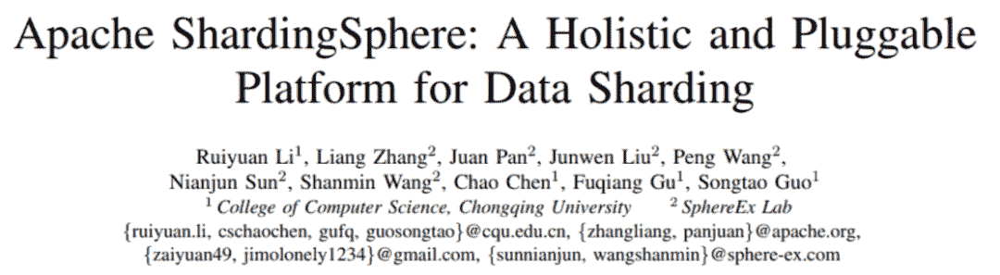
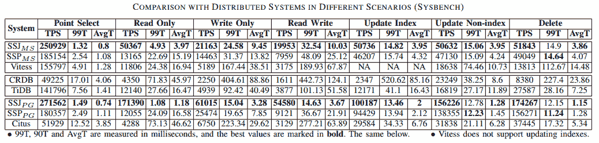
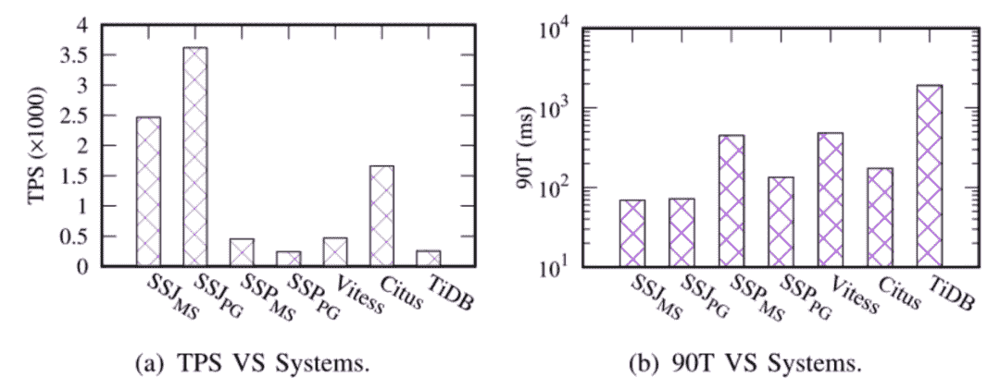

# Apache ShardingSphere 发表的第一篇学术论文被顶级数据库会议 ICDE 接受

> 原文：<https://medium.com/codex/1st-academic-paper-by-apache-shardingsphere-accepted-by-icde-a-top-level-database-conference-aea79f7b9076?source=collection_archive---------22----------------------->

## **ICDE 接受了 Apache ShardingSphere 的第一篇学术论文**

近日，由 Apache ShardingSphere 社区、SphereEx 实验室和重庆大学计算机系共同撰写的《Apache ShardingSphere:一个整体的、可插拔的数据分片平台》已被数据工程和数据库领域顶级国际会议之一的[国际数据工程会议(ICDE)](https://icde2022.ieeecomputer.my) 接受。这篇会议论文是第一篇关注数据库行业数据分片的论文。

ICDE 是数据库和数据挖掘领域的顶级学术会议，也是全球最大的技术专业组织[电气和电子工程师协会(IEEE)](https://www.ieee.org) 的旗舰会议。ICDE、ACM SIGMOD 会议和超大规模数据库国际会议被称为世界三大数据管理和数据库会议。

本文的发布代表了 Apache ShardingSphere 在其 Database Plus 开发概念指导下的 5 年 R&D 和实现测试的高潮。这篇论文的通过证明了学术界对 Database Plus、Apache ShardingSphere 的增强计算引擎和面向插件的架构的认可。

由于这篇论文被接受，我们的社区自豪地宣布，我们的努力已经导致了核心数据库技术的创新性突破。

在这篇论文中，共同作者提出:考虑到今天关系数据库的可伸缩性和效率不足以解决高并发性问题，仍然主导着在线事务处理，以及 NewSQL 数据库可能导致额外的培训成本，数据库中间件 Apache ShardingSphere 成为连接和管理多个数据库的一种非常友好和有效的方式。

## **Apache ShardingSphere:科学发展之路**

> 为什么我们选择改进数据库生态系统，而不是创建一个新的数据库？

Apache ShardingSphere 的目标是在分布式场景中更好地利用关系数据库的计算和存储能力，而不是实现一种新型的关系数据库。

到目前为止，由于关系数据库仍然是完整事务的最佳选择，因此它们通常用于处理在线事务处理。然而，关系数据库是为单台机器设计的。换句话说，在最初阶段，开发人员没有考虑大数据。简而言之，关系数据库的可伸缩性较差，无法有效解决高并发性问题。

在这样的背景下，NewSQL 应运而生。然而，新意味着这种类型的数据库是从零开始开发的。虽然它适用于当前的应用场景，但没有在足够真实的生产环境中进行测试，对于企业维护人员来说，它有着陡峭的学习曲线。

Apache ShardingSphere 刚刚发布了正式版 5.1.0。通过这次更新，Apache ShardingSphere 也将其定位转移到 Database Plus，希望在不同的数据库上构建标准和生态系统。除了增强的功能，Database Plus 架构还为开发人员和用户开放了一个高度可伸缩的数据库生态系统。

> Apache ShardingSphere 的多重特性

*   **可插拔**

Apache ShardingSphere 采用了“微内核+面向三层插件”的模式——使得内核、功能组件和整个生态系统可插拔、可扩展。开发者可以利用我们的插件根据他们的需求配置 ShardingSphere 的全部或部分功能。在 Apache ShardingSphere 架构下，所有特性都可以像构建块一样组装到 ShardingSphere 系统中。您可以单独使用它们，也可以根据需要将它们组合在一起使用。

然而，在开发人员面向标准的 SPI 编程中，内核不受增量功能的影响，因此 ShardingSphere 的多个功能模块可以在实际应用场景中灵活组合，让用户自行决定。

另外，Apache ShardingSphere 是在 SPI(服务提供者接口，Java JDK 提供的一种服务发现机制)和其他设计模式的基础上设计的。因此，可以根据需要轻松添加、删除或组合各种类型的数据库、函数和分片算法。

其中，作为 ShardingSphere 的主要发展方向，数据分片一直是我们最重要的功能之一。对于许多用户来说，数据分片是他们选择 ShardingSphere 的原因之一。一般来说，在关系数据库上执行数据分片，并通过水平数据分片的方式消除单机存储容量的限制，是企业的理想解决方案。

*   **高性能**

文中提到，重庆大学和[spherex](https://sphere-ex.com/en/)在 Sysbench 和 TPCC 测试场景下进行了多轮测试，验证了在使用相同配置的情况下，Apache ShardingSphere 的性能优于大多数分片系统和新的数据库架构。详细记录如下图所示:

Sysbench 测试结果

不同情况下与分布式系统的比较(TPCC)

**结论**

Apache ShardingSphere 已经被数百家企业采用和测试，从互联网、游戏、银行、保险和证券、制造、电信、新零售部门到公共部门等。，并且已经在多个生产场景中进行了测试。

随着第一篇论文被收录到 ICDE，Apache ShardingSphere 的概念现在已经得到了学术界的认可。本文将为数据库行业的发展和数据处理效率的提高提供新的解决方案。

也为分布式能力在关系数据库中的应用、插件架构的普及以及在碎片化数据库基础服务之上创建生态系统层奠定了坚实的理论基础。

我们希望本文和 Apache ShardingSphere 的探索能够启发数据库领域的开发人员和学者，将数据库构建成更接近企业业务场景的数据服务平台。