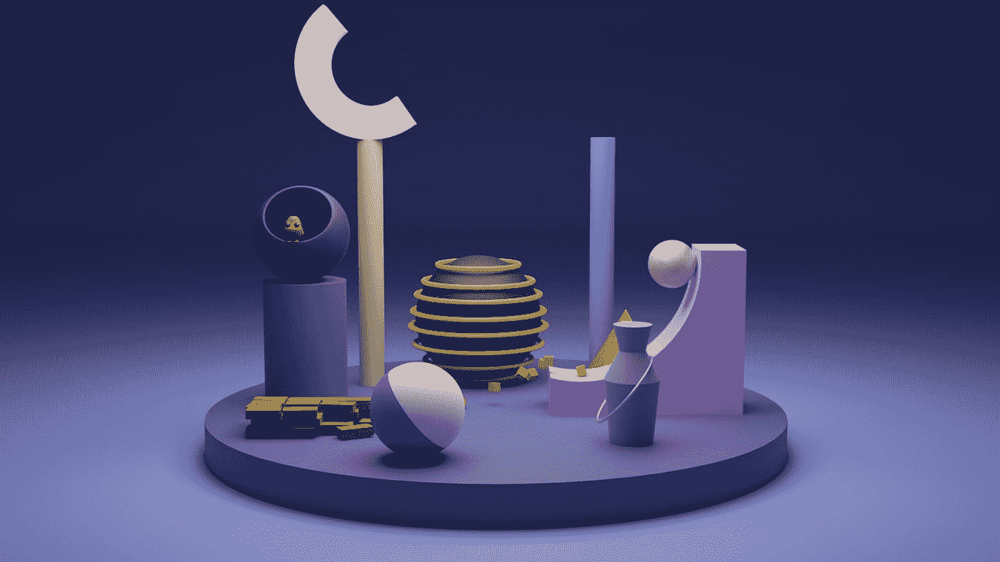

# 2 个动画 1 个小部件

> 原文：<https://medium.com/codex/2-animations-1-widget-38391d1c3d34?source=collection_archive---------5----------------------->

## 在 Flutter 中实现多个动画



由 [Unsplash](https://unsplash.com?utm_source=medium&utm_medium=referral) 上的 [Shubham Dhage](https://unsplash.com/@theshubhamdhage?utm_source=medium&utm_medium=referral) 拍摄的照片

好了，在[的 flutter.dev](https://flutter.dev/docs/development/ui/animations/staggered-animations) 上已经有一个关于如何做到这一点的教程了。但是那个教程…埋下了伏笔。

说真的，这太复杂了。所以我想我应该做一个更好的多动画教程。

基本上，你是这样做的:

```
_fadeAnimation = Tween<double>(
  begin…
```