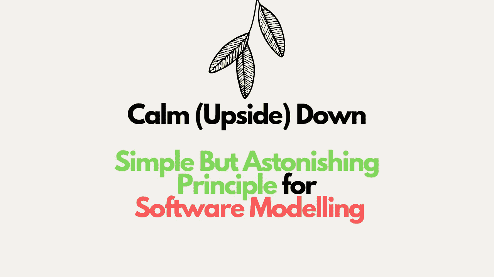

# 2 个小但令人印象深刻的原则可以解决多年来的任何编码问题

> 原文：<https://medium.com/codex/2-little-but-impressive-principles-to-fix-any-coding-problem-for-years-d31accf65c6a?source=collection_archive---------20----------------------->

## 这个自下而上的原则会让你的思维颠倒过来

**我赌 100 美元**面对问题时，你会直接跳到代码中。不管你是否知道整个解决方案或者至少是它的一部分。