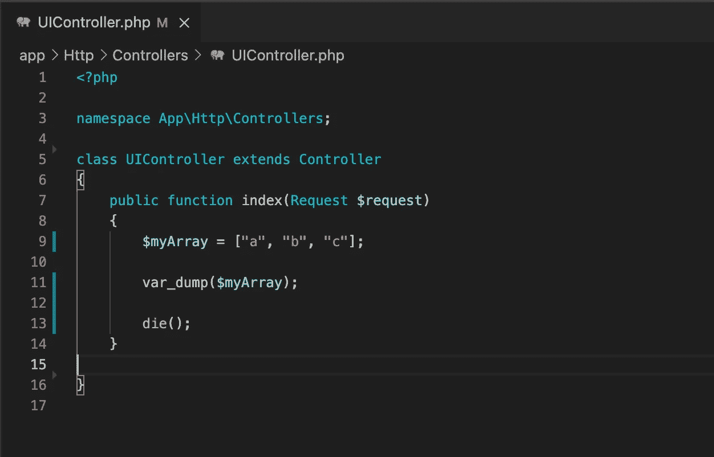

# 在 PHP 中打印数组的两种方法

> 原文：<https://medium.com/codex/2-ways-to-print-arrays-in-php-c18523f45f8?source=collection_archive---------0----------------------->

我的 PHP 代码

情况是这样的。这每天都在发生。你从一个 API 获得数据。你已经成功 JSON 解码了。现在你需要看到数据是什么，但是你用什么函数呢？

PHP 中可以用来打印数组的两个标准函数是 **var_dump** 和 **print_r** 。两者都是很好的函数，可以为你解决打印 PHP 数组的相同问题，并且有独特的用途。