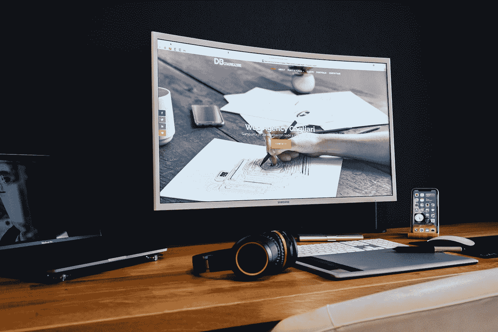

# 2022 年网页设计趋势

> 原文：<https://medium.com/codex/2022-web-design-trends-c978a12db80b?source=collection_archive---------9----------------------->

## 2022 年你需要知道的关于网页设计的一切

戴维·巴拉尔迪在 [Unsplash](https://unsplash.com?utm_source=medium&utm_medium=referral) 上拍摄的照片

2022 年的网页设计趋势将为用户创造更多身临其境、引人入胜的体验。期望看到更多的强调用户界面设计，动画和身临其境的内容。全息图和增强现实等新技术也将在网页设计中发挥作用。

# 审美极简主义