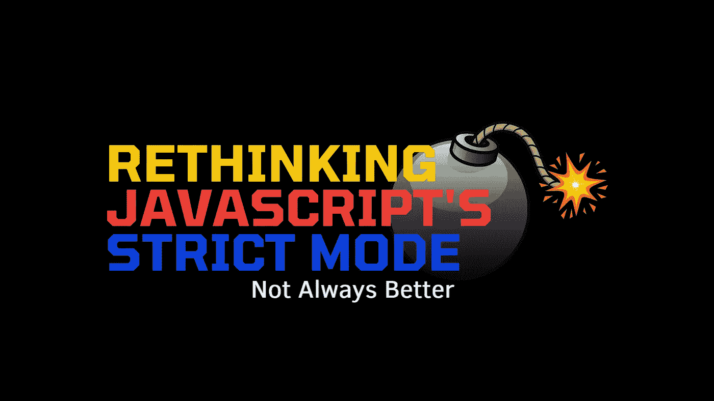

# 你需要停止高度沉迷于严格模式的 20 个理由

> 原文：<https://medium.com/codex/21-reasons-why-you-need-to-stop-being-highly-obsessed-with-strict-mode-1420d867e839?source=collection_archive---------6----------------------->

## JavaScript 的严格模式并不总是深入的选择

图片由[作者](http://www.arnoldcode.com)通过【Canva.com 制作

严格模式总是更好，不是吗？

我一直想知道在 JavaScript 中是否有不使用严格模式的理由。当你打开谷歌，你会很快相信这是一个很好的选择…