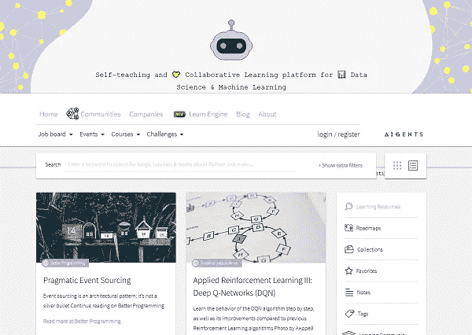

# 掌握 Python 的 22 大免费资源

> 原文：<https://medium.com/codex/22-best-free-resources-to-master-python-5a5e20114e6a?source=collection_archive---------1----------------------->

Python 是世界上最流行的编程语言之一。它不是一种新的语言编程语言。

它从 90 年代初就在这里了。它缓慢但稳定地成长，不断地改进，同时获得开发人员社区的支持。

如果不是因为在线开发者社区；python 就不会在这里了。感谢他们，我们有了这些[有用的资源](https://anuptechtips.com/debugging-in-python-using-icecream/)，帮助你免费掌握 python。

> 一旦你成为了 python 大师，别忘了回馈社区。

如果您想编写高效的 python 代码，本文提供了一些非常有趣的提示和技巧。

 [## 编写更好代码的 35 个最佳 Python 技巧和诀窍

### 如果需要在遍历列表或元组时创建列表，可以使用这种方法。列表 1 = [1，2，3]列表 2 =…

anuptechtips.com](https://anuptechtips.com/python-tips-tricks-better-code/) 

我根据资源所属的类别将它们分成不同的类型。

# 初学者应该关注的最佳 Python 博客

## 1.真正的 Python

真正的 Python 有从绝对初学者到有经验者的文章。Python 基础，Django，flask，web scraping，你可以找到一篇深入的文章来提高你的知识。

【https://realpython.com】链接——[链接](https://realpython.com/)

真正的 Python 主页

## 2.官方 Python 文档

没有比从造物主那里学到东西更好的地方了。嗯 [Guido Van Rossum](https://en.wikipedia.org/wiki/Guido_van_Rossum) 不会教我们 python，但官方的 python 文档是最先进的。尽管要记住，对于初学者来说，可能需要一些时间来适应。

**链接**——[https://docs.python.org/3/tutorial/index.html](https://docs.python.org/3/tutorial/index.html)

# 3.面向初学者的 Guru99 完整 python 教程

另一个博客，包含了从 python 的安装和设置到高级 python 库的所有基础知识。内容分为几个部分，以方便导航。

链接—[https://www.guru99.com/python-tutorials.html](https://www.guru99.com/python-tutorials.html)

# 4.使用 python 书籍和练习进行发明

[Inventwithpython.com](https://inventwithpython.com/)是一个由艾斯威加特创建和维护的对初学者友好的学习网站。是的，他是著名书籍[的作者，用 python](https://automatetheboringstuff.com/) 将枯燥的东西自动化。他花了大部分时间教人们如何编码，并免费分享了他的大部分电子书。

如果你对编程练习感兴趣，你应该看看 [python 编程练习，委婉解释的](https://inventwithpython.com/pythongently/)书。它是为初级和中级程序员设计的。它还包括对练习中每个问题的简单解释，以帮助您提高 python 的熟练程度。

【https://inventwithpython.com/】链接——[链接](https://inventwithpython.com/)

Inventwithpython 主页

## 5.通过编程学习 Python 编程

另一个令人惊奇的网站包含了一步一步的 python 教程。教程的主要部分是初学者友好的。

链接—[https://www.programiz.com/python-programming](https://www.programiz.com/python-programming)

# 面向初学者的免费 Python 课程

## 6.密歇根大学为每个人编程

这门课程是由密歇根大学的查尔斯·塞弗伦创建的。这个课程不需要任何先决条件，对初学者完全友好。

链接—[https://www . EDX . org/course/programming-for-every one-getting-started-with-pyt](https://www.edx.org/course/programming-for-everybody-getting-started-with-pyt)

## 7.哈佛大学 Python 编程导论

如果你是初学者，想从 python 开始你的开发载体，那么哈佛 CS50 是一个很好的选择。本课程由大卫·j·马兰创建。

链接—[https://cs50.harvard.edu/python/2022/weeks/0/](https://cs50.harvard.edu/python/2022/weeks/0/)

## 8.自由代码营地

这是与编程和开发相关的教程、博客和视频的最大集合之一。无论你是初学者还是专家，他们都有适合你的东西。

Python 课程链接— [学习 Python —初学者全教程](https://www.youtube.com/watch?v=rfscVS0vtbw)

## 9.谷歌的 Python 类

如果你知道其他的 OOP 语言，现在正在翻译成 python，那么 Google 的 python 类可以帮你。它提供端到端的文章、视频和任务，让[更好地理解 python](https://anuptechtips.com/dont-run-loops-in-python/) 。

链接—[https://developers.google.com/edu/python/](https://developers.google.com/edu/python/)

Google python 类主页

## 10.Codecademy 学习 Python 3

链接—[https://www.codecademy.com/learn/learn-python-3](https://www.codecademy.com/learn/learn-python-3)

# 视频收藏

## 11.PyVideo

Youtube 可以说是最好的地方之一，在那里我们可以找到任何主题的大量教程。但它不是唯一的一个视频分享平台。

人们经常在 Linkedin、Dailymotion、vimeo、脸书等网站上传 python 相关的内容。也有一些情况下，一些内容创建者喜欢自己托管内容。跟踪所有这些内容并找到最适合你的内容变得很困难。

这就是 PyVideo 前来营救我们的地方。If 查找并索引互联网上所有最新的 python 相关事件视频。您可以根据发言者、标签、事件和语言搜索特定内容或过滤特定事件。

链接—[https://pyvideo.org/](https://pyvideo.org/)

## 12.计算机科学和 Python 编程导论

大多数初学编程的课程都没有谈到计算思维和基本算法，比如搜索和排序。在我们职业生涯的后期，这些概念对于成为高效的开发人员是必不可少的。

链接—【https://www.youtube.com/playlist? list = plul 4 u 3 cngp 63 wbdfxl 8 giv 4 yhgdmgazna

## 13 .Calmcode.io

在 calmcode 中，你可以从分成不同类别的短视频教程开始。目前有 87 个类别超过 652 个视频。

链接—【https://calmcode.io/ 

# 互动实践网站

## 14.Exercism.org

如果你想在认识一些有趣的人的同时提高自己的编程技能；锻炼是个好去处。这个社区是最好的社区之一，它将指导你提高你的编程技术。

**链接**——[https://exercism.org/tracks/python/exercises](https://exercism.org/tracks/python/exercises)

## 15.Python 挑战

这是一个最有趣的 python 益智游戏。该网站目前是旧的，但社区仍然非常活跃。这些挑战对初学者来说没什么难度，但是解决它们是令人满意和有趣的。

**链接**——[http://www.pythonchallenge.com/](http://www.pythonchallenge.com/)

## **16。Snakify**

如果你的学习方式是通过简单的步骤、理论和一堆不同的练习。那么 snakify 对你来说可能是个不错的选择。

链接—[https://snakify.org/en/](https://snakify.org/en/)

# 策划 GitHub 列表

## 17.太棒了-python

顾名思义，这是一个很棒的 python 库、框架、软件和资源的列表。

链接—[https://github.com/vinta/awesome-python](https://github.com/vinta/awesome-python)

## 18.算法

它有 500 多种算法，从压缩到动态编程。您可以使用这些代码来构建和编写复杂的程序。

链接—【https://github.com/TheAlgorithms/Python 

## 19.Easy-python

这是一个令人难以置信的 doc 格式的不同库和源代码的来源。

链接—【https://easy-python.readthedocs.io/en/latest/ 

# 播客

## 20. **Python 字节**

[**Python Bytes**](https://pythonbytes.fm/episodes/all) 播客每周更新开发者新闻精选自 twitter、reddit 和其他新闻来源。

链接—[https://pythonbytes.fm/](https://pythonbytes.fm/episodes/all)

## 21.**播客。__init__**

[**播客。__init__**](https://www.pythonpodcast.com/episodes/) 如果对 python 面试感兴趣，体验故事；你应该给这个播客一个机会。你会从花在倾听上的时间中获得最大价值。

链接—[https://www.pythonpodcast.com](https://www.pythonpodcast.com/episodes/)

## 22。跟我说说 Python

[**跟我说说 Python**](https://talkpython.fm/)重点讲用 Python 对人和组织编码。每集都有 1 小时与行业专家的随意交谈。

链接—[https://talkpython.fm/](https://talkpython.fm/)

## 奖金—Aigents.co，学习发动机

Aigents 有一系列机器学习和数据科学的免费学习资源，这些资源是我们从互联网上收集的。

如果你是这些领域的新手，需要指导，我们有一个有用的路线图来帮助你成为机器学习工程师或数据科学家。

通过登录 LinkedIn，你可以组织和收藏你最喜欢的资源，帮助你跟踪你的进展，了解最新的发展。

总的来说，我们收集的资源可以帮助你开始或提高你在机器学习和数据科学方面的技能。试一试，看看你能学到什么！

aigents.co 主页

链接—[https://aigents.co/learn](https://aigents.co/learn)

## 结论

还有更多[免费资源可用于学习 Python](https://anuptechtips.com/debugging-in-python-using-icecream/) 或数据科学主题。我尽了最大努力让这篇文章尽可能全面，但是我错过了你推荐的任何资源吗？

一定要在下面留下评论，让我们知道！

保持好奇，不断学习，并愿意学习新的东西，直到我们下次见面！

如果你喜欢这篇文章，并希望与我联系，请关注我的 [**Linkedin**](https://www.linkedin.com/in/the-anup-das/) **。**

**感谢阅读！如果你喜欢这样，这将促进我努力工作，并随时通过评论给你的反馈和建议，以改进我的工作。😊**

直到下一次，照顾好你自己，你的家人，你的大家庭(邻居)和朋友，保持安全和健康！

# 更多阅读

1.  [**停止使用打印来调试 Python 中的**](https://anuptechtips.com/debugging-in-python-using-icecream/)
2.  [**决策树上的 A 到 Z 向导**](https://anuptechtips.com/decision-tree/)