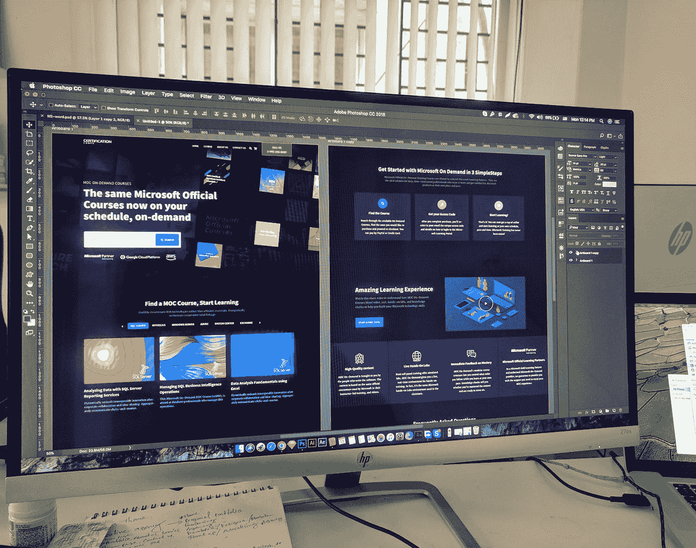

# 网站设计者的 23 个不受欢迎的工具，大部分是免费的

> 原文：<https://medium.com/codex/23-unpopular-tools-for-a-web-designer-that-are-mostly-free-efb277f51f73?source=collection_archive---------14----------------------->

## 布局，原型，搜索图标，背景，字体和灵感。

照片由 [Unsplash](https://unsplash.com?utm_source=medium&utm_medium=referral) 上的 [Eftakher Alam](https://unsplash.com/@easiblu?utm_source=medium&utm_medium=referral) 拍摄

互联网提供了如此多的工具，我们大多没有意识到。不幸的是，这些都是好的，但由于某些原因，我们不熟悉他们的存在。