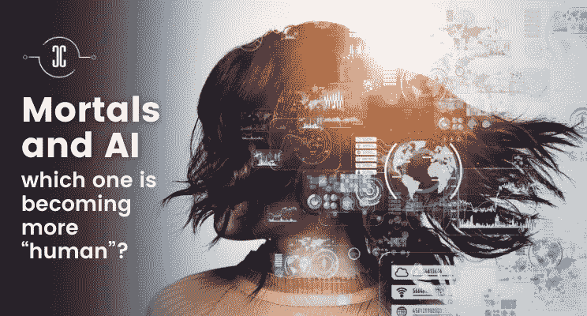
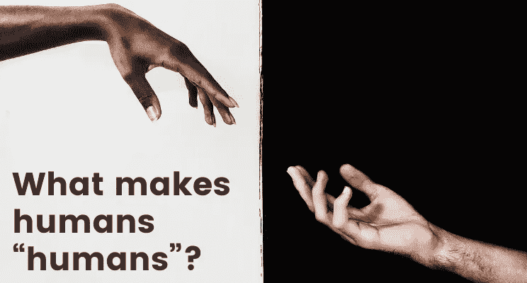
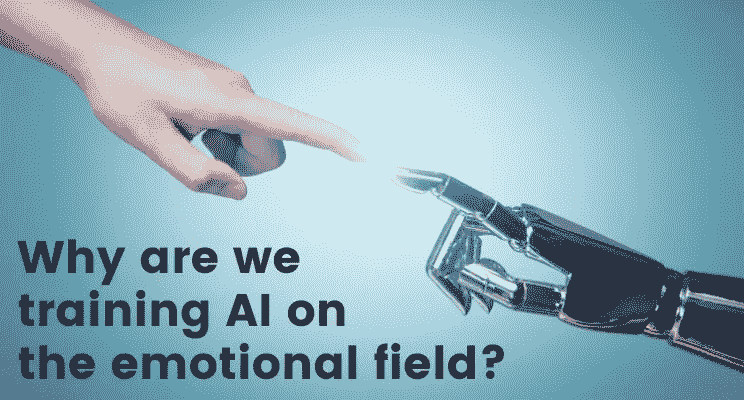
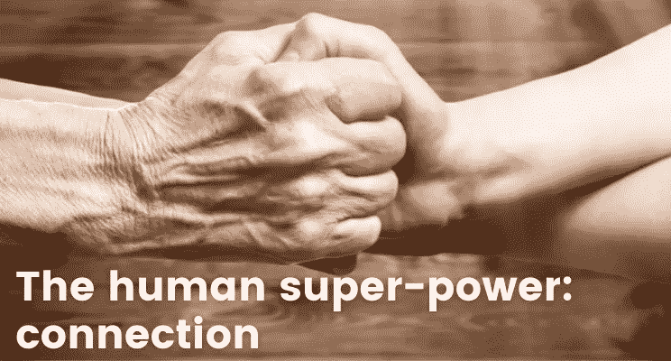
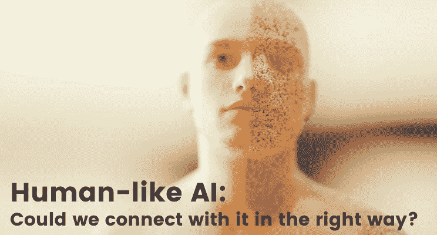
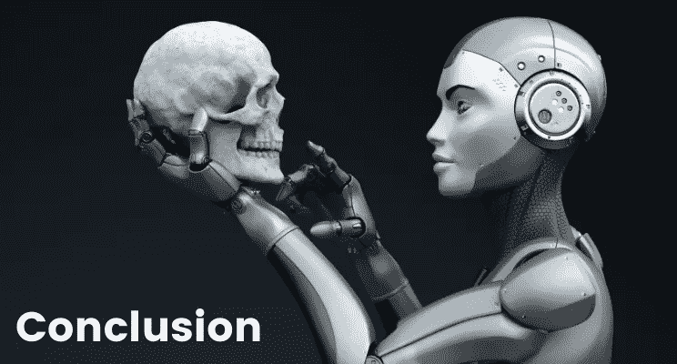

# 凡人和人工智能——谁变得更“人”？

> 原文：<https://medium.com/codex/28-09-mortals-and-ai-which-one-is-becoming-more-human-80b86036da3b?source=collection_archive---------8----------------------->

## 人类的创造力是形成世界的原因，也是技术不断变化的原因。但是，技术是否帮助我们提高了人类的素质？

我们今天所知的世界是由人类的创造力塑造的。我们在部落将自然物体改造成工具，以及人类对艺术和音乐的独特追求中看到了这一点。

现代社会在时尚、技术和食物方面的不断变化可以用这种创造性的冲动来解释。

然而，在技术方面，人工智能(AI)的进步正在通过改变交通、银行、医药、金融、军事等领域来重塑现代生活。

但在当今世界，技术是在帮助我们作为人类提高吗？

今天我要展示一个不同的目的。我不想教你什么，也不想给你任何做生意的建议。我想展开一场讨论，我想让你和我一起思考。

为了做到这一点，我会提供一些事实信息——一些我们已经拥有的事实或者我们知道肯定会发生的事情。最后，我会挑战你回答我的问题，因为我很想知道你的想法是什么！

所以，我们开始吧！

在今天的社会中，有许多不同的观点来定义一个人。在某些文化中，一个人之所以成为一个人，是因为他的理性能力。在其他情况下，这是他们感受痛苦或发展亲密关系的能力。

维基百科将人解释为被赋予了某些属性，如理性、道德、意识或自我意识，并属于一个家庭、拥有土地或负有法律责任的存在。"

但真正的问题是——是什么“东西”让我们与众不同？

这不是我们眼睛、头发、皮肤的颜色，也不是我们拥有的东西。人类被“赋予”的能力是拥有同理心和理解爱、友谊、尊重等感情。

让我们考虑一下人工智能。神经科学专家一致认为，人工智能无法感受情感。然而，合成语音可以模拟情感，如移情。人工智能有可能产生一种有益的反应，在某种程度上感到关心，但不像人类那样感同身受。还没！

最新一代的人工语音，如谷歌的 Tacotron 2，正在改变这一领域，通过模拟类似人类的声音，比迄今为止创造的其他技术形式更真实的音调。

所以，现在我们在教机器什么是感觉。我们为他们提供可以记忆的数据(比如通用的面部表情),并完全理解一个人在那一刻的感受，这是人类有时难以识别和理解的。

这种信息会让 AI 技术在情感意义上变得智能吗？

当然，我打赌你在质疑这个！

这是因为人工智能在简化日常任务方面的帮助越来越大。机器学习允许应用程序预测人们在什么时间可能想要什么，这可以实现许多任务的自动化，并将避免人们不得不猜测或采取主动。像订购食品杂货这样的普通活动都由相应的应用程序为你完成，只需在你的手机上点击一下！

人工智能现在可以用于改善许多其他方面的生活，例如通过网飞观看电影，而不必滚动无尽的选项，在开车回家的时候在 Spotify 上听你喜欢的音乐，甚至通过呼叫中心处理业务，与完全由人类管理相比，呼叫中心可以转化更多的销售。

但是谈到人工智能，我必须告诉你许多人(也许还有你)认为它是新事物。根本不是！

看看这个例子:古希腊人讲述了关于机器人的神话，中国和埃及的工程师建造了自动机，所以无生命的物体可以像智能生物一样活过来的想法已经存在了很久很久。

现代人工智能的起源可以追溯到古典哲学家试图将人类思维描述为一个符号系统。但是人工智能领域直到 1956 年才正式建立，那时“人工智能”一词才被提出。

然后在 1997 年，当 IBM 的“深蓝”成为第一台击败国际象棋冠军的计算机(当它击败俄罗斯特级大师加里·卡斯帕罗夫)时，人工智能开始流行起来，现在它已经成为我们生活的一部分，甚至我们都没有注意到它！

所以，基本上，今天人工智能是我们自动化事物并在生活和商业中领先的一种方式——现在，一些专家说，到 2060 年，人工智能将能够在所有方面击败我们。

如果你想更深入地了解这一点，预测称，人工智能将更快地掌握许多活动。据预测，到 2024 年，机器在翻译语言、2026 年写高中论文、2027 年开卡车、2031 年从事零售工作、2049 年写畅销书、2053 年做外科手术方面都将超过我们。事实上，据预测，在未来 120 年内，所有的人类工作都将实现自动化。

那我们呢。当我们拥有这些超能力、情感和人工机器时，我们在生活中会做些什么呢？

人类需要人际交往。事实上，据说拥有令人满意的人际关系的人比没有人际关系的人更幸福、更健康。

与身体健康同样重要的是我们被另一个人倾听和理解的感觉，因为研究表明，快乐可以将预期寿命从 7 年延长到 10 年。

拥抱时我们感受到的这种安慰不仅为我们提供了支持，还像药物一样帮助治愈由心碎或孤独引起的伤口，这种联系可以证明比任何药物都更有价值。

换句话说，当我们被另一个人拥抱时，这让我们感到与那个人有联系，这对我们的幸福是绝对必要的。

但是，如你所知，我们生活在一个技术飞速发展的时代，事情需要做得更快更好。因此，我们创造了一种叫做“社交媒体”的东西。

这难道不是现在与朋友和家人保持联系的最好方式之一吗？你在社交媒体平台上联系过多少人，仅仅因为这个，你就能和他们保持联系？如果不是通过这些网络联系，也许你已经遇到了你可能永远也不会遇到的人！

但是这些 ***是真正的*** 连接吗？你真的使用社交媒体来真诚地与人联系吗？

因为让我告诉你什么是现实世界中的联系:从我们出生的那一刻起，人类的联系就是一种能量交换，这种能量交换始于我们的母亲，并持续一生。

它具有如此强大的力量，只需轻轻一触就能加深瞬间，或者在专注聆听时凝视某人的眼睛。这可以在我们发展的每个阶段激发我们内心的变化——如果没有别的，就在那几秒钟里，你与某人真诚地联系在一起，就像地球上的人们一起分享一些重要的东西。

互联网给了我们许多新的交流方式，让我们能够通过跨越国界和距离来拓宽视野，但网络世界几乎不可能复制与另一个人在深层次上的社交或对话。除了交流的复杂性(语言和非语言)之外，我们与他人脱离的容易程度也让这些互动变得肤浅。

你最后一次真正与人交流是什么时候？

有哪些电影或节目描绘了机器人之间的浪漫或友好关系？当机器人角色遭遇不幸时，我们也会哭吗？

自从我们第一次看到电照亮了我们的世界，人类就一直对机器着迷，所以当我们不得不开发看起来和感觉上像我们的机器时，我们不应该感到惊讶。但是人工智能会影响我们人类相互交流的方式吗？

随着社会的发展，印刷机、电话和互联网的发明提高了我们存储和交流信息的能力——这些从根本上改变了我们共同生活方式的创新可能会随着虚拟现实等新技术的出现而进一步改变。

尽管这些创新很有影响力，但它们并没有改变人类行为的基本方面，这些基本方面构成了几十万年来所谓的“社会组合”。爱、友谊、教导和合作。

这些特征的基本轮廓在世界范围内保持着显著的一致性，无论一个群体是城市还是农村，也无论它是否使用现代技术。

但我们日常生活中的类人人工智能可能会改变我们的互动方式；它们可能会改变我们的爱心、友好和善良程度——不仅是在我们与相关机器的直接互动中，也在我们与他人的互动中。

耶鲁大学人性实验室的一项实验显示了我们在接触类人人工智能时的行为和反应。他们指导一小组人与人形机器人一起在虚拟世界中铺设铁轨。每个小组由三个人和一个蓝白相间的小机器人组成，他们围坐在一张方桌旁，在平板电脑上工作。

机器人被编程为偶尔犯错误——并承认错误:“对不起，伙计们，这一轮我犯了错误，”它得意地宣称。“我知道这可能很难相信，但机器人也会犯错。”

结果如何？使用笨拙的忏悔机器人，不同的小组通过改善他们的情绪状态和相互之间的互动表现出增强的表现。

与机器人只做温和陈述的对照组相比，有忏悔机器人的小组能够更好地合作。此外，他们变得更加放松和健谈，给跌倒的组员以安慰，他们更经常一起大笑。

然而，他们的实验并没有就此结束！在另一种情况下，我们的社会环境中的人工智能也有相反的影响，表明它可以使我们的行为更没有生产力和道德。

在这项旨在探索人工智能可能如何影响“公地悲剧”(即个人以自我为中心的行为可能会集体损害他们的共同利益)的实验研究中，他们给了几千名受试者一些钱，让他们在多轮在线游戏中使用。

在每一轮中，受试者被告知他们可以保留自己的钱，或者将部分或全部钱捐给邻居。如果他们捐了款，游戏会匹配，让他们邻居收到的钱翻倍。

在游戏早期，三分之二的玩家表现出利他行为。毕竟，他们意识到，在一轮中对邻居慷慨可能会促使邻居在下一轮中对他们慷慨，从而建立起互惠的规范。

然而，从自私和短期的角度来看，最好的结果是保留自己的钱，从邻居那里拿钱。在这个实验中，我们发现，通过添加一些以自私、搭便车的方式表现的机器人(冒充人类玩家)，我们可以驱使群体做出类似的行为。

最终，人类玩家完全停止了合作。机器人就这样把一群慷慨的人变成了自私的混蛋。

所以，让我们看看这种行为的含义:合作是我们这个物种的一个关键特征，对社会生活至关重要。信任和慷慨是区分成功团体和失败团体的关键。如果每个人都投入并牺牲来帮助团队，每个人都会受益。

然而，当这种行为被打破时，公共利益的概念就消失了；每个人都很痛苦，因为他们发现自己无法一起工作和成长——人工智能可能会有意义地降低我们相互合作的能力，这一事实令人担忧。

我们，人类，通过我们看到或感觉到的一切来体验我们的情绪，我们仍然能够爱(或恨)任何对我们重要的东西——但是我们的行为可以根据我们在那个特定时刻所处的环境而完全改变。

一个类似人类的人工智能会完全按照我们告诉他们的去做，没有任何真实的感情。不管是好是坏，它仍然只是一台被命令的机器——它做什么取决于我们给它的信息。

相反，人们可以辨别是非，决定做什么，并采取自己的主动——但我们被周围的事物严重腐蚀了。因此，如果在不久的将来，机器人不再仅仅是人类制造的物品，我们开始将它们视为一类新的社会行为者，我们是否能够以正确的方式进行联系，继续成为人类并对自己的态度负责？

我们在技术上投资很多，每天都有新的和先进的东西出现——事实上，要跟上我们周围所有的创新已经不可能了。其中一些，我们可能永远也不会听说；其他的我们已经在使用，甚至没有注意到其中嵌入了人工智能技术。

作为人类，我们对待技术的主要方式是让我们的生活变得更简单，尽我们所能实现自动化。在这样做的过程中，我们可能会减少身体上的联系，增加虚拟的联系——这改变了人与人之间的情感联系。

我不断研发，我看到的是我们在努力让人工智能更人性化。另一方面，我也看到人类在行为和与人互动的方式上变得更像人工智能，更像计算机。我们的生活变得有点做作——我们选择这样生活。

## 所以，现在我想挑战你。我的问题是:

# 我们是否会达到人类更像人工智能、人工智能更像人类的地步？

这是一个非常好的讨论话题，所以一定要分享你的想法！

 [## 科林·库珀|与众不同的思考能力

### 作家、行为专家、企业家、导师和合资企业专家免费获得一本科林热门新书…

www.colincoopersuccess.com](https://www.colincoopersuccess.com/)