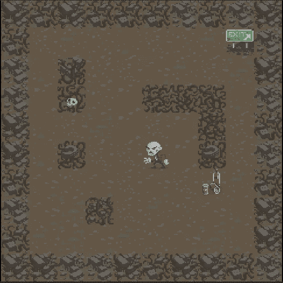
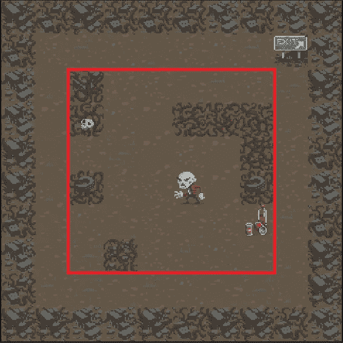
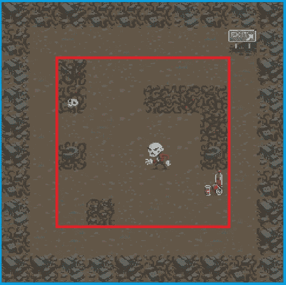

# 2D 团结一代

> 原文：<https://medium.com/codex/2d-level-generation-for-unity-c7a8185b846a?source=collection_archive---------8----------------------->


由 [Lorenzo Herrera](https://unsplash.com/@lorenzoherrera?utm_source=medium&utm_medium=referral) 在 [Unsplash](https://unsplash.com?utm_source=medium&utm_medium=referral) 上拍摄

# 介绍

我第一次进入 Unity 还没多久，甚至开始考虑随机化级别生成都让我头晕。我以为会是一些荒谬的算法或一些疯狂的工作量。



在 Unity 编辑器中捕获- *资产记入 Unity Technologies*

现在，对于更高级的技术和地形生成的特殊要求来说，这仍然是/可能是正确的，但是对于基础来说，它实际上非常简单，只是需要很多时间。这个想法很简单，使用我整个大学期间一直在使用的东西:嵌套循环。

你们中的一些人可能已经点头同意了，其他人可能被嵌套循环的使用吓到了。但是不管你的立场是什么，让我们先来看一遍，然后我们来看看结果如何。

# 旁注

我创建这个教程是基于这样一个假设:你至少使用过一点 Unity，并且熟悉使用 Unity 编辑器、预置、精灵和脚本。并且你也已经在做一个现有的项目(也许是你的第一个游戏？).

如果你刚刚开始一个项目，不要从这里开始。在进行随机等级生成之前，您应该设置和配置/学习很多东西。

如果你还没有做过一些 Unity 教程，Unity[Unity](https://learn.unity.com/)有很多很棒的教程可以帮助你快速启动。我强烈建议做一些，即使它们看起来是重复的，这样你就可以熟悉 Unity，以及根据你的项目实现相同目标的不同方法。

*这个是我跟* [*合一*](https://learn.unity.com/project/2d-roguelike-tutorial?uv=5.x) *学的，所以功劳归他们。如果您对资产和完整代码感兴趣，请查看链接。否则，我将浏览一下这些想法，以便您可以将它们应用到您自己的项目中。*

# 编码部分

```
using Random = UnityEngine.Random;
using System;
using System.Collections;
using System.Collections.Generic;
using UnityEngine;public int columns = 8;         // Number of Columns on our 2D board
public int rows = 8;            // Number of Rows on our 2D board
public GameObject[] gameTiles;  // Array of base Tile prefabs
public GameObject[] wallTiles;  // Array of outer wall Tile prefabs
public GameObject[] enemyTiles; // Array of enemy prefabs
public GameObject[] pickupTiles;// Array of pick-up prefabs
public GameObject   exit;       // Object for our exit// Use to child all our GameObjects to keep the hierarchy clean
private Transform boardHolder; // List of valid locations to place tiles upon
private List<Vector3> gridPositions = new List<Vector3>();
```

首先，我们要声明所有的变量。我添加了注释来简单解释一切。

对`boardHolder`来说，就是把所有的游戏对象都放在它的下面，这样我们就可以折叠它们并隐藏它们，而不用填满层级。

对于`gridPositions`，用于跟踪板上哪些位置有效(例如。我们不想填充边缘)并跟踪板位置是否已被填充。

对于所有不同种类的牌(如`wallTiles`、`pickupTiles`等)。)，为您计划最终放入场景的不同种类的对象创建尽可能多的对象。这可以是迷你墙，路障，buffs，等等。

## 可选公共最小/最大变量

我建议添加一些公共编号(或自定义类)来设置特定对象的最小和/或最大数量。尤其是当您想要在检查器中即时更改它时。例如，对于拾取，您可能希望每个级别最少 1 个，最多 3 个，所以添加一些公开跟踪的内容。

# 为有效的对象位置创建 2D 数组

```
void InitialiseList() { 
    // clear tiles from last generation
    gridPositions.Clear();     // create our 2D array of valid tile locations
    for (int x = 1; x < columns - 1; x++) { 
        for (int y = 1; y < rows - 1; y++) { 
            gridPositions.Add(new Vector3(x, y, 0f));
        }
    }
}
```

我们使用嵌套的 for 循环来遍历 x 轴和 y 轴。我们将列表清除并初始化为除了外面两层之外的所有方块，因为我们希望确保玩家至少有一条路径可以到达另一个角落，尽管是最长的路径。因此，我们也有一层外部阻隔墙。

在这个函数的最后，我们现在有了一个 2D 数组，它列出了所有可能的(有效的)位置来放置我们的游戏对象，比如敌人、硬币、资源等等。



我们为红框中的所有东西创建一个空的 2D 数组，这是放置阻挡者、敌人、接应者等的所有“有效”位置。

接下来，我们用基础地板砖和外墙搭建我们的板。

# 创建底层

```
void BoardSetup() {
// Initialize our board
boardHolder = new GameObject("Board").transform; for (int x = -1; x < columns + 1; x++) { 
    for (int y = -1; y < rows + 1; y++) { 
        // choose a random floor tile and prepare to instantiate it
        GameObject o = gameTiles[Random.Range(0, gameTiles.Length)]; // If at edges, choose from outer wall tiles instead
        if (x == -1 || x == columns || y == -1 || y == rows) { 
            o = wallTiles[Random.Range(0, wallTiles.Length)];
        }        // Instantiate the chosen tile, at current grid position
        GameObject instance = Instantiate(
            o,
            new Vector3(x, y, 0f),
            Quaternion.identity) as GameObject         // Set parent of our new instance object to boardHolder
        instance.transform.SetParent(boardHolder);
    }
}
}
```

总而言之，在我们遍历整个 2D 数组的每个循环中(这次包括两个外层！)我们执行以下操作:

我们选择一个随机的地板砖(通过从 0 到我们在数组中的砖预制总数中选择一个随机数来完成)。

如果我们碰巧在最外面的边上(当 x 或 y 等于-1 或者 rows/columns 变量在这里是 8 时)，那么我们从我们的外墙数组中选择一个随机的瓷砖。

在我们选择了我们想要的图块之后，我们简单地使用 Unity 的 Instantiate 函数在 Unity 中当前循环的 x / y 坐标处为该图块创建一个 gameObject。



这一次，我们遍历蓝色边框内的所有内容，包括红色边框内的内容，以便将我们的“基础”tileset 与地面和外墙放在一起。

# 随机组合辅助函数

```
Vector3 RandomPosition(){ 
// random index between 0 and total count of items in gridPositions
int randomIndex = Random.Range(0, gridPositions.Count); // random position selected from our gridPosition using randomIndex
Vector3 randomPosition = gridPositions[randomIndex] // remove the entry from gridPosition so it can't be re-used
gridPositions.RemoveAt(randomIndex); return randomPosition;
}
```

这只是一个帮助我们从有效位置列表中轻松获得一个随机位置的函数，用来在我们的棋盘上放置我们的游戏对象。

# 用物体填充游戏板

在最后一步之前，我们不会使用这个函数，所以不要担心我们将从哪里得到我们的图块数组，min 或 max。

```
void LayoutObjectAtRandom(GameObject[] tileArray, int min, int max){
// random amount to instantiate from given range 
int objectCount = Random.Range(min, max+1); // Place objects at random locations until object count limit
for (int i = 0; i < objectCount; i++ { 
    // use our helper function to get random position
    Vector3 randomPosition = RandomPosition();     // Choose a random tile (pick-up, enemy, etc.) 
    GameObject tileChoice = 
        tileArray[Random.Range(0, tileArray.Length)];     // Instantiate the chosen tile at the chosen location
    Instantiate(tileChoice, randomPosition, Quaternion.identity);
}
}
```

首先，我们在给定的最小值/最大值之间选择一个随机数。我们会循环精确的次数。这意味着此处选择的数字将是为给定图块阵列创建的对象总数。

当我们循环时，我们通过使用之前的辅助函数来选择随机的位置。然后，我们使用 Unity 的 random 选择随机牌，就像我们选择基础牌一样。

最后，我们再次使用实例化我们选择的随机位置和随机瓷砖。

# 设置场景

现在，让我们创建我们的设置函数，并使用我们刚刚在上面创建的函数。这将是唯一一个从外部调用的函数，它将从头开始设置整个地图。

```
public void SetupScene(int level){
// Call our function to create our outer walls and floor.
BoardSetup();// Re-create our list of valid gridPositions
InitialiseList();// Fill a random number of pick-up tiles 
LayoutObjectAtRandom(pickupTiles, 1, 3)// Determine number of enemies based on current "level"
// Fill a random number of creatures 
int enemies = (int)Mathf.Log(level, 2f);
LayoutObjectAtRandom(enemyTiles, enemies, enemies); // Put in our exit in top right 
Instantiate(
    exit,
    new Vector3 (columns -1, rows -1, 0f),
    Quaternion.identity
);
}
```

如果你创建了一个公众号(或者自定义类)，在我们的第一步，对于你对象的最小值/最大值，在这里使用它！

根据“等级”或“难度”，随意调整你想要的敌人数量我只是把它加到这里来说明你可以用一个关卡做一些特别的事情。

我们的出口对象也可以做同样的事情，这取决于你的角色从哪里开始，你可以随意把出口放在其他地方。

# 包扎

最后，您应该在 Unity Editor explorer 中选择用于级别生成的 C#脚本，并将其拖动到层次结构中。你需要把你的对象的预设从浏览器拖到检查器中，在你的脚本的正确的公共变量下。

*提示:选择脚本后，点击右上角的锁，这样你会更轻松。确保之后保存你的脚本预置！*

剩下的唯一事情就是在一些“游戏管理器”或一些管理器脚本中调用 SetupScene 函数来控制你何时想要创建一个新的随机地图。这可以是许多不同的形式，取决于你的项目。在我的项目中，我为我的游戏管理器使用了单例模式。我现在可以给出的一些提示是确保使用`DontDestroyOnLoad`和标准的`GetComponent<BoardManager>();`，这相对简单。

# 最后的想法

现在这是一个很长的教程，但我想确保我已经涵盖了一切，所以你可以把它作为一个模板，并将其应用到你自己的项目中，或作为一个关于你的游戏关卡生成的想法的一般演练。希望通过更详细的介绍，我能够帮助您更好地理解这个过程，这样您就可以更容易地将它集成到您的项目中。

我知道这个教程可能感觉相当冗长和枯燥，但我想详细一些，这样它对初学者和中间用户都有好处。

我发现添加额外的细节有助于回答人们可能有的问题，并帮助他们更好地理解正在发生的事情，即使这需要额外的阅读。

如果你有任何问题，请随时提问！我希望我能帮助你更好地理解 2D 的级代团结。