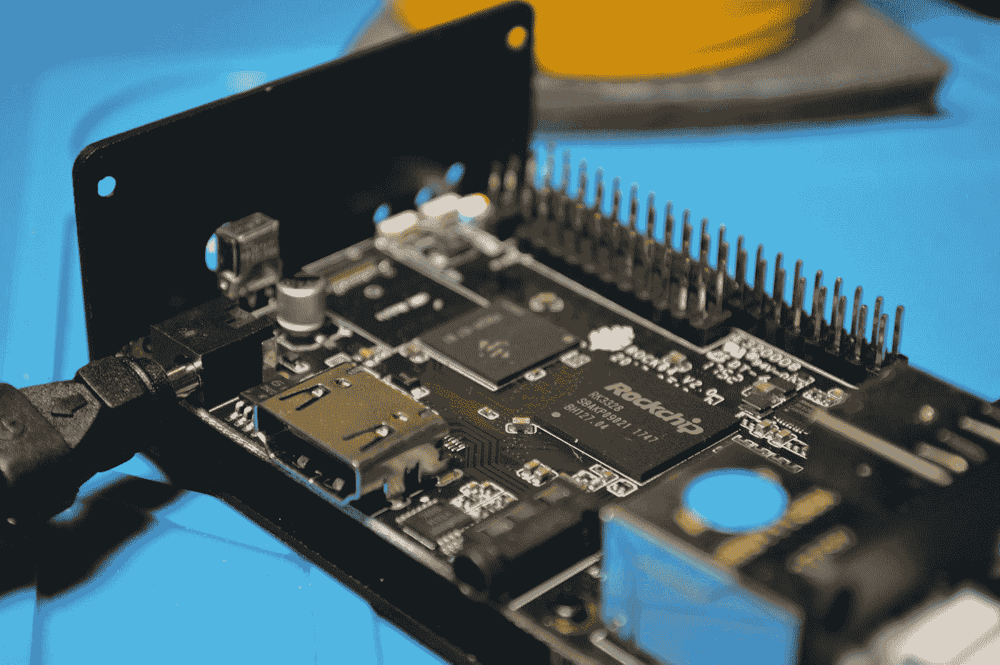

# 《覆盆子 Pi》之后的生活

> 原文：<https://medium.com/codex/3-alternatives-to-raspberry-pi-17265db21668?source=collection_archive---------1----------------------->

## 有一整个世界的选择。

托马斯·詹森在 [Unsplash](https://unsplash.com?utm_source=medium&utm_medium=referral) 上的照片

在 [**上一篇**](https://carlosaldea.medium.com/3-reasons-you-should-scorn-your-raspberry-pi-92bfab59537) 中我谈到了众所周知的树莓派的一些弱点。

既然你不能一辈子抱怨而不采取行动…

…在这篇文章中，我分析了树莓派的 3 种非常有趣的替代品。

# 橙色圆周率