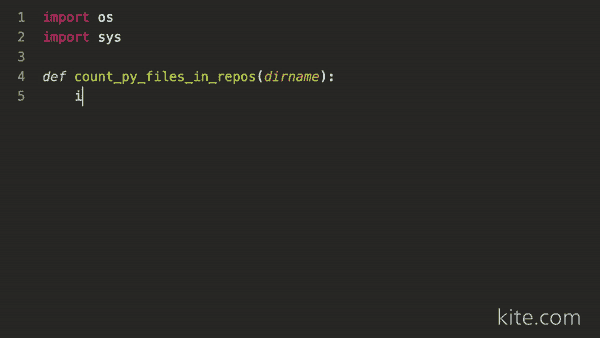
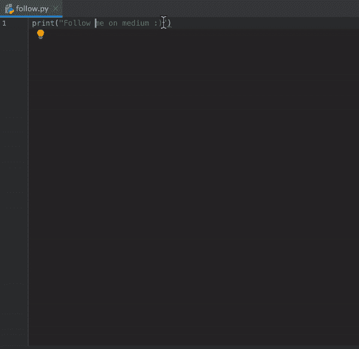

# 每个 Python 都应该拥有的 3 个令人敬畏的 Pycharm 插件！

> 原文：<https://medium.com/codex/3-awesome-pycharm-plugins-every-python-should-have-32d762fc23fb?source=collection_archive---------0----------------------->

## 使用这些插件提高您的生产力并使 Pycharm 看起来更好。

照片由 [Pexels](https://www.pexels.com/photo/man-sitting-in-front-of-three-computers-4974915/?utm_content=attributionCopyText&utm_medium=referral&utm_source=pexels) 的 [olia danilevich](https://www.pexels.com/@olia-danilevich?utm_content=attributionCopyText&utm_medium=referral&utm_source=pexels) 拍摄

PyCharm 是一个用于计算机编程的集成开发环境(IDE ),专门用于 Python 编程语言。它是 Python 中最流行的开发 ide 之一。

但是有了这些插件，你可以扩展你正在开发的游戏，让它更有效率。

## 下面你会发现每个 Pythoneer 爱好者都应该安装的 3 个 Pycharm 插件。

# 1.)Kite:智能自动完成

Pycharm 由它自己的自动完成引擎组成，这很好，但是如果你想让自动完成更上一层楼，你必须安装 Kite。

Kite 是一个 AI 驱动的插件，它使得 Pycharm 中的自动完成更加容易。有了这个插件，你可以快速完成你的代码。

来源:[风筝](https://www.kite.com/wp-content/uploads/2020/05/Python-video-main-65-resolution.mp4)

# 2.)关键启动子 X

Pycharm 包含了大量的快捷方式，节省了你在鼠标和键盘之间不断切换的时间，我们开发者讨厌使用鼠标😂。

Pycharm 有太多的快捷方式，我们很难记住它们。为了解决这个问题，这个插件帮助我们在工作时学习快捷方式。每当你在 Pycharm 中的一个按钮上使用鼠标时，插件会显示你应该使用的快捷键。

作者图片

# 3.)字符串操作

顾名思义，这个插件可以帮助我们操作任何字符串。使用这个插件，你可以改变单词的大小写，颠倒字符，交换单词，编码/解码等等。当您想在不离开 Pycharm 的情况下编辑字符串时，它变得非常有用。

作者提供的视频

# 最后的想法

这里有一些很棒的插件可以提升你的 python 开发。我希望这篇文章对你有所帮助，并让你学到一些新东西。把这篇文章分享给你的 Pythoneer 朋友吧。

# **编码快乐！**