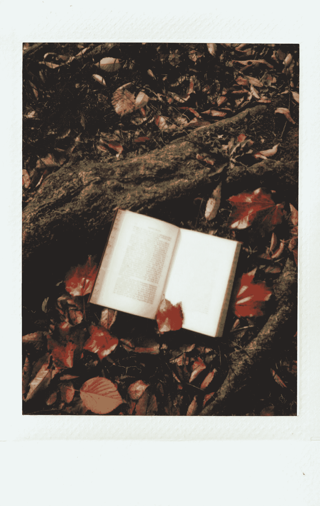

# Python 的 3 本最佳书籍

> 原文：<https://medium.com/codex/3-best-books-for-python-a36feb6de853?source=collection_archive---------0----------------------->

应归功于立夏·阿梅博什

让我从我的角度介绍三本学习 Python 的最佳书籍。Python 无疑是目前最受欢迎的学习语言之一。原因不仅仅是因为它对初学者来说很简单，还因为它是目前机器学习/数据科学领域中使用最广泛的语言之一。所以，我觉得我要给出三个我个人比较喜欢的参考，希望，你们会喜欢…