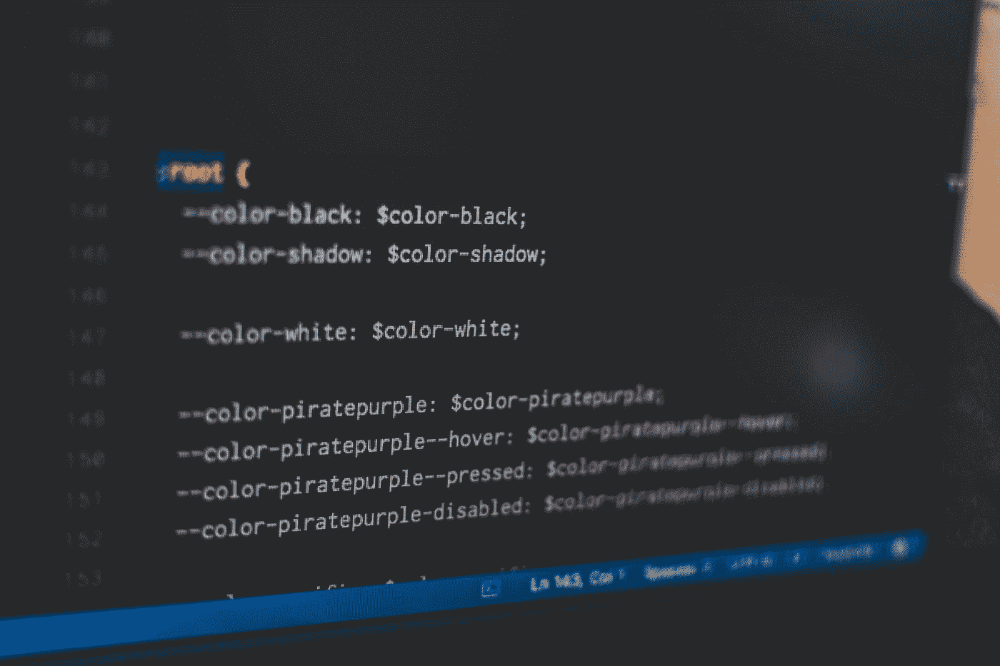

# 3 个最佳 Visual Studio 代码扩展

> 原文：<https://medium.com/codex/3-best-visual-studio-code-extensions-97756b37873b?source=collection_archive---------19----------------------->

如果您使用 Visual Studio 代码作为您的主要开发环境，您应该考虑添加一些扩展来提高您的工作效率。这里有 5 个最好的:微软 Azure、Apache Cordova、Vim、Stackify Prefix 和 CodeStorm。所有这些扩展使得编写更好的代码和更彻底地测试代码变得更加容易。它们还可以帮助您节省时间，防止编写代码时的返工。

潘卡杰·帕特尔在 [Unsplash](https://unsplash.com?utm_source=medium&utm_medium=referral) 上的照片