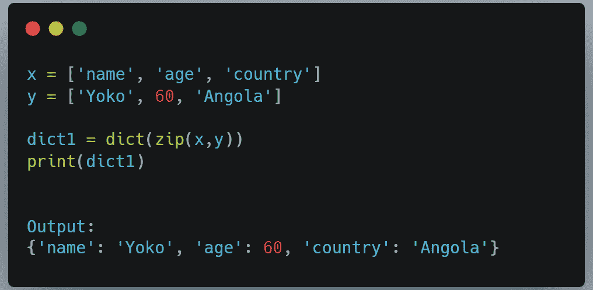
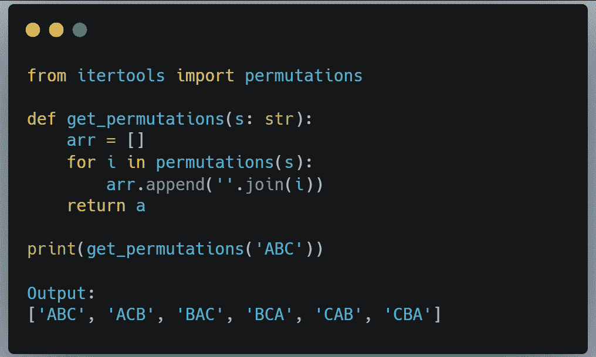
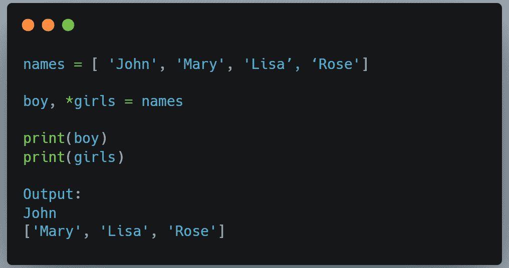
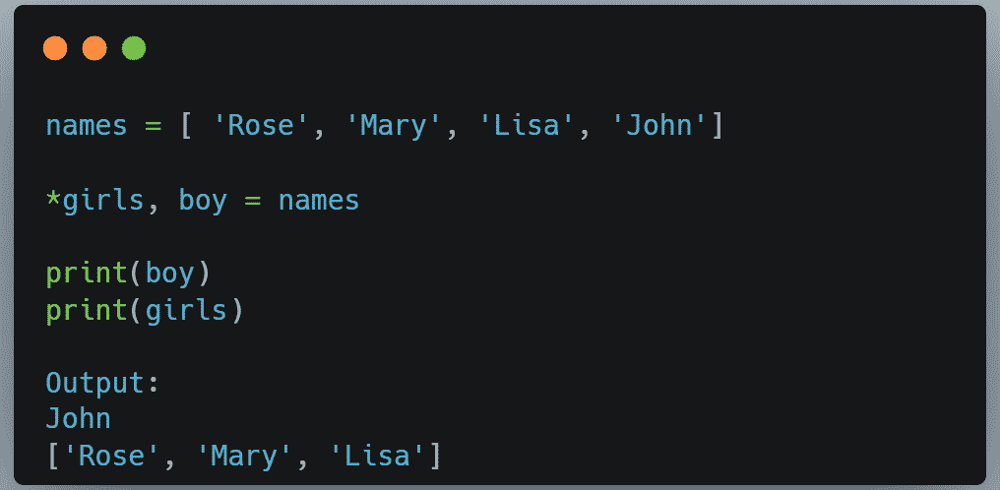

# 你应该知道的 3 个很酷的 Python 技巧

> 原文：<https://medium.com/codex/3-cool-python-tricks-you-should-know-cf0ff794bb31?source=collection_archive---------3----------------------->

布雷特·赛勒斯的照片:[https://www.pexels.com/photo/two-men-on-skate-park-2020157/](https://www.pexels.com/photo/two-men-on-skate-park-2020157/)

在本文中，我们将看看你应该知道的 3 个很酷的 Python 技巧。

# 1.将两个列表合并到一个字典中

有时，在使用列表时，您可能希望将数据类型更改为字典。也就是说，您可能希望将这些列表合并到一个字典中。为此，您可能需要使用 *zip()* 函数和 *dict()* 函数。 *zip()* 函数接受两个 iterables 并将元素配对。列表一中的第一个元素与列表二中的第一个元素配对，第二个元素与另一个第二个元素配对，依此类推。函数的作用是:返回元组的迭代器。 *dict()* 函数将把成对的元素转换成键值组合，创建一个字典。

如果列表中的一个元素不能与另一个元素配对，那么它将被忽略。假设*列表 1* 有四个元素，而*列表 2* 有五个元素；*列表 2* 中的第五项将被省略。

# 2.寻找字符串的排列

字符串的排列是我们可以排列字符串元素的不同顺序。例如，给定一串“ABC”，我们可以将它重新排列成——[' ABC '，' ACB '，' BAC '，' BCA '，' CAB '，' CBA']。在 Python 中，寻找字符串排列的最简单方法是使用 itertools。Itertools 有一个置换类。下面是我们如何使用 itertools 来做这件事。

# 3.使用星号运算符解包列表

有时你想打开一个列表，把元素分配给不同的变量。Python 有一个方法，可以让你的生活变得更轻松。我们可以使用 Python 解包操作符(*)。下面是名单。我们想得到男孩的名字，并将其赋给变量“男孩”其余的名字将被赋给变量“girls”因此，我们将列表中的第一项赋给男孩变量。然后，我们将星号*添加到变量“女孩”中通过在名字上加*号，我们基本上是在告诉 Python，一旦它从列表中解包了男孩的名字，剩下的所有名字都必须赋给女孩的变量名。请参见下面的输出:

如果“约翰”这个名字在名单的末尾，我们会在名字的开头加上星号。见下文:

# 结论

感谢您的阅读。如果你觉得这个故事内容丰富，请鼓掌，分享，并成为关注者。也可以在 [Twitter](https://twitter.com/RealBenjizo) 关注我。