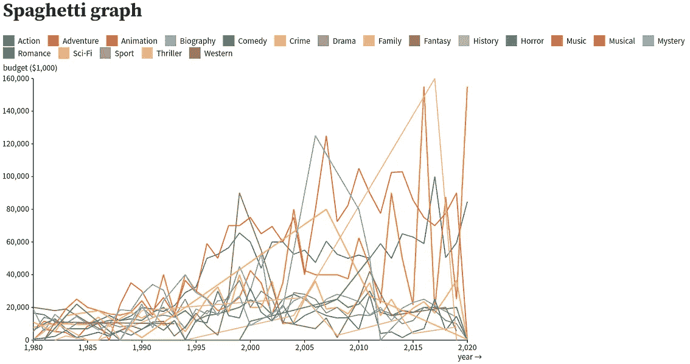
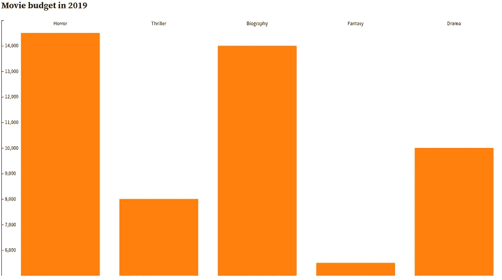
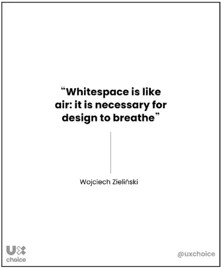
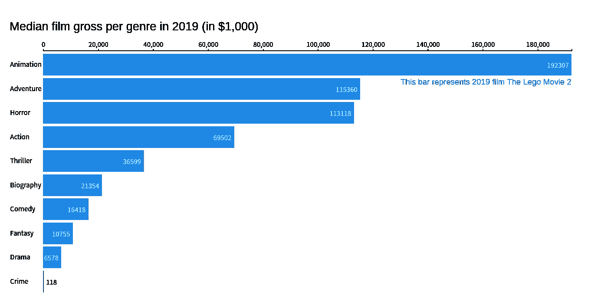
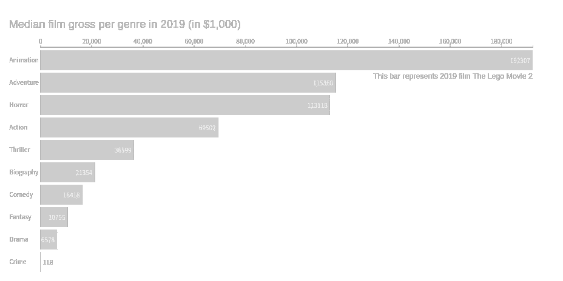

# 数据可视化需要遵循的 3 个关键步骤

> 原文：<https://medium.com/codex/3-crucial-steps-to-follow-in-data-visualization-3d6a3764622e?source=collection_archive---------5----------------------->

## 示例来自 [D3](https://observablehq.com/@0a51d8f1b3dd034f/3-crucial-steps-to-follow-in-data-visualization-example-vis)

因为我们都有不同的理解和解释，所以不是每个人在看同一个主题时都会得到相同的想法。这个概念也适用于数据可视化。因此，如果不考虑它，你可能会创建一个糟糕的视觉效果，观众很难理解。为了避免这种情况，有 3 个步骤可以遵循。了解你的受众，选择合适的视觉效果，消除混乱，吸引注意力。

# 第一步:了解你的受众

在绘制任何图形之前，首先要考虑的是了解你的受众。从学生到项目主管，受众类型很多。根据这些群体的不同，你需要告诉他们什么，他们希望从视觉化中得到什么，都会发生变化。这意味着，为了有效地传达你的观点，你需要针对不同的群体强调不同的方面，并相应地改变风格。因此，与其基于一般观众来创建你的可视化，不如选择一个特定的观众和信息。

照片由[乔纳斯·雅各布森](https://unsplash.com/@jonasjacobsson?utm_source=medium&utm_medium=referral)在 [Unsplash](https://unsplash.com?utm_source=medium&utm_medium=referral) 上拍摄

# 第二步:选择合适的视觉效果

在你决定了你要谈论谁和什么之后，是时候选择如何传达你的信息了，有几个选项可供你选择。这个话题再深入下去，就没完没了了。所以我只提供一些视觉效果的摘要，你可以稍后搜索更多。

## 简单文本

*   直接使用数字
*   简化不可避免地会丢失信息
*   不同的指标传达不同的信息→根据您的信息进行选择

丹尼尔·格里贾尔瓦收集的电影数据集的要点

## 桌子

*   让观众阅读而不是观看→不推荐用于现场演示，但可能是讲义的不错选择。

由[丹尼尔·格里贾尔瓦](https://www.kaggle.com/danielgrijalvas/movies)收集的电影数据集的表格

## 热图

*   可以用色彩来引导观众的注意力
*   使用大量的颜色会让观众困惑→使用颜色饱和度

自 1980 年以来每年每种类型的中值热图(左:颜色饱和度|右:各种颜色)

## 散点图

*   在显示数量关系时很有用

动画电影预算和总中值散点图

## 线形图 **h**

*   绘制连续数据(如时间)时非常有用
*   使用一致的时间点，以免误导观众
*   不要重叠太多的台词，因为观众会跟不上→用颜色突出你的观点

显示动作片年度预算中位数变化的折线图

中值预算变化的意大利面条图/强调动作片系列的折线图

## 斜率图

*   显示不同类别的相对增加或减少

突出显示增加预算的流派的斜率图

## 垂直条形图

*   大多数观众熟悉→容易理解要点
*   使用零基线不会误导观众，因为人们通常会比较相对终点
*   条形之间留有足够的空白

按类型显示 2019 年预算中值的条形图

带有非零基线的条形图带有过小空白的条形图

## 水平条形图

*   当类别名称很长时很有用

## 堆积条形图

*   每个条形图代表 100% →使用哪种类型的条形图取决于您想要传达的信息
*   用太多颜色代表不同的类别会分散观众的注意力→用单一颜色突出你的观点

按年份显示毛收入百分比变化的堆积条形图/突出显示动作片的堆积条形图

# 应该避免的视觉效果

除了我上面提到的，你还可以使用更多的视觉效果。但是在这些当中，有一些视觉效果是人们通常会避免的，因为它们会让观众感到困惑。

## 饼图/圆环图

*   很难判断哪个片段更大，因为很难判断二维空间中的数量差异
*   相反，使用堆积条形图、简单条形图或数字

饼图/圆环图

## 3D 视觉

*   扭曲视觉
*   引入不必要的图表元素

詹姆斯·桑德斯制作的 3d 条形图

## 辅助 y 轴

*   花时间阅读和理解视觉的含义
*   取而代之的是，直接标记这些点或者垂直分离图表

动作片和喜剧片的总体变化，以一个带有辅助 y 轴的折线图表示

辅助 y 轴垂直拆分

# 第三步:消除混乱，吸引注意力

在你选择了一个合适的视觉之后，你需要记住这一点。你呈现给观众的每一个元素都等于观众额外的认知负荷。因此，你应该试着去掉那些对你的观点没有意义的东西。让我们一个一个地看每一点。

## 对齐

在很多情况下，通常有三种对齐方式:左对齐、右对齐和居中对齐。人们可能会认为居中对齐的文本看起来很干净。然而，在大多数情况下，向左或向右可能是更好的选择。

居中对齐标题/左对齐标题

正如你所看到的，居中对齐不能产生清晰的垂直线，而左对齐可以，看起来更清晰。因此，左对齐或右对齐更好，这两者之间的决定应该基于可视化中其他元素的安排。

对齐需要记住的另一点是避免对角线元素。在空间有限但文本太多的情况下，人们通常会想到两种选择。缩小文本大小或使文本成对角线。然而，这两种选择都使文本更难阅读。最重要的是，对角线上的文字会引起不必要的注意，因为除了文字之外，其他的都是正常方向的。

带对角线刻度标签的条形图

因此，除了使用对角线，最好考虑其他选择。例如，在条形图中，您可以使用水平条形图而不是垂直条形图。

## 空格

你应该考虑的下一件事是空白。通常，这一点会被忽视，因为人们不知道它的重要性。但是如果你看两个不同的版本，你就会明白为什么我们需要考虑空白。

几乎没有空白的文本

第一次看到上面的文字，你的第一印象是什么？你认为你能很容易地从这样的视觉中读出信息吗？现在来看看这个版本。

有足够空白的文本

比起第一篇文字，看着不是更舒服吗？

正如你刚刚经历的两个文本图像，空白分隔元素，给观众一点时间思考他们在看什么。同样的想法也适用于其他视觉效果。所以在你的设计中包含一些空白是至关重要的。

由 [UXChoice](https://twitter.com/uxchoice/status/1242842624156790784?lang=ga) 创建的报价图像

## 大小

这一点看起来很明显。大小=重要性:元素越大意味着它越重要。那么这在图表中是如何应用的呢？

文本大小相等的图形

假设我们有下面的图表，它有一个标题、轴标签、轴刻度和额外的解释。其中，标题和额外的解释相对来说比轴记号和标签更重要。因此，为了在视觉上告诉他们更重要，为这些元素使用更大的字体是很自然的。

对于相对重要的元素，图形具有较大的文本大小

## 修改文本

除了大小，您还可以用粗体、斜体、下划线和颜色突出显示文本。

其中，粗体文本非常突出，同时增加了最小的噪声。斜体文本也增加了最小的噪声，但与粗体相比不太突出。最后，带下划线的文本比其他两种方法增加了更多的噪音，同时也使文本更加引人注目。

粗体/斜体/下划线

另一种突出文本的方法是通过颜色。但是由于颜色是可视化最重要的方面之一，我们将在下面的段落中更深入地讨论这一点。

## 颜色

如果运用得当，色彩可能是抓住观众注意力的最有效的方法。但是，当不是的时候，只会分散观众的注意力。因此，在将任何颜色应用到可视化之前，你应该采取的第一步是将所有的东西推到背景中。这意味着将每个元素设置成浅灰色，这样就不会有任何元素吸引你的注意力，并且在后面的步骤中应用颜色时会有更大的对比度。

推到背景的每个元素的图形

然后，思考你的信息以及你应该强调什么来传达信息。例如，如果你想从上面的图表中突出显示动画电影的中值总收入，你可以将条形设置为彩色。

突出显示动画条的图形

但是如果你要传达的信息不止一条呢？例如，你还想突出 2019 年票房收入最低的两种类型。你添加多种颜色吗？

突出显示两点的图表

要记住的一点是，你越是让事情变得不同，事情就越不突出，观众可能会感到迷惑。根据设计的普遍原则，你最多应该突出你视觉的 10%。因此，如果你认为你正在越过那一点，最好通过在每次迭代中强调不同的方面来重复你的可视化。这样，你可以有效地传达你的信息，观众可以在不使用太多脑力的情况下了解不同的观点。

强调不同观点的重复视觉效果

现在，问题是你应该使用哪种颜色。这很大程度上取决于你和谁一起工作。你必须记住，颜色唤起情感，某些颜色在不同的文化、公司和情况下可能意味着不同的东西。

例如，当你在谷歌上输入互联网快速拨号时，你会发现某种颜色并不总是传达相同的意思。有时，绿色代表快速，而有时红色代表快速。

Google 上的互联网快速拨号搜索结果

所以不要盲目地选择颜色，你应该把颜色和你想要传达的信息联系起来，就像下面《卫报》的图片一样。

由 [Guardian](https://www.theguardian.com/environment/2021/apr/28/speed-at-which-worlds-glaciers-are-melting-has-doubled-in-20-years) 制作的世界冰川流失图

正如其图例所示，Guardian 使用红色表示减少，蓝色表示增加。考虑到视觉信息和冰川的特性，观众不难将冰川中蓝色和红色之间的点联系起来，并理解该图形突出了冰川中的损失。

因此，在颜色上没有一个正确的答案。而是回到本帖的第一点。在选择颜色之前，你应该了解你的受众和你要传达的信息。

最后，世界上大约 12 个男人中有 1 个，200 个女人中有 1 个是色盲，我们无法事先知道你的观众是不是色盲。因此，最好记住它们，使用色盲友好的颜色。最常见的是，他们很难区分红色和绿色。看看红色和绿色在 Deuteranopia 和 Protanopia 色轮中的样子。所以与其用红色和绿色，不如用橙色和蓝色来代替。

由 [Coolwinks](https://venngage.com/blog/color-blind-friendly-palette/) 制作的不同视觉色轮

然而，你的客户可以要求你使用橙色和蓝色以外的颜色。在这种情况下，你可以访问[色盲着色](https://davidmathlogic.com/colorblind/#%23332288-%23117733-%2344AA99-%2388CCEE-%23DDCC77-%23CC6677-%23AA4499-%23882255)来了解哪些组合效果好，或者检查不同类型的色盲如何看待你选择的颜色组合。

色盲的[上色截图](https://davidmathlogic.com/colorblind/#%23648FFF-%23785EF0-%23DC267F-%23FE6100-%23FFB000)

## 其他考虑

除了我上面提到的，还有几件事要考虑。

首先，你不应该让你的视觉过于复杂。如前所述，你给观众的每一个元素都等于给他们额外的认知负荷。因此，与其让你的视觉效果华而不实，不如让你的视觉效果易于理解。这包括使用一个动作标题，让观众在理解你的信息上有一个良好的开端，使用一致的字体和颜色，不要混淆观众，使用简单的语言，而不是缩写。

其次，每一个元素都不是同等重要的。有些应该一直留在你的视觉中，而其他的可以被移除或弱化。决定删除或不删除哪些元素取决于你的信息和你的听众的认知负荷。

通常，轴刻度没有实际数据点重要。然而，我们并不总是删除它们。例如，假设您想要传达数据的总体趋势。在这种情况下，保留坐标轴以显示全局是个好主意。但是，当您希望观众比较特定的点时，最好直接移除坐标轴并标记数据点。

作为另一个例子，轴指标不如数据点重要。然而，删除它们会给你的观众带来额外的认知负担，因为观众需要在你的视觉之外寻找数据点的含义。这可能会分散观众的注意力。所以，要看情况。

因此，当决定从视觉中移除什么时，问问你自己。消除这个会改变什么吗？如果它确实改变了什么，观众会对这种改变有什么感觉？

# 参考

[1]克纳弗利克，科尔·努斯鲍默。*用数据讲故事:商业人士的数据可视化指南*。约翰·威利&儿子公司，2015 年。

[2] [D3 视觉示例](https://observablehq.com/@0a51d8f1b3dd034f/3-crucial-steps-to-follow-in-data-visualization-example-vis)