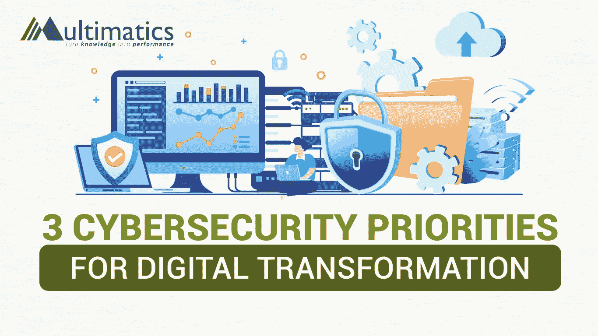

# 数字化转型的 3 个网络安全优先事项

> 原文：<https://medium.com/codex/3-cybersecurity-priorities-for-digital-transformation-7d7a96b77f2e?source=collection_archive---------9----------------------->

数字化转型被普遍认为是企业在当今快节奏环境中生存的关键。通过将手动流程转换为数字流程，组织可以在竞争激烈的市场中保持相关性、适应性和生产力。很明显，数字化对长期成功至关重要，无论这意味着企业转向数字工资单，还是在线学习平台的培训提供商。

许多组织匆忙走过了数字化过程中的一个重要阶段，即网络安全，特别是当他们在短短几周内迅速应对一场全球性灾难时。只有当网络安全成为数字革命的基石时，它才是可靠和有弹性的。组织、他们的员工和他们的客户容易受到攻击，因为他们在匆忙走向数字化的过程中忽视了网络安全。

没有网络安全，数字化转型只是一句口号

数据和连接的浪潮通常由数字化转型产生，数字化转型分为四类:领域、流程、商业模式和组织/文化。尽管这种丰富的信息为创新和优化开辟了新的可能性，但也使企业更容易受到网络威胁和数据泄露的影响。这意味着公司经常投资数百万美元将其运营数字化，却冒着数据泄露的危险。

这意味着任何新的技术计划都应该被视为既有优势也有弱点。在数字化转型能够安全进行之前，企业需要花时间建立智能网络安全基础，以保护其投资回报、声誉和消费者。

但在此之前，组织需要先了解自己的能力和漏洞，然后再选择关注哪个网络安全框架。在这些挑战中，组织应重点关注这三个网络安全优先事项，以改善其数字化转型！

**网络弹性**

网络安全专家必须描述组织面临风险的每个数字接触点；这通常是通过确定如何将新技术集成到整个系统中来实现的。这些终端可以配备复杂的监控工具，如用户和实体行为分析(UEBA)和融合安全信息和事件管理(SIEM)，以提高安全性并保证平稳的数字化部署。首席信息安全官(CISOs)和其他网络安全专业人员可以通过培养组织内部的网络弹性来主动防范各种网络攻击。通过对相关网络攻击的种类和频率进行风险评估，并制定事件恢复战略，可以提高网络安全的恢复能力。

**实施零信任**

零信任是妥协的假设，并不仅仅是对真正的帐户或设备授予信任，也不意味着对合法用户进行身份验证时的行为视而不见。零信任策略是 NIST 等知名组织的首选，它通过持续观察和检查活动来打击欺诈和盗窃行为。这使得攻击者很难通过简单地窃取或克隆一个对象(如密码、设备或 SIM 卡)而得逞。在组织中采用和实施零信任框架意味着通过不断对用户进行身份验证来降低网络安全事件的风险。为了实施零信任，安全主管应建立高管层的认同，获得终端可见性，划分组织网络，并建立最低权限访问。

**身份和访问管理**

IAM(身份和访问管理)确保您企业中的适当个人和工作职能能够访问他们履行职责所需的资源。您的公司可以借助身份管理和访问系统来管理员工应用程序，而无需以管理员身份登录每个应用程序。身份和访问管理系统使您的企业能够控制人、计算机、机器人和物联网(IoT)对象的身份。如果安全专业人员缺乏强大的身份和访问管理(IAM)策略，他们的公司可能会遭受网络攻击，因为恶意行为者会伪装成特权用户。通过识别 IAM 利益相关者并创建支持业务目标的访问和身份策略，组织可以在不断变化的技术环境中保持弹性。

事实上，每个企业都需要一份手册，概述如何处理安全事故，以确保将伤害降至最低。随着数字化转型速度的加快，网络弹性现已成为所有数字化转型战略的重要组成部分。

组织必须将网络安全视为数字化转型过程中的重新考虑。投资数字化而不加强网络安全程序是愚蠢的。但是一旦基础到位，开拓者可能会创新并带领他们的企业达到更高的高度。不断发展的数字化转型应与强大的网络安全技术相结合。优先建立网络弹性、实施零信任、身份和访问管理，可以支持组织保护其流程、技术以及增强网络安全专业知识。

还可以查看 Multimatics 策划的[洞见](https://multimatics.co.id/insight.aspx)，讨论数字化转型、网络安全和最新技术趋势！