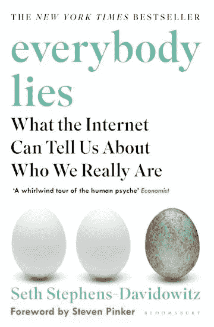
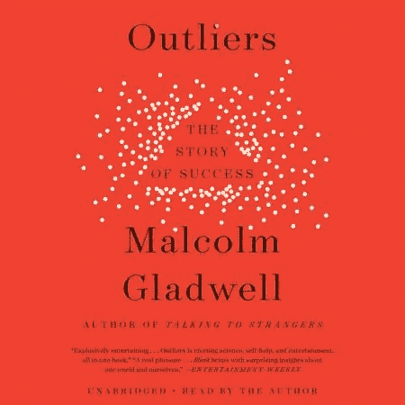
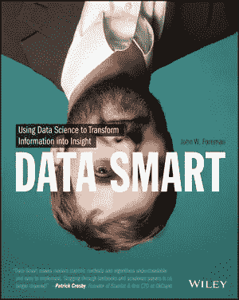

# 3 本会启发你的数据科学书籍

> 原文：<https://medium.com/codex/3-data-science-books-that-will-inspire-you-2a94c24faf66?source=collection_archive---------0----------------------->

从事数据科学或分析工作可能会非常鼓舞人心和令人满意，但与任何其他工作一样，每天都保持 100%的积极性几乎是不可能的。

无论你是否只是有时有几次动机骤降，或者你已经完全忘记了当初为什么要进入数据科学，我希望你能从这三本书中找到新的灵感和动力。它们都从不同的角度强调了数据科学及其可能性，但它们的共同点是都传达了一种好奇心和发现的喜悦。

## 每个人都说谎:互联网能告诉我们什么是真正的我们

图片借用自[https://www.bloomsbury.com/](https://www.bloomsbury.com/)

Seth Stephens-Davidowitz 写了一本关于[人们在谷歌搜索栏](https://trends.google.com/trends/)里写了什么，以及这些数据如何被聚集和分析的书。有些人可能会审查他们告诉朋友和家人的内容，但很少有人审查他们在隐私中向谷歌询问的内容。

这本书涉及的话题从政治到性偏好，以及如何利用这些数据。例如，有没有可能通过追踪搜索“如何谋杀某人”来防止谋杀？根据青少年怀孕和校园欺凌的区域搜索为青少年中心分配资源怎么样？或者只是纠正一些社会偏见，即男性比女性有更高的性欲？根据谷歌，关于不做爱的男朋友的搜索是不做爱的女朋友的两倍。

这本书展示了什么是宝石数据，让我们更好地了解世界和我们自己。我发现思考这些信息被(负责任地)利用的所有可能性非常鼓舞人心，尤其是在社会层面。

## 局外人:成功的故事

图片借用自 https://www.littlebrown.com/[的](https://www.littlebrown.com/)

马尔科姆·格拉德威尔的这本书主要不是为数据科学读者写的，但主题与我们非常相关，因为它调查了社会中的离群值。为什么有些人在他们所做的事情上如此成功？这本书对成功仅仅是努力工作的问题这一普遍观点提出了质疑。

Gladwell 要求我们不要仅仅因为它们是离群值就忽视它们，而是投入更多的时间来研究它们，并看得更远，而不是它们最明显的特征。格拉德威尔提出了成功的科学家和他们出生的地点和时间的重要性，以及他们在关键年龄面临的社会变革，以及他们如何从中受益。如果比尔·盖茨在个人电脑问世的时候不年轻，他会创立微软吗？如果他的学校没有一台电脑供孩子们使用(这在当时是非常罕见的)呢？或者，如果他没有能够欺骗华盛顿大学的系统，以获得不受限制地进入他们的个人电脑？

格拉德威尔在书中举了几个类似的例子，即关于为什么许多亚洲人擅长数学以及为什么甲壳虫乐队获得如此巨大的人气的理论。

我认为这本书非常鼓舞人心，因为它挑战我们不要忽视异常值和特殊模式，而是留出时间，深入挖掘。离群值可能不仅能给我们提供与之相关的洞见，而且在更广泛的意义上是有用的。

## 数据智能:利用数据科学将信息转化为洞察力

图片借用自[https://www.wiley.com/](https://www.wiley.com/)

这本书不是关于数据可以告诉我们什么，或者如何更好地将数据转化为信息，而是数据科学如何以一种替代的、更直观的方式来完成。

本文作者约翰·w·福尔曼(John W. Foreman)曾在营销自动化平台 MailChimp 担任数据科学家，他希望揭穿一个神话，即机器学习是一件极其困难的事情，只有数学专家才能使用复杂的工具来完成。

这本书介绍了几种常见的 ML 算法(朴素贝叶斯、线性回归、k-means 聚类…)以及它们如何用于解决 Excel 中的不同业务问题。是的，你没听错，在 Excel 里！然而，这本书的想法不是告诉我们开始在 Excel 中进行机器学习，而是展示如果在电子表格中一步一步地执行，遵循模型的逻辑是多么容易。

对于那些没有手动计算所有不同模型的人，那些想要回顾的人，那些想要向业务用户解释 ML 模型的人，当然，对于业务用户本身来说，这是一本很棒的书。

在关于最佳 ML 模型、特性选择方法、参数调整和新的酷框架的讨论中，我认为看到仅仅通过基础知识以及对清晰和“足够好”的关注就可以完成多少工作，这令人耳目一新，令人鼓舞。这与以最大的复杂性为代价追求最大的*准确度/精确度/无论你的度量是什么*形成了对比。