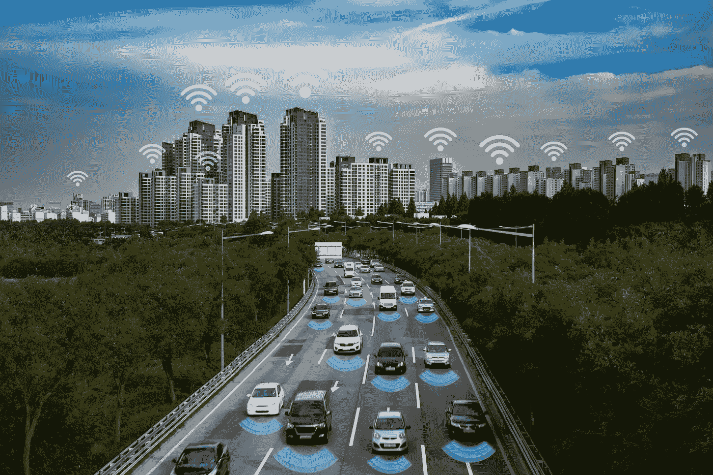
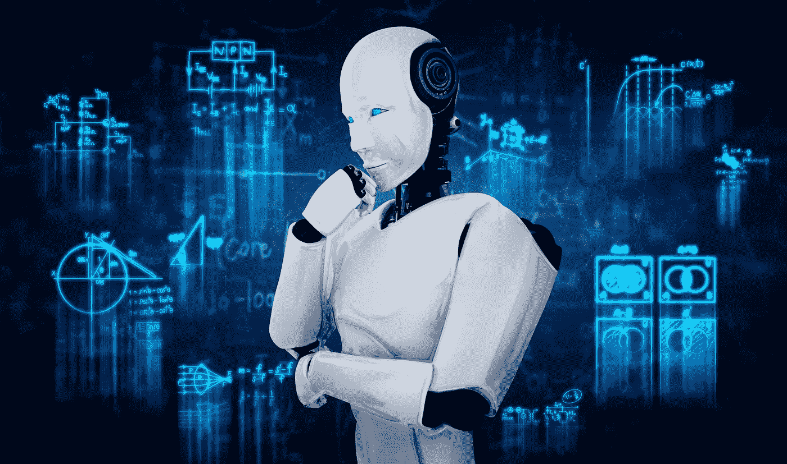

# 3 不道德使用数据的令人不安的后果

> 原文：<https://medium.com/codex/3-disturbing-consequences-of-using-data-unethically-263e2b5b803c?source=collection_archive---------12----------------------->

照片由 Adobe 的 photoraidz 提供。

技术正处于十字路口。

我们以前见过:新的东西被开发出来，人们急于尽快批准和使用它。例如，在第二次世界大战期间，DDT 被用来对抗斑疹伤寒和疟疾之后，就有一股推动力量去寻找它的更多应用。在战争结束时，美国食品和药物管理局批准它作为杀虫剂使用，没有严格的测试和监管…它导致数千人患癌症。

同样，当我们竞相开发人工智能和机器学习的应用程序时，我们遇到了一个道德困境。

作为 HG Insights 的[首席技术官，我花了很多时间思考数据在行业中是如何使用的。随着数据使用的不断增长，安全性，尤其是个人信息，是众多关注的问题之一。在](https://www.linkedin.com/in/robertjfox/) [HG 实现 SOC 2](https://hginsights.com/hg-insights-soc-2-compliance/) 安全合规之后，我不禁思考我们如何在更普遍的层面上使用它，以及随之而来的伦理问题。

因此，在我们继续[开发新技术](https://hginsights.com/technology-ensures-credibility-and-market-dominance/)的同时，我想就我们将如何注意这些伦理问题展开一场对话——不要陷入个人、个案的框架，而是在更广泛的背景下，通过探索几个例子。

1.  **决策有后果:无人驾驶汽车的安全性**

人工智能的好坏取决于它所基于的学习模型和数据集。

在决策权留给机器的情况下——根据机器学习的数据集做出决策——如果出现问题，谁来负责？机器决策背后的伦理考量呢？有许多移动的部分——必须分析建模和训练数据，必须审查指导做什么和采取什么行动的软件。这个灰色地带甚至成为消费者考虑的两难问题。在许多情况下，他们完全不知道有人在为他们做决定。这就变成了一个数据伦理问题…例如:

> 人工智能的竞赛是数据的竞赛，但我们并不都是赛车手。那么，随着人工智能改变我们的驾驶方式，当无人驾驶汽车发生[事故，一种 21 世纪的](https://www.reuters.com/business/autos-transportation/life-death-question-regulators-is-teslas-autopilot-safe-2021-09-21/)[奇谈怪论](https://www.merriam-webster.com/words-at-play/trolley-problem-moral-philosophy-ethics#:~:text=The%20trolley%20problem%20is%20a,to%20kill%20just%201%20person.&text=That%20person%20is%20certain%20to%20be%20killed%20if%20the%20switch%20is%20activated.)时，会发生什么？如果自动驾驶车辆撞车，是程序员的错吗？汽车是一个可以被追究责任的独立实体吗？
> 
> 谁在做这类决定？虽然司机在技术上负有责任，但他们怎么可能对触发决策的 ML 算法产生任何影响呢？

随着公司在公共道路上推出[“完全自动驾驶”测试软件](https://techcrunch.com/2021/09/20/mit-study-finds-tesla-drivers-become-inattentive-when-autopilot-is-activated/)，这对监管者来说是一个越来越重要的道德困境。将责任转嫁给司机实际上只是更深层的责任问题的表面。

这只是我们面临的道德十字路口之一。

图片由 Adobe 公司提供。

2.**避免偏见:我们必须从过去吸取教训，而不是重复它**

这是一个我们已经努力解决了一段时间的问题，正如我们在[面部识别争议](https://www.forbes.com/sites/nicolemartin1/2019/09/25/the-major-concerns-around-facial-recognition-technology/?sh=5c8ae0504fe3)中看到的那样。

尽管我们将在未来三年创造比过去三十年更多的数据，但大部分数据都受到了严密的保护。所以，我们还需要更多的[数据来训练算法](https://www.technologyreview.com/2019/02/04/137602/this-is-how-ai-bias-really-happensand-why-its-so-hard-to-fix/)。这个数据是人工智能为人工智能创造的，它在几个不同的方面可能是不完美的。

例如，这些算法只和通知它们的数据一样好。创建这些数据是为了准确地描述这个世界，好的和坏的。例如，如果一个算法被输入了关于历史信息 re:性别之间的工资差距的数据，它将从这个历史中学习并硬编码这个系统问题。正如艾伦[图灵研究所](https://www.turing.ac.uk/research/publications/what-data-ethics)所指出的，“即使是从未直接转化为信息的数据，也可以用来支持行动或产生行为。”

> 消除偏见是当今数据科学中一个极其重要、复杂且有争议的领域。合成数据是一个热门领域，不仅可以在数据不容易获得时为机器学习提供更多数据，还可以通过生成合成数据来克服偏见。
> 
> 在当今这个充满政治和社会压力的世界上，最大的问题之一是，当有助于支持一个人的立场或观点时，有偏见的预测就会故意扩散。在这最后一种情况下，人类实际上是在放大偏见的影响，这种偏见给下游更多的模型提供了信息，从而产生了相当大的负面影响。

致力于公平和负责任的人工智能和像[算法正义联盟](https://www.ajl.org/)这样的组织比以往任何时候都更重要。

图片由[蓝色星球工作室](https://stock.adobe.com/contributor/205611350/blue-planet-studio?load_type=author&prev_url=detail)通过 Adobe 提供。

3.**保护个人数据:隐私和创新的平衡**

虽然随着我们越来越深入数据世界，这些都是重要的决定，但对我们许多人来说，它们仍然不在日常生活中。

当我们开始使用自己的个人数据时，这些问题变得更加紧迫。我们已经看到了个人安全方面的一些进步，比如 GDPR 的法规、CCPA 的法规和饼干法。

这一早期的法规是对世界范围内更多隐私法的呼吁——一些人甚至呼吁制定一部[人工智能“权利法案”](https://www.axios.com/white-house-ai-bill-of-rights-1b318b62-88e9-4369-9233-c611692bbd27.html)

围绕个人信息隐私的争论现在比以往任何时候都更加突出。每次你访问网站，看到广告，使用网飞的 Spotify，你都会看到它。向你暗示的一切都是由你过去的行为决定的。

我很想知道我们如何跟上这一趋势，帮助保护我们自己，限制负面后果，同时继续改善我们周围的世界。我们如何在创新和个人隐私之间取得平衡？我有兴趣与数据科学界合作，以减轻这些不利影响和可疑的数据使用。作为新和新颖见解的策展人，我有责任在这个数据生态系统中以符合道德的方式行事，并作为模范公民对自己负责。

在机器学习的时代，人们急于创造新技术来改善我们的生活——并相应地加以利用——我们需要始终考虑我们的创新和突破的好处和后果。就在我们已经感受到人工智能在日常生活中的积极好处时，也出现了一些问题。我们的技术越进步，忽视它们的后果会越深远。

通过处理这些伦理考虑，我们都可以使用数据为我们的社会带来最大的价值。数据使用的伦理需要从多个角度考虑，而不仅仅是由企业家和数据科学家来考虑。为了进行适当的对话，我们必须共同努力。

社会以前处理过巨大的伦理问题。与 DDT 的影响相比，对 AI 的担忧要少得多。DDT 是一种致癌物质，会在数百万美国人的生活中传播。

**关于罗伯特·福克斯**

Rob 拥有超过 25 年的商业软件和工程经验、强大的分析技能以及广泛的一般行业和商业知识。他曾在 MuleSoft(现在的 Salesforce)和 Liaison Technologies(现在的 OpenText)等行业领先的组织中领导过工程团队。

凭借其企业家精神、创新愿景和行业领先的思想领导力，Rob 专注于所有数据领域，包括:分析、数据科学、集成、管理、安全、API 管理以及 B2B、EAI、云和大数据领域的专业知识。